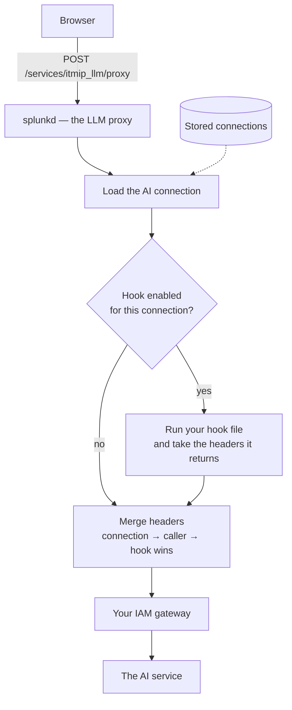

# Customer authorisation hook

**App version:** 2.5.9
**Last updated:** 2026-09-22
**Audience:** whoever owns your IAM integration — the person who will write and
maintain the hook file.

The hook covers three outbound paths: LLM calls, custom HTTP tools, and MCP
servers.

> **The LLM path requires an Enterprise licence.** Without the `iam_gateway_hook`
> entitlement, an LLM call that would use the hook is refused with
> *"The customer IAM gateway hook requires an Enterprise license."* Configure the
> licence before writing the hook, or the first call will fail with that message
> and nothing in the hook itself will be at fault.

> **About this app — read first.** Adjutant AI is a *host shell*: a
> single-page React app that has **no use-cases of its own**. Every
> piece of functionality it offers — which playbooks appear, which
> LLMs are reachable, which tools the LLM may call, where saved
> searches / dashboards / alerts land — is fully derived from
> **(a) the Splunk app the user opened it from** and **(b) the Splunk
> roles that user holds**. End users should reach the assistant from
> within Search / ITSI / Enterprise Security / your custom or MSP
> customer apps via a nav-menu entry — they should **not** be pointed
> at the `itmip_ai_splunk_assistent_app` tile directly. The whole
> point of the Workbench is to deliver an AI assistant *inside other
> apps, for other users*, with all generated knowledge objects landing
> in those apps' namespaces. See
> [the installation guide, Deployment model](../installation.md)
> for the full rationale.

When an outbound target — an LLM endpoint, a custom HTTP tool, or an
MCP server — sits behind a corporate IAM / SSO gateway (WebEAM.Next,
Ping, Okta, AzureAD, internal SAML, ADFS, etc.), the Splunk-side
dispatcher needs to attach **fresh, dynamic** HTTP headers to every
outbound request — short-lived bearer tokens, signed cookies,
gateway-issued correlation IDs, and so on.

Static `extra_headers` on an LlmConfig or static `auth.headers` on a
custom tool only stores constants. The **customer authorisation
hook** is a customer-supplied Python file that runs server-side per
request and returns whatever headers the gateway needs *right now*.
The same file serves all three dispatchers; a `target_kind` field in
the input context lets the hook branch on which flow is calling.

## Architecture



The hook runs only when:

1. The LLM configuration has **Customer authorisation hook** ticked in
   the Settings tab (`customer_auth_enabled = true` in KVStore).
2. The configuration is in **`splunk_proxy`** call mode. Browsers
   cannot invoke server-side Python; the checkbox is disabled in
   `browser_direct` mode.

## File location

| Path | Purpose |
|------|---------|
| `bin/customer_authorisation.py` | Ships with the app. Default = no-op stub. |
| `local/bin/customer_authorisation.py` | **Customer edits.** Wins over the `bin/` copy. Never overwritten by app upgrades. |

The recommended workflow:

```bash
SPLUNK_HOME=/opt/splunk
cd $SPLUNK_HOME/etc/apps/itmip_ai_splunk_assistent_app
mkdir -p local/bin
cp bin/customer_authorisation.py local/bin/customer_authorisation.py
$EDITOR local/bin/customer_authorisation.py
$SPLUNK_HOME/bin/splunk restart
```

## Function contract

```python
def get_request_headers(context: dict) -> dict[str, str]: ...
```

**Input — `context`:**

The hook is called from three different dispatchers — the LLM proxy
(0.1.0+), custom HTTP tools (0.6.0+), and MCP server invocations
(0.7.0+). The `target_kind` discriminator tells you which flow you're
servicing so you can branch token policy if needed.

| Key | Type | Always present | Notes |
|-----|------|---|---|
| `target_kind` | `str` | yes (0.6.0+) | `"llm"` / `"tool"` / `"mcp"`. Older hooks that don't branch on this still work — both `tool` and `mcp` flows pass through. |
| `splunk_session_key` | `str` | yes | Pass as `sessionKey=` to `splunk.rest.simpleRequest` to query `storage/passwords` or other Splunk endpoints. |
| `splunk_user` | `str` | yes | Calling Splunk user name. Useful for per-user audit logging or per-user token routing. |
| `body_preview` | `str` | yes (LLM path) | First ~256 chars of the outbound LLM request body. Use to route auth on prompt content when you must. Empty string on the tool / MCP paths. |
| `llm_config` | `dict` | LLM flow only | The LLM configuration record. Useful keys: `name`, `endpoint`, `provider_kind`, `model`, `org_short`, `bu_short`. |
| `tool_name`, `tool_target_url`, `tool_target_host`, `tool_method` | `str` | Tool flow | Identifies the custom HTTP tool the LLM is about to invoke. |
| `mcp_server_id`, `mcp_server_name`, `mcp_endpoint_url`, `mcp_upstream_tool_name` | `str` | MCP flow | Identifies the upstream MCP server + tool. |

A typical hook that needs to mint different tokens per kind:

```python
def get_request_headers(context):
    kind = context.get("target_kind", "llm")
    if kind == "llm":
        return _llm_headers(context)
    if kind == "tool":
        return _tool_headers(context)
    if kind == "mcp":
        return _mcp_headers(context)
    return {}
```

**Return value:**

A `dict[str, str]`. Header name → header value. Empty dict means "no
extra headers, but proceed". Non-string values get rejected by the
caller with a `502`.

**Errors:**

Raise any exception to abort the request. The dispatcher returns
`502` to the browser with `{"error": "customer_auth hook failed:
<message>"}` and writes the full traceback to `splunkd.log`. This is
true for all three flows — there is no silent fallback to an
unauthenticated upstream call.

## Storing credentials

Never hardcode credentials in the hook file. Put them in
`storage/passwords` and read them at runtime:

```bash
# As admin, write the secret once:
curl -k -u admin:<pw> \
  -X POST \
  -d "name=webeam_login" \
  -d "realm=itmip_llm_assistent_app" \
  -d "password=alice:hunter2" \
  "https://localhost:8089/servicesNS/nobody/itmip_ai_splunk_assistent_app/storage/passwords"
```

```python
# Inside the hook:
import splunk.rest as rest

def _load_credentials(session_key):
    path = (
        "/servicesNS/nobody/itmip_ai_splunk_assistent_app/"
        "storage/passwords/itmip_llm_assistent_app%3Awebeam_login%3A"
        "?output_mode=json"
    )
    resp, content = rest.simpleRequest(
        path, sessionKey=session_key, method="GET"
    )
    if resp.status != 200:
        raise RuntimeError("WebEAM credentials missing")
    data = json.loads(content)["entry"][0]["content"]
    u, _, p = data["clear_password"].partition(":")
    return u, p
```

## Caching tokens

The hook is called **once per request**, and its result is not cached for you. If
minting a token costs an HTTP round-trip to your IAM gateway, that is added to
every LLM turn.

> **A module-level cache will not work.** The hook file is re-read and re-executed
> from disk on every single call — deliberately, so you can edit it and see the
> change immediately without restarting splunkd. A `_TOKEN_CACHE = {}` at the top
> of your module is therefore reset before each request and never hits. Earlier
> revisions of this page recommended exactly that, and blamed the occasional
> re-mint on worker processes. That was wrong: the cache never survives, on any
> worker.

**Cache in KVStore instead.** It is the only store that outlives a call:

```python
import json, time
import splunk.rest as rest

_COLLECTION = "/servicesNS/nobody/itmip_ai_splunk_assistent_app/storage/collections/data/my_token_cache"

def _cached_token(session_key, cache_key):
    try:
        _, body = rest.simpleRequest(
            "%s/%s" % (_COLLECTION, cache_key),
            sessionKey=session_key, method="GET", raiseAllErrors=False)
        row = json.loads(body)
        if row.get("expires_epoch", 0) > int(time.time()) + 300:
            return row.get("token")
    except Exception:
        pass
    return None
```

Write the freshly minted token back the same way, keyed by the connection name,
and refresh a few minutes before expiry. Create the collection in your own app,
not in Adjutant AI's, so an upgrade never touches it.

If a round-trip per turn is acceptable — many gateways answer in a few
milliseconds on the same network — the simplest correct hook is one that mints
every time and caches nothing.

## Worked example — fictional WebEAM.Next

> The flow below is **illustrative**. Real WebEAM.Next deployments
> differ in field names, login URL, and refresh semantics — adapt to
> your environment.

```python
"""WebEAM.Next adapter."""

import json
import time
import urllib.request

import splunk.rest as rest

# No module-level cache: this file is re-executed on every call, so one would
# never survive. Mint per request, or cache in KVStore as shown above.


def _load_credentials(session_key):
    path = (
        "/servicesNS/nobody/itmip_ai_splunk_assistent_app/"
        "storage/passwords/itmip_llm_assistent_app%3Awebeam_login%3A"
        "?output_mode=json"
    )
    resp, content = rest.simpleRequest(
        path, sessionKey=session_key, method="GET"
    )
    if resp.status != 200:
        raise RuntimeError("WebEAM credentials missing in storage/passwords")
    data = json.loads(content)["entry"][0]["content"]
    u, _, p = data["clear_password"].partition(":")
    return u, p


def _fetch_token(session_key):
    username, password = _load_credentials(session_key)
    body = json.dumps({
        "username": username,
        "password": password,
        "clientId": "splunk-ai-assistent",
    }).encode("utf-8")
    req = urllib.request.Request(
        "https://webeam.example.com/api/v2/login",
        data=body,
        headers={"Content-Type": "application/json"},
        method="POST",
    )
    with urllib.request.urlopen(req, timeout=15) as resp:
        payload = json.loads(resp.read())
    return payload["access_token"], int(time.time()) + _CACHE_TTL_SEC


def get_request_headers(context):
    cfg = context["llm_config"]
    # Only the LLMs whose endpoint goes through WebEAM need this.
    if "webeam" not in (cfg.get("endpoint") or "").lower():
        return {}

    token, _expires = _fetch_token(context["splunk_session_key"])

    return {
        "Authorization": "Bearer " + token,
        "X-WebEAM-User": context["splunk_user"],
    }
```

## Security model

- The hook runs in the splunkd Python process as the splunkd user.
  Full `urllib`, `ssl`, `http.client` and Splunk REST access.
- **Customer-trusted code.** Nothing in the hook is sandboxed. Treat
  it like any other splunkd extension.
- The proxy's hook invoker rejects non-dict and non-string returns
  with a clean `502`. A hook that raises produces a `502` with the
  exception message and a full traceback in `splunkd.log`.
- The hook can **override** static `cfg.extra_headers` (merge order:
  `cfg.extra_headers` → caller_extras → hook). Use this for tokens
  that change while other config-level headers stay constant.
- Don't log secret values. Use `splunk.mining.dcutils.getLogger()` for
  audit lines if needed.

## Testing locally

Run the file directly with Splunk's bundled Python — the stub has a
`__main__` block that calls the hook with a sample context and prints
what comes out:

```bash
$SPLUNK_HOME/bin/splunk cmd python \
    $SPLUNK_HOME/etc/apps/itmip_ai_splunk_assistent_app/local/bin/customer_authorisation.py
```

A no-op stub prints `{}`. Once you've pasted your real flow in,
re-running prints whatever headers the gateway gives you.

## Operational notes

- Hook latency lands on every LLM request. Cache aggressively.
- A broken hook fails the LLM call (`502` to the browser). The user
  sees a clear error in the Ask tab. Other LLM configs without
  `customer_auth_enabled` are unaffected.
- Restart splunkd after editing the hook file. Python's persistent
  handler caches modules between requests; the proxy loads the hook
  via `importlib.util` fresh on each request, but Splunk's worker pool
  may keep stale workers around briefly during a restart.

## Related

- The supported-LLM matrix — provider reference (CORS, streaming,
  endpoint shapes).
- `bin/customer_authorisation.py` — the placeholder file with its own
  inline docstring.
- `bin/itmip_llm_proxy.py` — the proxy that invokes the hook
  (`_invoke_customer_auth_hook`).
