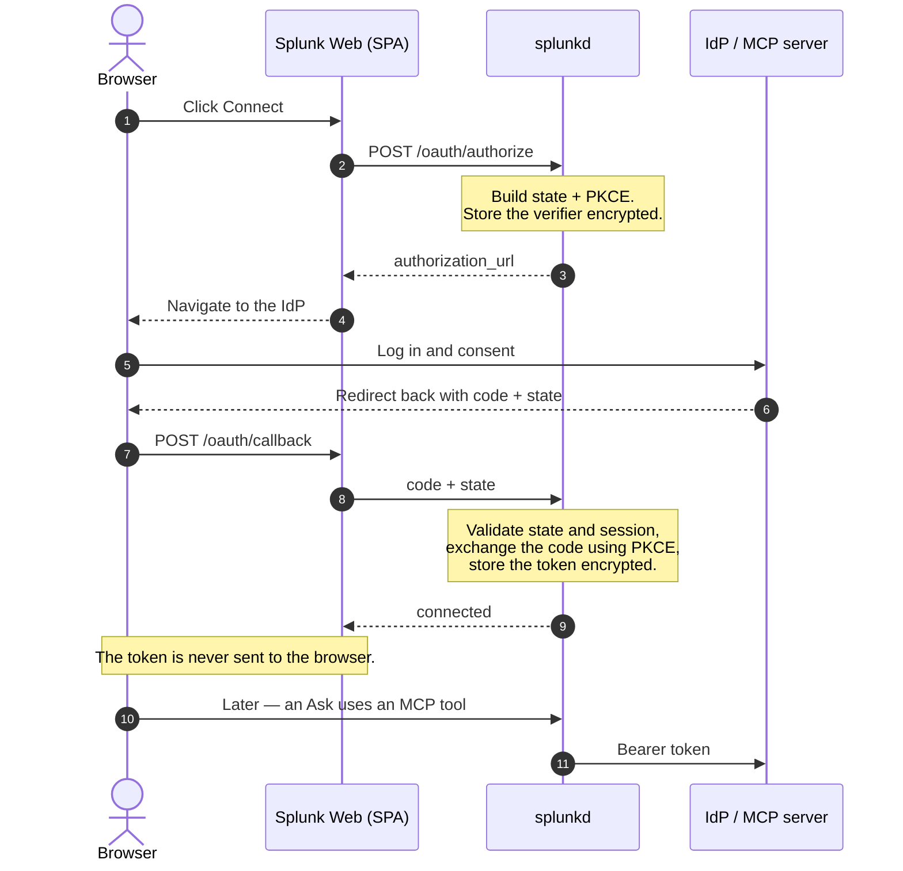

# MCP OAuth 2.1 — connecting Adjutant AI to OAuth-protected MCP servers

**App version:** 2.5.9  ·  **Last updated:** 2026-09-22  ·  **Audience:** Splunk admins,
integrators, security reviewers.

Adjutant AI can connect to remote **Model Context Protocol (MCP)** servers that require
**OAuth 2.1** — including ServiceNow **Action Fabric / MCP Server Console**. This page explains
how it works, how to register and connect an OAuth MCP server, and the security model.

> **One-line summary.** Adjutant AI is a **governed, backend-mediated OAuth 2.1 client**. The
> browser is used *only* for the human login/consent redirect; the **Splunk backend (splunkd)** is
> the OAuth client and token holder. It stores and refreshes tokens encrypted in
> `storage/passwords` and calls the MCP server with the right access token. *Browser → Splunk Web →
> splunkd → MCP server* — the browser never talks to the MCP server and **never receives a token**.

---

## 1. When to use OAuth (vs a static token)

| Your MCP server… | Use |
|---|---|
| accepts a long-lived API key / personal access token / static bearer | **Static** (`auth_type = static`) — unchanged from earlier versions |
| requires OAuth 2.x (authorization-code, PKCE, client-credentials) | **OAuth 2.1** (`auth_type = oauth2`) — this page |

**ServiceNow note.** ServiceNow's **MCP Server / Action Fabric** endpoint is **OAuth-only** —
there is no static API key for the inbound MCP connection, and it uses the **authorization-code**
grant (client-credentials for MCP is on ServiceNow's roadmap, not yet available). ServiceNow's
*REST* API (Table/Import APIs) is a **separate** connection that still accepts an API key — don't
confuse a ServiceNow REST token with an MCP resource token.

---

## 2. How it works (architecture)

Key points:
- The **PKCE `code_verifier`** and all **tokens** live in `storage/passwords` (encrypted at rest),
  never in KVStore plaintext, never in the browser, never in logs.
- Every OAuth transaction is **bound** to the initiating Splunk user, Org, BU, server, exact
  redirect URI, resource, and scopes, and is **single-use** with a ≤10-minute TTL.
- Token **refresh** is automatic and **single-flight** (serialised across search-head-cluster
  members) so two concurrent tool calls trigger one refresh, not two.

---

## 3. Register an OAuth MCP server

**Tools → MCP servers → + Register MCP server** (admin only; requires an Enterprise license —
OAuth rides the existing `mcp_servers` gate, it is not separately licensed).

1. Fill in **Name**, **Short**, **Endpoint URL**, **Org/BU** as for any MCP server.
2. Under **Authentication**, set **Authentication type = OAuth 2.1**. Then:

| Field | Meaning |
|---|---|
| **Owner mode** | `per_user` (each user connects their own account), `shared` (one Org/BU-shared admin connection), or `service` (unattended service identity). |
| **Issuer** | The OAuth authorization server. Leave **blank to auto-discover** from the endpoint (RFC 9728 protected-resource metadata → RFC 8414 / OpenID Connect discovery). |
| **Client ID** | The OAuth client registered in your IdP for Adjutant AI. |
| **Client secret ref** | A `storage/passwords` name holding the confidential client secret. **Leave blank for a public client** (PKCE is the proof). |
| **Scopes** | Space-separated scopes. For ServiceNow these are the Action Fabric tool-package scopes (owned by the ServiceNow MCP Server Console — Adjutant AI requests what you configure, it does not invent scopes). |
| **Resource / audience** | RFC 8707 resource indicator = the MCP endpoint URL, so the IdP mints an audience-restricted token. |
| **Allowed issuers** | Optional per-connection allowlist. If set, discovery **refuses** any issuer not listed (protects against a spoofed discovery document). |

3. **Register the redirect URI in your IdP.** The editor shows the exact value to register, e.g.
   `https://<your-splunk-web-host>:8000/en-US/app/itmip_ai_splunk_assistent_app/<view>?mcp_oauth=1`.
   It is **the same for all Orgs** in a deployment — register it in each IdP/instance's OAuth app.
4. Store the client secret (if confidential) in `storage/passwords` under the name you put in
   **Client secret ref** (Tools → custom-tool credentials, or the secret REST endpoint).
5. **Save**.

### Storing the client secret
The client secret is referenced by name, never typed into KVStore. Save it the same way as any
other Adjutant AI secret (realm `itmip_llm_assistent_app`), e.g. via the in-app credential field or
`POST /services/itmip_llm/secret` with `{name, value}`.

---

## 4. Connect (authorise)

After saving, the server card shows an **OAuth: not connected** badge and a **Connect** button.

- **Connect** → you are redirected to the IdP to log in and consent → the IdP returns you to Splunk
  → Adjutant AI completes the exchange in the backend and shows **MCP server connected via OAuth**.
- **Disconnect** revokes the token at the provider where supported (RFC 7009) and deletes the local
  material regardless. Re-connecting always works.

**Owner modes in practice:**
- **`shared`** — an admin connects once; everyone in the Org/BU uses that connection.
- **`service`** — an admin connects a dedicated service/integration user once; the refreshable token
  is reused for **unattended** runs. *This is ServiceNow's near-term unattended pattern* (a
  dedicated integration user, admin consents once, the token is stored and refreshed).
- **`per_user`** — the connection is per individual user. In v1.5.0 the **Connect** action is in the
  admin Tools tab; until a given user has their own token, interactive use falls back to a `shared`
  connection if one exists. (Per-user end-user self-service connect UI is a planned follow-up; the
  backend already supports per-user tokens.)

---

## 5. Unattended (alert → action) runs

For unattended/background execution the grant is resolved in this fixed order:
1. **client-credentials** — if a machine identity is configured **and** the authorization server
   supports it;
2. **delegated service token** — the `service` owner-mode token an admin consented once (ServiceNow);
3. **static** — a stored API key/bearer;
4. otherwise **fail closed** (`auth_unavailable_for_unattended_run`) — an unattended run **never**
   starts a browser login.

---

## 6. Security model (what's guaranteed)

- **No browser leakage** — access/refresh tokens, the client secret, and the PKCE verifier never
  reach browser JavaScript. The authorization `code` transits the browser once (inherent to the
  flow) and is immediately exchanged server-side and stripped from the URL.
- **No token passthrough** — Adjutant AI never forwards your Splunk session, an app token, an LLM
  provider key, or another server's token to an MCP server.
- **Audience/issuer bound** — every token is validated for the configured resource and issuer.
- **Governance is the floor** — OAuth scope is a ceiling on the *server* side; Adjutant AI's tool
  allowlist, tenancy, audit, and (for the unattended engine) write-target binding always apply. A
  broad OAuth scope never widens what Adjutant AI will call.
- **Secrets never logged** — the OAuth log (`$SPLUNK_HOME/var/log/splunk/itmip_llm_mcp_oauth.log`)
  records lifecycle events only; token/code/secret values are redacted.
- **DCR off by default** — dynamic client registration is not used unless an admin explicitly
  enables it per connection.

---

## 7. Splunk Cloud posture

OAuth reuses only patterns already vetted in the shipping app: outbound HTTPS via the app's
`urllib`-based HTTP client (no third-party libraries), secrets in `storage/passwords`, custom REST
endpoints paired with `web.conf [expose]`, TLS verification on by default. The app remains
Splunk-Cloud-vettable. On-prem/Enterprise is the first-class deployment; confirm the redirect-URI
mechanism on your environment before rolling out broadly.

---

## 8. Troubleshooting

| Symptom | Likely cause / fix |
|---|---|
| **"OAuth discovery failed"** on Connect | Issuer/endpoints can't be discovered. Set the **Issuer** (or explicit endpoints) explicitly; check the **Allowed issuers** list isn't excluding it; verify TLS/CA. |
| **"This authorization request belongs to a different user."** | The callback was completed by a different Splunk user than the one who started it (session binding). Start the flow and finish it as the same user. |
| **"This authorization request was already used / expired."** | The transaction is single-use and ≤10-minute TTL. Click **Connect** again. |
| Tool call returns **`mcp_oauth_unauthorized`** | The token is no longer valid (revoked/rotated) and a refresh didn't recover it. **Disconnect** then **Connect** again. |
| Redirect returns to a blank/other tab | Ensure the **exact redirect URI** shown in the editor is registered in the IdP, including the `?mcp_oauth=1` marker. |
| ServiceNow returns **insufficient scope** | The integration user's MCP Server Console tool-package doesn't grant the requested scope. Adjust on the ServiceNow side; Adjutant AI surfaces it as a governed refusal (no retry loop). |

Logs: `index=_internal source=*itmip_llm_mcp_oauth.log` (file) and the per-call audit row in
`itmip_llm_custom_tool_calls` carries the OAuth identity fields alongside the MCP target.

---

## 9. Reference

- Standards: MCP Authorization (2025-06-18 / 2025-11-25); OAuth 2.1; RFC 9728 (protected-resource
  metadata); RFC 8414 (AS metadata); OpenID Connect Discovery; RFC 8707 (resource indicators);
  RFC 7009 (revocation); PKCE (RFC 7636).
- Related: [the tool catalogue](./tool-catalogue.md) (MCP servers), the architecture overview (channels +
  collections), [the customer authorisation hook guide](../security/customer-authorisation-hook.md) (IAM-gateway
  composition).
