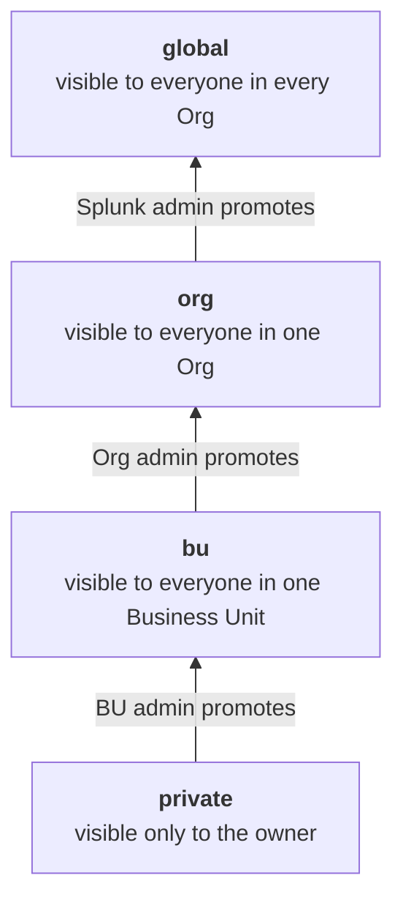
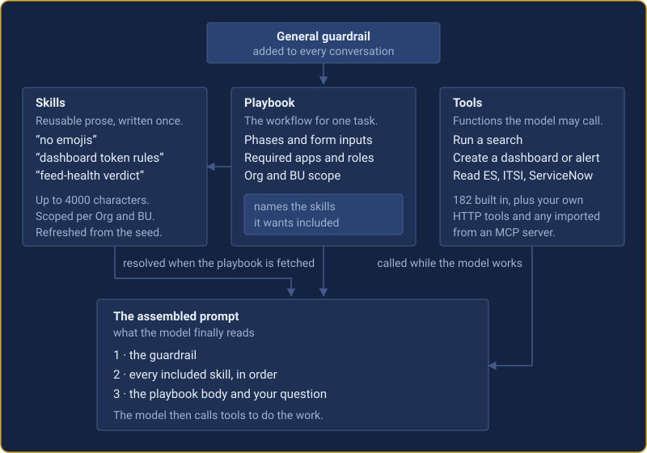

# Overview — playbooks and built-in tools

**App version:** 2.5.9
**Last updated:** 2026-09-22
**Audience:** Splunk admins, integrators and reviewers who need one flat
reference of everything that ships in the box — every playbook and every
built-in tool, with their parameters and how they are scoped per tenant.

> **This is a reference catalogue, not a tutorial.** For how playbooks and tools
> are configured, scoped per tenant or extended, see [the tool catalogue](./tool-catalogue.md),
> [the user manual](../../user/user-manual.md), [the admin manual](../admin-manual.md),
> the rights and roles reference and
> the Dashboard Studio guide.

---

## Table of contents

1. [How to read this document](#1-how-to-read-this-document)
2. [Tenancy model — Org / BU scoping](#2-tenancy-model--org--bu-scoping)
   - [2.1 What an Org and a BU are](#21-what-an-org-and-a-bu-are)
   - [2.2 Runtime tenant resolution](#22-runtime-tenant-resolution)
   - [2.3 Scoping built-in tools](#23-scoping-built-in-tools)
   - [2.4 Scoping custom + MCP tools](#24-scoping-custom--mcp-tools)
   - [2.5 Scoping use-case playbooks](#25-scoping-use-case-playbooks)
   - [2.6 Defence-in-depth](#26-defence-in-depth)
3. [Default use-case playbooks](#3-default-use-case-playbooks)
   - [3.1 Common playbook fields](#31-common-playbook-fields)
   - [3.2 Stage: `operational`](#32-stage-operational)
   - [3.3 Stage: `draft`](#33-stage-draft)
   - [3.5 Default skill catalogue (v0.9.6)](#35-default-skill-catalogue)
4. [Built-in tool catalogue](#4-built-in-tool-catalogue)
   - [4.1 How tools are advertised to the LLM](#41-how-tools-are-advertised-to-the-llm)
   - [4.2 Category: `routing`](#42-category-routing)
   - [4.3 Category: `templates`](#43-category-templates)
   - [4.4 Category: `splunk-core`](#44-category-splunk-core)
   - [4.5 Category: `search`](#45-category-search)
   - [4.6 Category: `metrics`](#46-category-metrics)
   - [4.7 Category: `knowledge-objects`](#47-category-knowledge-objects)
   - [4.8 Category: `dashboards-simplexml`](#48-category-dashboards-simplexml)
   - [4.9 Category: `dashboards-studio`](#49-category-dashboards-studio)
   - [4.10 Category: `alerts`](#410-category-alerts)
   - [4.11 Category: `visualizations`](#411-category-visualizations)
   - [4.12 Category: `ai-toolkit`](#412-category-ai-toolkit)
   - [4.13 Category: `enterprise-security`](#413-category-enterprise-security)
   - [4.14 Category: `itsi`](#414-category-itsi)
   - [4.15 Category: `trackme`](#415-category-trackme)
5. [Cross-reference indices](#5-cross-reference-indices)
   - [5.1 Playbook → tools invoked](#51-playbook--tools-invoked)
   - [5.2 Tool → playbooks that invoke it](#52-tool--playbooks-that-invoke-it)
   - [5.3 Playbook → skills included (v0.9.6)](#53-playbook--skills-included)
   - [5.4 Skill → playbooks that include it (v0.9.6)](#54-skill--playbooks-that-include-it)
6. [What ships, in numbers](#6-what-ships-in-numbers)

---

## 1. How to read this document

- **Playbooks** are seeded from
  `useCases.ts` on first
  load. Entries with `creator=system / updated_by=system / version=1`
  are auto-refreshed on app startup; once an admin edits a row it
  becomes immune to seed-refresh.
- **Tools** are declared in
  `tools.ts` as a
  `TOOL_DEFINITIONS` array. Tags + categories + short descriptions
  live in a separate `TOOL_METADATA` block and are merged in at
  module load time. Per-tool admin overrides (Tools tab → *Metadata
  override*) layer on top of those defaults from the
  `itmip_tool_overrides` KVStore collection.
- **Parameter notation in this doc** —
  `name (type, required | optional, default: X)` — followed by a
  one-line description. For enums, the allowed values are listed
  inline.
- Every built-in tool returns a structured envelope. Write-capable
  tools (tagged `write`) emit `{ok, kind, name, action, url}` so the
  "Created in Splunk" panel can render drilldown links;
  destructive-update tools are additionally tagged `gated` and refuse
  to fire until the UI's confirm-modal has run.

---

## 2. Tenancy model — Org / BU scoping

Everything in §3 (playbooks) and §4 (tools) is filtered through a
two-level multi-tenant model at advertisement time AND at execution
time. This section explains the model so the per-playbook /
per-tool entries that follow make sense.

> **Companion doc.** Read this section together with
> the rights and roles reference: this section explains
> *how* the resolver picks an Org / BU and how artefacts are scoped;
> RIGHTS_AND_ROLES is the *who-can-do-what* matrix per UI surface.

### 2.1 What an Org and a BU are

An **Organisation (Org)** is the top-level tenant; a **Business
Unit (BU)** is a sub-tenant within an Org. Neither is hardcoded —
both are KVStore-backed and resolved from Splunk role / app
patterns at runtime.

| Concept | KVStore collection | Key fields |
|---|---|---|
| Org | `itmip_organisations` | `short` (uppercase id — e.g. `ACME`, `DFLT`), `name`, `description`, `app_patterns` (glob of Splunk app ids), `role_patterns` (glob of Splunk role names) |
| BU | `itmip_business_units` | `org_short` (parent), `short` (BU id), `extra_role_patterns` (additional role globs), `extra_user_names` (explicit user grants) |

A built-in **`DFLT` / `DFLT`** pair always exists as the universal
fallback. `DFLT` Org has `role_patterns = ["admin"]` so unconfigured
admins always resolve cleanly; non-admins fall through to it with
`is_unassigned=true` flag (the UI shows a grey "no tenant" overlay
with an admin-configurable message).

### 2.2 Runtime tenant resolution

The resolver lives in
`tenancy.ts` →
`resolveTenant()` and runs a two-step waterfall:

```
Step 1 — Org match
  FOR EACH Org:
    appOk  = (Org.app_patterns matches current Splunk app id)
    roleOk = user.isAdmin OR (any Org.role_patterns matches a user role)
    IF appOk AND roleOk → Org matched, go to Step 2.

Step 2 — BU within matched Org
  FOR EACH BU in that Org (excluding DFLT):
    IF user.name IN BU.extra_user_names
       OR any BU.extra_role_patterns matches a user role
       → BU matched. Return { org_short, bu_short, … }.
  ELSE → use the Org's DFLT BU (auto-created if missing).

Fallback (no Org matched)
  → return { org_short: "DFLT", bu_short: "DFLT", is_unassigned: !isAdmin }
```

The same resolver is mirrored server-side in
`itmip_llm_tenancy.py` so the Python
dispatcher computes the caller's `(org, bu)` independently — the UI
cannot lie to the dispatcher about its identity.

### 2.3 Scoping built-in tools

Built-in tools (§4) are enabled-by-default. Admins can disable them
per `(Org, BU)` via per-row rules stored in `itmip_tool_assignments`.
The resolver is `isToolEnabled()` in
`toolAssignments.ts`.

**Precedence — most-specific-wins:**

| Rank | Match | Example use |
|---|---|---|
| 1 | `org_short == caller.org` AND `bu_short == caller.bu` | Disable `es_update_notable` for ACME / SOC-B only |
| 2 | `org_short == caller.org` AND `bu_short == "*"` | Disable `splunk_create_alert` org-wide for ACME |
| 3 | `org_short == "*"`         AND `bu_short == caller.bu` | Rare; tenant-cross BU rule |
| 4 | `org_short == "*"`         AND `bu_short == "*"`         | Global kill-switch (e.g. disable AI Toolkit tools on every tenant) |
| (none) | no rule exists for the tool | implicit `enabled = true` |

The first match in this order wins; later rules are NOT evaluated.

**Metadata overrides** (`itmip_tool_overrides`) are app-global, NOT
per-tenant — one row per `tool_name` replaces the built-in
`tags` / `categories` / `short_description` / `short_description_concise`
everywhere they're shown.

### 2.4 Scoping custom + MCP tools

Custom HTTP tools (`itmip_llm_custom_tools`) and imported MCP tools
(`itmip_mcp_tools`) use a **sharing-based** model instead of the
assignment ladder. The visibility filter is `_doc_visible_to()` in
`itmip_llm_custom_tools.py`:

| `scope_sharing` | Visible to |
|---|---|
| `private` (default) | Only callers whose `(org, bu)` exactly matches the tool's `(scope_owner_org, scope_owner_bu)`. |
| `app` | Any caller in the same Org as the tool's `scope_owner_org`, regardless of BU. |
| `global` | Every caller, every tenant. |

Admins always bypass the filter (`isAdmin → return True` early).

MCP-imported tools follow the same model AND additionally pass
through the per-(Org, BU) enable/disable ladder of §2.3 — a
double-filter so an admin can mute one imported tool for one tenant
without unimporting it for everyone.

### 2.4.5 Sharing scope ladder

Starting in 0.9.7, every playbook + every skill (+ every tool, with
field renames) carries a four-step **sharing scope ladder** stored
directly on the row:



A caller sees a `bu` row when their Org **and** Business Unit both match, and an
`org` row when their Org matches. **Administrators do not bypass `private`.**

The visibility filter switches on `sharing` first, then falls back
to the legacy `org_short` / `bu_short` derivation for pre-0.9.7 rows
(dual-read; legacy fields stay one release and are removed in 0.9.8).

**End-user-authored playbooks** always start at `sharing=private`;
the server (`splunk_create_user_template` in
`itmip_llm_user_templates.py`)
forces this regardless of what the LLM emits. Admins promote
upward via the Playbooks tab; promotion authority is per spec §1.3
of the design specification.

**Skills** can be at any scope but in practice ship at `global`
(admin-only authoring; no end-user skill flow). The visibility
filter handles `private` defensively for forward-compat.

### 2.5 Scoping use-case playbooks

Playbooks carry `org_short` + `bu_short` directly. The filter is
`filterByUserAccess()` in
`useCases.ts`:

| Playbook's `(org_short, bu_short)` | Visible to |
|---|---|
| `(DFLT, DFLT)` | Everyone (subject to role + dependent-app gates). All default playbooks ship as `DFLT / DFLT`. |
| `(ACME, DFLT)` | All callers resolved to Org `ACME`, regardless of BU. |
| `(ACME, OPS)` | Only callers resolved to Org `ACME` AND BU `OPS`. |
| Other combinations | Hidden — admins see them only via the *Show drafts / all tenants* toggle on the Playbooks tab. |

Two additional gates always apply on top of the tenant filter:

- **`required_roles`** — when set, the caller must hold at least
  one listed Splunk role. Admins bypass. Default playbooks with
  this gate today: *Build / improve an alert* and *AI Toolkit –
  Outlier ALERT + diagnostic dashboard* (require `power` or
  `admin`); *Data onboarding helper* (requires `admin`).
- **`dependent_apps`** — list of `{name, min_version}` Splunk apps
  that must be installed on the search head. Playbooks whose
  dependencies are missing are dropped from the user's list — they
  are *never* shown as broken. Used by all `AI Toolkit – *`
  (Splunk_ML_Toolkit), `ES — *` (SplunkEnterpriseSecuritySuite),
  `ITSI — *` (SA-ITOA), `TrackMe — *` (trackme + optional
  combinations).

Two playbooks are special-cased in the filter:

- `is_general=true` (only **General**) — never shown in any picker;
  silently prepended to every interaction as a guardrail.
- `is_default=true` (only **Default**) — auto-selected when the
  user submits a free-form question without picking a playbook;
  serves as a router that calls `splunk_list_use_case_templates` +
  `splunk_get_use_case_template_prompt` to dispatch to the right
  specialist playbook.

### 2.6 Defence-in-depth

Every scoping rule is enforced at **both** advertisement time AND
execution time. This protects against a streaming-LLM provider
surfacing a tool the model wasn't supposed to see, or against a
client-side bypass.

| Surface | Advertisement check | Execution check |
|---|---|---|
| Built-in tool | `listToolsForRouting()` in `tools.ts` calls `isToolEnabled()` before adding to LLM-facing list. | `executeTool()` in `tools.ts` re-calls `isToolEnabled()` before dispatching; returns `{ok: false, error: "Tool 'X' is disabled for Org=Y/BU=Z"}` on miss. |
| Custom HTTP tool | `_handle_definitions()` in `itmip_llm_custom_tools.py` calls `_doc_visible_to()` per row before emitting. | `_handle_invoke()` re-calls `_doc_visible_to()` and checks `enabled` flag; HTTP 403 on miss. |
| MCP-imported tool | Same `_doc_visible_to()` + `isToolEnabled()` ladder as above. | Same dual check. |
| Playbook | `filterByUserAccess()` in `useCases.ts` filters the list before the picker / router sees it. | `splunk_get_use_case_template_prompt` server handler in `itmip_llm_use_cases.py` re-runs the filter before returning prompt text. |

> **Audit follow-through.** Every tool invocation writes a row to
> `itmip_llm_custom_tool_calls` (custom + MCP) or to per-tool
> usage telemetry (built-in via `itmip_llm_usage_log.py`). Rows
> include `org_short` / `bu_short` so an admin can answer "what did
> tenant X run last week" with `| inputlookup`.

### Where the admin UI surfaces this

- **Tools tab → Manage** (per built-in tool row) — edit / delete
  `itmip_tool_assignments` rows.
- **Tools tab → Custom tools editor** — set `sharing`,
  `scope_owner_org`, `scope_owner_bu` on a custom tool.
- **Tools tab → MCP servers editor** — set the same scope fields
  on a registered MCP server; imported tools inherit but can be
  overridden per row.
- **Playbooks tab → Edit modal** — set `org_short`, `bu_short`,
  `required_roles`, `dependent_apps`, `status` (operational/draft)
  on a playbook row.
- **Settings → Organisations / Business units** — define new Orgs +
  BUs, edit `app_patterns` / `role_patterns`.

> **Splunk Cloud caveat.** The tenancy model itself works on Cloud
> unchanged. What differs on Cloud is what an admin can *disable*
> via per-tenant rules — e.g. the dev-mode `tls_skip_verify`
> escape hatch is force-stripped Cloud-wide regardless of tenant
> rules. See
> [the tool catalogue](./tool-catalogue.md) §"Working with PEM files".

---

## 3. Default use-case playbooks

### 3.0 Per-feature licensing tags

From v1.4.1 the licence is a **capability matrix**, not a single flat
gate: every capability has its own minimum tier. The source of truth is
`CAPABILITY_MIN_TIER` in
`itmip_llm_license_tier.py`,
resolved server-side and emitted as `capabilities` from
`GET /services/itmip_llm/license` (server-authoritative + fail-closed —
a capability the licence doesn't grant is refused even if the UI offers
it). Playbooks carry a `required_capability` and built-in tools a
`min_capability`; this doc annotates the affected groups rather than
every row. The full customer-facing matrix lives in
the licensing reference.

**Tag → capability → minimum tier (the only mappings used in this doc):**

| Tag value | Capability | Minimum tier | Applies to |
|---|---|---|---|
| `security_workflows` | Security + threat-hunting workflows | **Enterprise** | The 17 security playbooks (ES + ITSI + ATT&CK Tactic Hunt) AND every `es_*` / `itsi_*` / `sse_*` tool. |
| `in_splunk_awareness` | In-Splunk feed/context awareness *(deprecated 1.7.1 — gates nothing)* | ~~Professional~~ **All tiers** | Formerly gated every `trackme_*` feed-health tool + the `_internal`/Cribl ingestion-health checks. As of v1.7.1 these data-quality ingestion checks are available on **every tier (incl. Personal)** — the boundary is now Splunk's own role + index ACLs, not this capability. The key is kept (still emitted on `GET /itmip_llm/license`) only for back-compat. |
| `ml_generation` | ML model generation | **Professional** | The 10 ML-*training* playbooks AND `splunk_share_mltk_model_globally`. |

Everything **not** listed above stays open on every tier (Personal
included): SPL / dashboard / alert generation, BYOK + multi-LLM,
knowledge, skills, and playbook authoring. The scoring/advisory
AI-Toolkit playbooks that don't *train* a model — *Stats vs ML decision
helper*, *Ask an external LLM (`ai` command)*, *Bring your own ONNX
model*, *Score against an AWS SageMaker endpoint* — are deliberately
**open** (no `ml_generation` gate). History, tokens & costs, and backups
are Professional+ surfaces; MCP servers, custom HTTP tools, the IAM
gateway hook, and audit + governance logging are Enterprise+ surfaces —
see the licensing reference for those non-playbook/non-tool gates.

> **Note — audit logging moved to Enterprise in 1.4.1.** Through 1.3.x
> audit logging was Professional+; from 1.4.1 it sits with governance
> logging under Enterprise.

> **Note — Azure OpenAI keyless auth is Enterprise (1.8.2).** Azure OpenAI
> LLM configs can authenticate with **Microsoft Entra ID** (service-principal
> client-credentials) or **managed identity** (IMDS / App Service) instead of a
> static API key — a keyless, server-side-only path (`call_mode = splunk_proxy`
> forced; the Bearer token never reaches the browser). This keyless path is gated
> on the new **Enterprise** capability `azure_entra_auth`; **API-key Azure remains
> available on all tiers**. It adds no new tool, playbook, or skill (it is an LLM
> **provider-auth** feature). See the Azure Entra authentication guide +
> the licensing reference.

### 3.1 Common playbook fields

Every seeded playbook carries the following fields. Most are stable
across the catalogue; the value-bearing fields per playbook are
listed in the per-playbook sections below.

| Field | Meaning |
|---|---|
| `name` | Unique human-readable id; shown on the Playbooks tab tile. |
| `status` | `operational` (visible to end users) / `draft` (hidden behind the Drafts toggle) / `deleted` (tombstone). |
| `prompt_text` | The system-prompt body the LLM sees when this playbook is active. |
| `question_text` | The user-facing form prompt — the questions the UI asks before launching the LLM. |
| `short_description` | Curated one-liner used by the router and by `splunk_list_use_case_templates`. |
| `short_description_concise` | Optional condensed variant for Concise Mode (0.9.3+). |
| `style_profile` | Optional LLM-style hint: `default` / `concise` / `verbose`. |
| `categories` | Semantic groupings (e.g. `search`, `ai-toolkit`, `security-soc`). |
| `tags` | Searchable labels (e.g. `creates-objects`, `read-only`, `iterative`, `siem`). |
| `dependent_apps` | List of `{name, min_version}` apps the playbook needs (e.g. `Splunk_ML_Toolkit ≥ 5.0.0`). |
| `required_roles` | Splunk roles required to use this playbook (e.g. `["power", "admin"]`). |
| `org_short` / `bu_short` | Tenant scope; defaults to `DFLT` / `DFLT` for global visibility. |
| `is_default` | True only for the `Default` router playbook. |
| `is_general` | True only for the `General` guardrail playbook (never user-pickable). |
| `allowed_tools` / `denied_tools` / `tool_tag_filters` / `tool_category_filters` | Optional tool-scoping overrides. All default playbooks leave these empty — the dispatcher's minimum-budget routing applies. |
| `allowed_template_refs` / `denied_template_refs` / `template_tag_filters` / `template_category_filters` | Optional cross-playbook referencing controls. All default playbooks leave these empty. |

### 3.2 Stage: `operational`

These playbooks are visible to end users without enabling drafts.
Each entry below shows: header table (status, tags, short description,
inputs) followed by a **structured workflow detail** block.

#### 3.2.1 Foundation — applied automatically

| Playbook | Categories | Tags | Short description |
|---|---|---|---|
| **General** | `general` | `guardrail`, `read-only`, `splunk-cloud-safe` | Universal scope + safety guardrail silently prepended to every prompt; defines refusals, no-emoji rule, uniform-colour palette and base-search dashboard rules. |
| **Default** | `general` | `router`, `read-only`, `splunk-cloud-safe` | Router fallback used when the user did not pre-select a playbook; lists playbooks and dispatches the user's free-form question to the best match. |

The `General` playbook is never user-pickable (`is_general=true`) —
it is silently composed onto every interaction. `Default`
(`is_default=true`) handles the no-playbook case by listing
available playbooks and routing the user's question.

##### General — workflow detail

- **Intent:** Universal scope guardrail + safety framework silently prepended to every prompt.
- **Workflow phases:** (1) define scope: Splunk Enterprise / Cloud + AI Toolkit only; (2) enumerate refusals (out-of-scope, sexual / violence / discrimination, legal / medical / financial advice, credential extraction, jailbreaks); (3) enforce safety rules (no SPL exfiltration, no audit-disabling configs, explicit auth before destructive changes); (4) state style expectations (plain-language explanations, persist outcomes as clickable Splunk objects); (5) define universal dashboard rules (uniform colour semantics, base-search pattern, **no emojis / icons anywhere**, HTML only inside `<panel><html>`, dual-axis when value ranges differ ≥ 10×).
- **Tools invoked:** none (guardrail).
- **Output artifacts:** none — silently prepended.
- **Output style:** refusals must include one Splunk-related alternative; no-emoji rule explains *why* (URL routing fails, lookups fail, email rendering breaks, XML clips unpredictably).

##### Default — workflow detail

- **Intent:** Route a free-form user question to the right specialist playbook by intent-matching against `short_description`s.
- **Workflow phases:** (1) `splunk_list_use_case_templates` (already role / Org / BU / dependent-app filtered); (2) parse the user's question for intent signals; (3) match to playbook `short_description`, preferring the most specific fit; (4) `splunk_get_use_case_template_prompt` for the chosen playbook; (5) apply that playbook's logic, briefly justifying the choice ("I picked *Build a SPL search* because …").
- **Tools invoked:** `splunk_list_use_case_templates`, `splunk_get_use_case_template_prompt`.
- **Output artifacts:** none directly — handed off to chosen playbook.
- **Output style:** one-line playbook-choice justification before delegating.

#### 3.2.2 Search authoring

| Playbook | Tags | Short description | Question-text inputs |
|---|---|---|---|
| **Build a SPL search** | `creates-objects`, `saved-search-output`, `spl`, `iterative`, `splunk-cloud-safe` | Author a NEW optimised SPL search from intent, validate it via a test run, then persist it as a named saved search. | saved-search name • intent • indexes • sourcetype / source / host • time range • fields • aggregation • output shape • performance notes |
| **Improve an existing SPL** | `modifies-objects`, `saved-search-output`, `spl`, `iterative`, `splunk-cloud-safe`, `audit` | Refactor an existing SPL for speed / correctness / readability, benchmark before-and-after, then save as new or overwrite the original. | existing saved-search name • SPL to improve • problem (slow / wrong / unreadable / migration) • save strategy • time range • data-model acceptability • preservation requirements |

##### Build a SPL search — workflow detail

- **Workflow phases:** (1) clarify intent via numbered Qs if index / time-range / output / save-name is ambiguous; (2) ground via `splunk_list_indexes` + `splunk_list_saved_searches` + `splunk_get_version` (real names, no invention); (3) optimise SPL — explicit `index`+`earliest`/`latest` first, `tstats` over accelerated DMs, filters before transforms, `fields` early, prefer `eval` / `where` over `regex`, prefer `stats`/`timechart` over `transaction`; (4) validate via `splunk_run_search` (–15m → now); (5) name-conflict check via `splunk_list_saved_searches`, ask user on collision; (6) persist via `splunk_create_saved_search` (auto-validates); (7) self-correct on `validation.ok=false`, max 3 attempts; (8) deliver SPL in ```` ```spl ```` block + one-line explanation + perf-choice justification + clickable link.
- **Tools invoked:** `splunk_list_indexes`, `splunk_list_saved_searches`, `splunk_list_lookups`, `splunk_get_version`, `splunk_run_search`, `splunk_create_saved_search`.
- **Output artifacts:** 1 saved search (persistent).
- **Output style:** never deliver failing SPL; never persist without `validation.ok=true`; perf-choice justification mandatory.

##### Improve an existing SPL — workflow detail

- **Workflow phases:** (1) analyse user SPL line-by-line — perf issues (`index=*`, no time range, early transforms, `transaction`, fat sub-search), correctness (wrong field names, broken eval, time math), readability; (2) ground via `splunk_list_indexes` + `splunk_list_saved_searches` + `splunk_list_lookups`; (3) benchmark original via `splunk_run_search` (-5m → now, count=10), note errors / behaviour; (4) rewrite with optimisation priorities (explicit `index` / time, `tstats`, filter-before-transform, `fields` early, `transaction` → `stats values()` / `range()`); (5) validate rewrite via `splunk_run_search`, max 3 retries; (6) ask user: save-as-new (with name) OR overwrite; (7) on collision ask user; (8) persist via `splunk_create_saved_search` OR `splunk_update_saved_search` (gated); (9) self-correct on errors, max 3 attempts; (10) deliver improved SPL + bullet list of EVERY change + expected impact + anything intentionally untouched + clickable link.
- **Tools invoked:** `splunk_list_indexes`, `splunk_list_saved_searches`, `splunk_list_lookups`, `splunk_run_search`, `splunk_create_saved_search`, `splunk_update_saved_search`.
- **Output artifacts:** 1 saved search (new or updated in place).
- **Output style:** change justifications mandatory; before/after perf comparison implied; never overwrite without explicit user confirmation.

#### 3.2.3 Dashboard authoring (Simple XML)

| Playbook | Tags | Short description | Question-text inputs |
|---|---|---|---|
| **Build a Simple XML dashboard** | `creates-objects`, `dashboard-output`, `dashboard-xml`, `spl`, `iterative`, `splunk-cloud-safe` | Generate a complete Simple XML dashboard (tokens, inputs, panels, dual-axis rules) and self-correct via panel-data validation until it renders clean. | dashboard name • description • primary indexes • time picker (yes/no) • default range • form inputs • panels (free-form) • visualization preferences • drilldown / refresh |
| **Improve a Simple XML dashboard** | `modifies-objects`, `dashboard-output`, `dashboard-xml`, `spl`, `iterative`, `splunk-cloud-safe`, `audit` | Diagnose anti-patterns in pasted Simple XML (missing inputs, slow SPL, bad viz choices) and apply a validated rewrite to the existing dashboard. | dashboard name • problem (performance / errors / layout / inputs / migration) • existing XML (pasted) • preservation requirements |
| **ATT&CK Tactic Hunt — Technique Coverage Dashboard** *(v1.4.0; requires Splunk Security Essentials)* | `creates-objects`, `dashboard-output`, `dashboard-xml`, `spl`, `iterative`, `splunk-cloud-safe`, `soc`, `siem`, `mitre`, `threat-hunting`, `coverage-gap` | For a chosen MITRE ATT&CK tactic + techniques over a data source, ground detection logic in Splunk Security Essentials and build one Simple XML dashboard with a per-technique evidence panel, a technique rollup and a combined timeline. No green zeros (zero-evidence tiles are neutral, never green); fixed-window demo datasets are time-re-anchored to the data's active period. Categories `security-soc`, `dashboards`. | hunt / dashboard name (blank → auto-named `*_aiworkbench`) • tactic (id/name) • techniques (CSV ids, blank = propose from SSE) • primary index • sourcetype (opt) • time picker • default range • theme (dark/light) • zero-evidence policy (ask / broaden / drop / show-neutral) • zero-tile colour (neutral / grey / red) |

> Dashboard Studio (JSON) ships as `draft` — see [§3.3.1](#331-dashboard-studio).

##### Build a Simple XML dashboard — workflow detail

- **Workflow phases:** (1) clarify name (lowercase_with_underscores, unique), ≥1 panel, time-picker behaviour, critical inputs; (2) ground via `splunk_get_version` + `splunk_list_indexes` + `splunk_list_saved_searches` + `splunk_list_visualizations` EARLY (custom-viz fit?); (3) structure `<dashboard version="1.1">` with `<label>`, `<description>`, time-picker `<input>` + `<default>`, per-panel form inputs (each `$token$` MUST have matching `<input token="…">`), panels with `<search>` + `<earliest>$tok.earliest$</earliest>` / `<latest>$tok.latest$</latest>`, layout KPIs → trend → breakdowns → details, SPL optimised; (4) token discipline strict (validator fails on orphan tokens); (5) **no emojis / icons anywhere** (plain ASCII in `<label>`, `<description>`, `<title>`, `<option>`, `<html>`, view name); (6) HTML lives **only** in `<panel><html>…</html>` — `<label>` / `<description>` / panel `<title>` are plain text; (7) dual-axis when value ranges differ ≥ ~10× via `charting.chart.overlayFields` + `charting.axisY2.enabled=true` + `axisTitleY.text` + `axisTitleY2.text`; (8) name-check via `splunk_get_dashboard_xml`, ask user on collision; (9) create via `splunk_create_dashboard_xml` (auto-validates); (10) self-correct via `splunk_update_dashboard_xml` if `validation.ok=false`, max 3 attempts; (11) **render check mandatory** via `splunk_get_dashboard_panel_data` — `response.ok=true` is the success gate, not just `validation.ok`; max 3 combined fix attempts; (12) deliver plain-language summary + links + "what to look at" guide.
- **v1.4.0 — now builder-driven.** This playbook sets `tool_category_filters: ["dashboards-simplexml"]` and drives the `splunk_xml_*` builder instead of hand-writing XML: `splunk_xml_create` → `splunk_xml_add_input` (time first; ISO/relative defaults) → `splunk_xml_add_panel` once per panel (RAW SPL; `full_width`/`row` for the evidence-side-by-side layout) → `splunk_xml_publish` (orphan-token gate + the same guardrails as `splunk_create_dashboard_xml`) → render-check via `splunk_get_dashboard_panel_data`, self-correct with `splunk_xml_update_panel`. No raw XML, no truncation, no manual escaping.
- **Tools invoked:** `splunk_get_version`, `splunk_list_indexes`, `splunk_list_saved_searches`, `splunk_list_visualizations`, `splunk_route_tools`, `splunk_xml_create`, `splunk_xml_add_input`, `splunk_xml_add_panel`, `splunk_xml_update_panel`, `splunk_xml_preview`, `splunk_xml_publish`, `splunk_get_dashboard_panel_data` (hand-written `splunk_create_dashboard_xml` / `splunk_update_dashboard_xml` remain for trivial 1–2 panel dashboards).
- **Output artifacts:** 1 Simple XML dashboard (persistent).
- **Output style:** token discipline critical (orphan = validation fail); dual-axis use stated in response; render-check errors actionable and must be fixed.

##### Improve a Simple XML dashboard — workflow detail

- **Workflow phases:** (1) parse pasted XML for anti-patterns (missing / mismatched tokens, missing `version="1.1"`, `index=*`, no time range, early transforms, unused tokens, dead inputs, layout issues, viz mismatches); (2) ground via `splunk_get_version` + `splunk_list_indexes` + `splunk_list_lookups` + `splunk_list_visualizations`; (3) refuse if user gave name only — must paste XML; (4) rewrite keeping original structure, changing only what fixes a real problem; (5) apply via `splunk_update_dashboard_xml` (auto-validates, gated); (6) self-correct, max 3 attempts; (7) deliver: what was wrong, what changed, expected impact, what was intentionally left alone.
- **Tools invoked:** `splunk_get_version`, `splunk_list_indexes`, `splunk_list_lookups`, `splunk_list_visualizations`, `splunk_update_dashboard_xml`.
- **Output artifacts:** 1 Simple XML dashboard (updated in place).
- **Output style:** change justifications mandatory; `validation.ok=true` is success gate.

##### ATT&CK Tactic Hunt — Technique Coverage Dashboard — workflow detail

- **Per-feature licensing (v1.4.1):** carries `required_capability = security_workflows` → **requires `security_workflows` (Enterprise)** (the 17th security playbook; its `sse_*` tools are gated to the same capability). See §3.0 + the licensing reference.
- **Hard dependency:** Splunk Security Essentials (`Splunk_Security_Essentials`). Advertised only when SSE is installed/visible; phase 1 also calls `sse_check_prerequisites` and STOPS if `ready=false`. The tactic, techniques, index and sourcetype are **parameters** — nothing is hard-coded to a specific tactic / technique / dataset.
- **Workflow phases:** (1) prerequisite gate (`splunk_get_version` + `sse_check_prerequisites`); (2) resolve tactic + techniques (use `hunt_techniques`, or propose from `sse_list_content(mitre_tactic=…, has_search=true)` when blank); (3) ground each technique in SSE (`sse_list_content(mitre_technique=…)` → `sse_get_detection(include_json=true)` for the REAL detection SPL + lineage); (4) ground the data source (`splunk_list_indexes` + a `splunk_run_search` field probe; adapt datamodel SPL to a raw-`rex` form when the datamodel isn't populated); (5) time window via the **`demo-dataset-time-reanchor`** skill (existence-check `demo_dataset_windows`, re-anchor only on a positive index match, else honour `hunt_default_range`); (6) per-technique evidence + zero-evidence handling via the **`hunt-evidence-honesty`** skill (run the search for the hit count BEFORE building the tile; never a green zero — apply `hunt_zero_evidence`: broaden / drop / show-neutral / ask); (7) fan-out fidelity check for network-service-discovery techniques (T1046 — distinct-port/dest fan-out, exclude updater/browser noise); (8) process-discovery broadening (T1057 / T1518 — match the process-enumeration tooling family via `rex`); (9) build the Simple XML dashboard with the **`splunk_xml_*` builder** (route-unlock `dashboards-simplexml`; `splunk_xml_create` → `add_input` → `add_panel` × N → `publish`) — KPI row with per-technique tiles, one evidence panel per technique citing its SSE card, technique rollup, combined timeline, raw audit table, `| head 50` row-caps, `full_width` for the header/rollup/timeline; (10) static html intro panel (`add_panel viz="html"`); (11) validate + mandatory render-check (`splunk_xml_publish` → `splunk_get_dashboard_panel_data`, `response.ok=true` is the gate, `splunk_xml_update_panel` + re-publish to fix, max 3 attempts). Shape/escaping/HTML-placement/dual-axis basics come from the `dashboard-xml-discipline` skill, not this playbook.
- **Tools invoked:** `splunk_get_version`, `sse_check_prerequisites`, `sse_list_content`, `sse_get_detection`, `splunk_route_knowledge`, `splunk_search_knowledge`, `splunk_get_knowledge_entry` *(consults the knowledge layer for the sourcetype's field-extraction recipe — e.g. the `sysmon-xmlwineventlog-spath-extraction` static rule)*, `splunk_list_indexes`, `splunk_list_lookups`, `splunk_get_lookup_sample`, `splunk_run_search`, `splunk_list_visualizations`, `splunk_get_dashboard_xml`, `splunk_create_dashboard_xml`, `splunk_update_dashboard_xml`, `splunk_get_dashboard_panel_data`.
- **Output artifacts:** 1 Simple XML coverage dashboard (persistent), with per-technique SSE lineage citations.
- **Output style:** evidence-backed (counts quoted, no fabrication); uniform colour semantics (red == bad, never green for a zero); re-anchoring narrated as a feature when it fires.
- **Naming:** uses the caller's hunt name verbatim; when blank, proposes a `*_aiworkbench` view name (not the AI Toolkit `*_aiworkbench` convention) and confirms before creating.
- **Time-default guard (general, all Simple XML):** `validateDashboardXml` now REJECTS two locale/binding traps in an `<input type="time"><default>`: (a) a **slashed-date** literal (`08/20/2018:00:00:00`) — Splunk's time parser rejects MM/DD/YYYY (and DD/MM/YYYY) in non-US locales (en-GB etc.), so the picker shows "Invalid Value" and panels error "Invalid earliest_time"; (b) a **bare epoch** integer (`1534723200`) — renders in the picker but does NOT bind to `$tok.earliest$`/`$tok.latest$`, so panels silently return "No results" while "Open in Search" works. Locale-proof forms: **ISO 8601** (`2018-08-20T00:00:00`), relative (`-24h@h`), or `0` (all-time). Verified against `/services/search/timeparser`.
- **Skills:** `dashboard-xml-discipline` • `dashboard-xml-validation-loop` • `viz-best-fit` • `spl-perf-priorities` • `spl-validation-loop` • `metric-vs-event-index-aware` • `naming-collision-handling` • `read-only-by-default-soc` *(ES-gated — drops gracefully without ES; its read-only intent is also covered by `general-output-style` + `hunt-evidence-honesty`)* • `consult-security-knowledge-first` *(drives route → search → fetch so the sourcetype's extraction recipe + any SSE lineage come from the knowledge layer, not re-derivation)* • `hunt-evidence-honesty` • `demo-dataset-time-reanchor` • `feed-health-verdict` *(opt — drops when TrackMe absent)*.
- **Knowledge layer:** the data-source extraction recipe is NOT baked into the prompt — it lives in the reusable `sysmon-xmlwineventlog-spath-extraction` static rule (`itmip_knowledge_static_rules`), which fires on any `XmlWinEventLog:*` / `Microsoft-Windows-Sysmon` / `WinEventLog` SPL and is consulted via `consult-security-knowledge-first`. The playbook keeps only a slim deterministic fallback (use `spath`, don't probe field-by-field) so it degrades gracefully if the model skips the consult.

#### 3.2.4 Alerts & reports

| Playbook | Tags | Short description | Question-text inputs |
|---|---|---|---|
| **Build / improve an alert** | `creates-objects`, `alert-output`, `dashboard-output`, `spl`, `iterative`, `splunk-cloud-safe`, `requires-power-user` | Design a scheduled alert (cron, throttle, severity, email) AND ship a companion diagnostic dashboard so on-call has one click from email to investigation. Requires `power` or `admin` role. | alert name • dashboard name • trigger condition • evaluation cadence (cron) • time window • severity • email • throttle period • indexes / sources / sourcetypes |
| **Build / improve a report** | `creates-objects`, `report-output`, `spl`, `single-pass`, `splunk-cloud-safe` | Produce SPL plus a savedsearches.conf stanza for a Splunk report (`is_visible=1`) with schedule, visualization choice and sharing scope. | report name • question answered • audience • visualization • schedule (one-off / hourly / daily / weekly / monthly) • time range • indexes / sourcetypes • sharing scope |

##### Build / improve an alert — workflow detail

- **Workflow phases:** (1) clarify trigger condition, cron, evaluation window, severity, email, throttle window, indexes / sourcetypes; (2) ground via `splunk_get_version` + `splunk_list_indexes` + `splunk_list_saved_searches`; (3) design SPL ending in a transforming command (`stats` / `eval` / `where`) so the result is "trigger rows only" (`>0 rows = alert fires`); (4) name-check alert (`<thing>_alert`) AND companion dashboard (`<thing>_dashboard`); (5) **create companion dashboard FIRST** via `splunk_create_dashboard_xml` — required panels: time picker (default -24h), KPI single (trigger-row count in window), timechart over time, detail table of recent trigger rows, static `<html>` panel explaining when the alert fires and how to investigate; (6) create alert via `splunk_create_alert` with cron / dispatch.earliest / dispatch.latest / `alert_condition="number of events"` / threshold / severity / suppress / email / description (must embed dashboard link `See dashboard: /<locale>/app/<app>/<dashboard_name>`); (7) self-correct (auto-validation), max 3 attempts per object; (8) deliver plain-language summary + links + throttle / severity reasoning.
- **Tools invoked:** `splunk_get_version`, `splunk_list_indexes`, `splunk_list_saved_searches`, `splunk_list_visualizations`, `splunk_get_visualization_docs`, `splunk_create_dashboard_xml`, `splunk_create_alert`.
- **Output artifacts:** 1 alert + 1 companion diagnostic dashboard (alert never ships alone).
- **Output style:** dashboard mandatory; alert description embeds dashboard link; `splunk_get_dashboard_panel_data` recommended post-create.

##### Build / improve a report — workflow detail

- **Workflow phases:** (1) clarify scheduled vs ad-hoc, output (table / chart), drilldown, sharing scope, audience; (2) design SPL with same optimisation priorities as *Build a SPL search*; (3) propose `savedsearches.conf` config (`dispatch.earliest_time`, `dispatch.latest_time`, `cron_schedule`, `is_visible=1`, `displayview` / `vsid`, `acl`); (4) deliver SPL in ```` ```spl ```` block + conf stanza in ```` ```ini ```` block + viz recommendation.
- **Tools invoked:** none — recommend-only (write tool not wired in this playbook).
- **Output artifacts:** read-only — SPL + conf for user to apply manually.
- **Output style:** single-pass.

#### 3.2.5 Knowledge objects

| Playbook | Tags | Short description | Question-text inputs |
|---|---|---|---|
| **Build / improve a lookup** | `creates-objects`, `lookup-output`, `single-pass`, `splunk-cloud-safe` | Design a CSV or KVStore lookup — schema, sample rows, lookups.conf / transforms.conf, optional automatic-lookup wiring — ready for manual upload. | lookup name • type (CSV / KVStore) • purpose • fields (`name\|type\|sample`) • match key • auto-apply (yes/no) • sourcetypes • case sensitivity |
| **Build / improve a field extraction** | `creates-objects`, `extraction-output`, `single-pass`, `splunk-cloud-safe` | Author a tight regex field extraction from a sample event, validate captures via `rex`, and emit props.conf / transforms.conf stanzas. | sourcetype • sample raw event(s) • fields to extract • search-time vs index-time • existing extractions to preserve |

##### Build / improve a lookup — workflow detail

- **Workflow phases:** (1) clarify type (CSV vs KVStore), fields + types, match keys, automatic vs manual, case sensitivity; (2) design schema (name / type / sample), 5–20 sample rows, `collections.conf` (KVStore) / `lookups.conf` / `transforms.conf` stanzas, optional automatic lookup via `props.conf` `LOOKUP-…`; (3) deliver schema table + sample data + conf stanzas + usage-example SPL.
- **Tools invoked:** none — recommend-only.
- **Output artifacts:** read-only — config for manual application.
- **Output style:** single-pass.

##### Build / improve a field extraction — workflow detail

- **Workflow phases:** (1) clarify type (regex / delimited / structured), source (sourcetype / source / host), search-time vs index-time, fields to extract; (2) design — user MUST paste sample raw event(s); anchor strings (stable text around value); tight regex (no `.*`, prefer non-greedy); named capture groups per field; (3) validate via `splunk_run_search` with `… | head 5 | rex "<regex>" | table _raw, <fields>`, confirm captures, max 3 retries; (4) deliver `props.conf` (`REPORT-…`) + `transforms.conf` (`REGEX = …`, `FORMAT = …`) + test SPL + note about restart / refresh.
- **Tools invoked:** `splunk_run_search`.
- **Output artifacts:** read-only — conf stanzas + test SPL.
- **Output style:** regex validation mandatory; stanzas in ```` ```ini ```` blocks.

#### 3.2.6 Data onboarding

| Playbook | Tags | Short description | Question-text inputs |
|---|---|---|---|
| **Data onboarding helper** | `creates-objects`, `single-pass`, `splunk-cloud-safe`, `onboarding`, `requires-admin` | Guide a Splunk admin through bringing a new source online: inputs.conf, props.conf timestamp / line-merge tuning, sizing, and verification SPL. Requires `admin` role. | source description • where from (file / syslog / HEC / modular / forwarder / API) • format (JSON / CSV / syslog / key=value / unstructured) • sample events • volume • destination index • sourcetype • retention • PII / sensitive fields |
| **Data Source Onboarding (full)** *(new in 1.5.0-dev)* | `creates-objects`, `package-output`, `onboarding`, `data-onboarding`; **`required_capability = data_onboarding` (Professional+)** | Turn a raw sample into a **deployment-ready 4-app config package** (a downloadable `.tar.gz`) via `splunk_generate_conf_package` — drafts the four apps, **validates every props/transforms stanza against the real `.conf.spec`** and computes a **0–100 Data Quality Score** (iterate if < 90), then delivers a download + the score + per-app summary + verification SPL. For an already-arriving feed it also runs `splunk_check_ingest_health` (the `data-onboarding-readiness` skill) to report any ingestion/parse errors. The recommend-only "Data onboarding helper" is kept alongside it. | sample raw events (required) • sourcetype • destination index • input type (file / syslog / HEC / modular / forwarder / API) • format • expected volume • CIM model intent • forwarder host pattern(s) • retention • PII / sensitive fields |

##### Data onboarding helper — workflow detail

- **Workflow phases:** (1) clarify source type (file / TCP / UDP / HEC / modular / forwarder), volume (eps, GB/day), format (JSON / CSV / syslog / unstructured), destination index, sourcetype; (2) design `inputs.conf` stanza (path, sourcetype, index, monitor settings), `props.conf` stanza (`LINE_BREAKER`, `SHOULD_LINEMERGE`, `TIME_PREFIX`, `TIME_FORMAT`, `TRUNCATE`, `MAX_TIMESTAMP_LOOKAHEAD`, `KV_MODE`), optional `transforms.conf` (filtering / routing / sourcetyping), index sizing recommendation; (3) validate timestamp / parse settings against the sample event the user pastes; (4) deliver stanzas grouped by file in ```` ```ini ```` blocks + sizing recommendation + verification SPL + common gotchas per source type.
- **Includes skills (1.5.0-dev):** `data-onboarding-readiness` (if the feed already exists, call `splunk_check_ingest_health` and report the ingestion/parse verdict — correctness ≠ freshness) + `feed-health-verdict`.
- **Tools invoked:** none for the config-recommendation path (apply not wired); `splunk_check_ingest_health` *(opt — via `data-onboarding-readiness`, when licensed and the sourcetype is already arriving)*.
- **Output artifacts:** read-only — conf stanzas + verification SPL.

##### Data Source Onboarding (full) — workflow detail *(new in 1.5.0-dev)*

- **Includes skills:** `conf-package-discipline` (4-app layout, index-time vs search-time split, Magic-8 self-check, no-hallucinated-attribute grounding) + **`magic-8-compliance`** *(1.5.0-dev — validate every stanza against the real `.conf.spec`, then score; iterate if < 90)* + `data-onboarding-readiness` (correctness ≠ freshness — verify the feed actually parses) + `naming-collision-handling`.
- **Workflow phases:** (1) GATHER — confirm the raw sample (required), target sourcetype/index, input type, volume, optional CIM intent and host-whitelist patterns; (2) ANALYSE the sample (single- vs multi-line, timestamp location/format, data shape, candidate fields); (3) EXISTENCE / COLLISION check (read-only) via `splunk_list_indexes` + a `splunk_run_search` probe; (4) DRAFT the four apps per `conf-package-discipline` (index-time on the indexer app, search-time on the search app) — **grounding attribute names in the knowledge layer** (route → search → fetch the `conf-spec` / `cim-data-models` connectors, which read the running install's authoritative `.conf.spec` + installed CIM); (5) **VALIDATE + SCORE** *(1.5.0-dev, per `magic-8-compliance`)* — run `splunk_validate_props_conf` + `splunk_validate_transforms_conf` on the drafted stanza bodies, FIX every `unknown_attribute` error, then `splunk_compute_data_quality_score(mode="generated", …)`; if the score is < 90, iterate the lowest dimensions, re-validate, re-score (max ~3 rounds); (6) GENERATE via `splunk_generate_conf_package(sourcetype, apps={…})`; (7) DELIVER — **lead with the Data Quality Score + letter grade and the per-dimension breakdown** (the procurement artifact), then the Download button under "Created in Splunk" (link ~1 hour) + one-line-per-app "what/where it deploys" summary + the Magic-8 status + sizing/retention note + verification SPL (`index=<idx> sourcetype=<st> | head 5`, then confirm `_time` parsed + fields extracted, and `splunk_check_ingest_health` is clean post-deploy). When the source is **already arriving** (re-onboarding / tuning an existing feed), `data-onboarding-readiness` runs `splunk_check_ingest_health` to read `index=_internal` for that sourcetype's ingestion/parse errors (as the system user) and report the verdict.
- **Tools invoked:** `splunk_generate_conf_package`, `splunk_validate_props_conf`, `splunk_validate_transforms_conf`, `splunk_compute_data_quality_score`, `splunk_check_ingest_health`, `splunk_run_search`, `splunk_list_indexes`.
- **Output artifacts:** a downloadable 4-app config package (`.tar.gz`; staged in `itmip_ai_artifact_packages`, not persisted into Splunk's knowledge layer) + a Data Quality Score + drafted stanzas shown in chat.
- **Licensing / graceful degrade:** `required_capability = data_onboarding` (Professional+). Below Professional the generate + validate/score tools refuse with a clear license message (403); the playbook still hands over the drafted stanzas in chat so the work isn't lost. On Splunk Cloud the validators degrade gracefully (`spec_available=false`) — the `.conf.spec` files aren't readable there.
- **Output style:** single-pass (with a bounded validate/score iteration); Data Quality Score leads the delivery; per-source-type gotcha section mandatory.

#### 3.2.7 Visualisation, correlation, enrichment

| Playbook | Tags | Short description | Question-text inputs |
|---|---|---|---|
| **Data visualization helper** | `read-only`, `spl`, `single-pass`, `splunk-cloud-safe` | Recommend the right chart type for a given question / data-shape and emit SPL that produces the exact row shape the chart needs. | question • index / sourcetype / key fields • time dimension • categorical dimensions • numerical metric • audience • where shown |
| **Data correlation helper** | `read-only`, `spl`, `single-pass`, `splunk-cloud-safe` | Design a multi-source correlation SPL (stats-by, streamstats, baseline + stdev) across data sets joined on a pivot entity, with performance reasoning. | correlation goal • source 1/2/3 (`index=`, `sourcetype=`, key field) • correlation key • time window • threshold • output (alert / dashboard / report) |
| **Data enrichment helper** | `creates-objects`, `lookup-output`, `extraction-output`, `single-pass`, `splunk-cloud-safe` | Pick the right enrichment strategy (iplocation, KVStore TI, CSV business-context, eval-derived) and emit configs plus example SPL. | field to enrich • source events • enrichment type (geoIP / TI / business / derived) • enrichment data source • auto-apply • sourcetypes • refresh frequency |

##### Data visualization helper — workflow detail

- **Workflow phases:** (1) clarify question, data shape (categorical vs continuous, time-series vs not, single-value vs distribution), audience; (2) pick chart type per intent — "how many?" → single value / KPI; "over time?" → `timechart` (line / area); "breakdown?" → bar (stacked / grouped), pie only if ≤ 5 slices; "X vs Y?" → scatter / heatmap; "where?" → choropleth / cluster; "which has most?" → top-N table / horizontal bar; (3) design SPL producing the exact row shape the chosen chart needs; (4) deliver chart-type + reasoning + SPL + style notes (colourblind-safe palette, label rotation, legend placement) + drilldown suggestions.
- **Tools invoked:** none — recommend-only.
- **Output artifacts:** read-only.
- **Output style:** single-pass.

##### Data correlation helper — workflow detail

- **Workflow phases:** (1) clarify entity being correlated, sources involved, time window, output target (alert / dashboard / report); (2) pick strategy — 2 sources joining on a key → `stats by <key>` with eval flags; sequence-of-events → `streamstats` (avoid `transaction`); pattern-of-events → `union | stats … eval count_by_source`; anomaly vs baseline → `eventstats`/`stats` to compute mean+stdev then `where current > N*stdev`; (3) write SPL favouring `stats values()` / `range()` over `transaction`; (4) validate via `splunk_run_search` on small window, max 3 retries; (5) deliver SPL + performance reasoning + tunables (window, thresholds).
- **Tools invoked:** `splunk_run_search`.
- **Output artifacts:** read-only — correlation SPL + notes.
- **Output style:** single-pass; strategy justified.

##### Data enrichment helper — workflow detail

- **Workflow phases:** (1) clarify input field, desired enrichment, where it applies (search-time vs index-time, automatic vs manual); (2) pick strategy — geoIP / ASN → `iplocation` (built-in) or lookup file; TI → KVStore lookup with TTL refresh; business context → CSV lookup; derived fields → eval calculated field in `props.conf` or per-search; (3) design config + SPL: `lookups.conf` / `transforms.conf` if lookup; `props.conf` if automatic; example SPL showing enrichment in action; (4) validate via `splunk_run_search`; (5) deliver stanzas + verification SPL.
- **Tools invoked:** `splunk_run_search`.
- **Output artifacts:** read-only — enrichment config + verification SPL.
- **Output style:** single-pass; strategy chosen upfront.

#### 3.2.8a Authoring family

Two new system playbooks let end users author their own private
playbooks via natural language. Both ship at `sharing=global`,
`creator=system`, and are visible to every user (unless an admin
disables end-user authoring per Org via the deferred
`itmip_authoring_policies` collection).

| Playbook | Tags | Short description | Question-text inputs |
|---|---|---|---|
| **Create user playbook** | `creates-objects`, `playbook-output`, `iterative`, `splunk-cloud-safe`, `llm-mediated-authoring` | Describe a use case in plain English; the LLM creates a private playbook you own and can refine later. | what should this do • inputs to ask • create / recommend-only • (optional) closest existing playbook |
| **Update user playbook** | `modifies-objects`, `playbook-output`, `iterative`, `splunk-cloud-safe`, `llm-mediated-authoring` | Refine a private playbook you own — change inputs, add or remove skills, adjust the workflow. | playbook name • what should change |

##### Create user playbook — workflow detail

- **Workflow phases:** (1) parse the user's description for use-case category + artifact type; (2) fetch the closest existing playbook via `splunk_get_use_case_template_prompt` for structural reference; (3) call `splunk_list_skills` + `splunk_get_skill` to pick the right cross-cutting skills (never inline skill content); (4) compose body + question_text + includes_skills; (5) apply the `prompt-injection-defense-on-authored-content` skill — refuse scope-escalation / owner-spoof / skill-back-door / guardrail-bypass / role-elevation / system-impersonation patterns; (6) call `splunk_create_user_template` — the server enforces `sharing=private`, `owner_user=<caller>`, `required_roles=[]`, `dependent_apps=[]`, `is_default=false`, `is_general=false`, and runs the validation chain (field shapes, ASCII-only, skill-reference visibility, forbidden-content scan, quota, name-uniqueness with auto-suffix); (7) self-correct on `{ok:false, errors:[]}` envelope, max 3 attempts; (8) deliver a conversational summary including which skills were included and why.
- **Tools invoked:** `splunk_list_use_case_templates`, `splunk_get_use_case_template_prompt`, `splunk_list_skills`, `splunk_get_skill`, `splunk_route_tools` (for tool discovery), `splunk_create_user_template`.
- **Output artifacts:** 1 private playbook (persisted in `itmip_ai_use_cases` with `sharing=private`, `owner_user=<caller>`).
- **Output style:** conversational; never repeats forbidden text verbatim into the persisted body; surfaces refusals plainly when the user's description includes them.

##### Update user playbook — workflow detail

- **Workflow phases:** (1) `splunk_get_use_case_template_prompt(name=<target>)` — the server refuses if `sharing != 'private'` OR `owner_user != caller`; (2) parse the change request against current state; (3) apply the same injection-defense skill — refuse scope changes, owner changes, admin-only skill includes; (4) compose a minimal patch; (5) call `splunk_update_user_template(name, patch)` — server independently re-checks ownership, forbidden fields, references, content; (6) self-correct on `{ok:false, errors:[]}`, max 3 attempts; (7) deliver a diff narrative ("I changed X, kept Y, refused Z").
- **Tools invoked:** `splunk_get_use_case_template_prompt`, `splunk_list_skills`, `splunk_get_skill`, `splunk_route_tools`, `splunk_update_user_template`.
- **Output artifacts:** 1 updated playbook (in place, sharing / owner_user preserved by server).
- **Output style:** diff narrative — never silently changes things the user didn't ask for.

#### 3.2.8 AI Toolkit family

All AI Toolkit playbooks declare `dependent_apps =
[{name: "Splunk_ML_Toolkit", min_version: "5.0.0"}]` and the
category `ai-toolkit`. They are dropped silently for users in tenants
where MLTK is not installed.

> **Per-feature licensing (v1.4.1).** The **10 ML-*training* playbooks**
> below carry `required_capability = ml_generation` → **requires
> `ml_generation` (Professional)**: *Smart outlier detection (single
> metric)*, *Multi-field anomaly detection*, *Smart forecasting*, *CDTSM
> Smart Forecasting*, *CDTSM Anomaly Detection*, *CDTSM Predictive
> Alerting*, *Smart clustering*, *Smart prediction (categorical or
> numeric)*, *Outlier ALERT + diagnostic dashboard*, and *Audit &
> refresh an existing ML use case*. The scoring/advisory playbooks that
> don't *train* a model stay **open on every tier** (no `ml_generation`
> gate): *Stats vs ML decision helper*, *Ask an external LLM (`ai`
> command)*, *Bring your own ONNX model*, *Score against an AWS
> SageMaker endpoint*. See §3.0 + the licensing reference.

| Playbook | Tags | Short description | Question-text inputs |
|---|---|---|---|
| **AI Toolkit – Smart outlier detection (single metric)** | `creates-objects`, `saved-search-output`, `dashboard-output`, `model-output`, `ml`, `mltk`, `outlier`, `iterative`, `splunk-cloud-safe` | End-to-end DensityFunction outlier detector on one numeric field: training + scoring saved searches, globally-shared model, and a dual-axis verification dashboard. | index / sourcetype • numeric field • per-group field (optional) • collection window • risk tolerance (tight / balanced / loose) • alert (yes/no + cadence / email) • baseline notes |
| **AI Toolkit – Multi-field anomaly detection** | `creates-objects`, `saved-search-output`, `dashboard-output`, `model-output`, `ml`, `mltk`, `outlier`, `anomaly`, `iterative`, `splunk-cloud-safe` | `MultivariateOutlierDetection` across 2+ numeric fields (StandardScaler+PCA+DensityFunction) when no single metric tells the whole story; ships scoring + per-field overlay dashboard. | index / sourcetype • numeric fields (≥2) • per-group field (optional) • training window • risk tolerance • alert (yes/no) |
| **AI Toolkit – Smart forecasting** | `creates-objects`, `saved-search-output`, `dashboard-output`, `model-output`, `ml`, `mltk`, `forecast`, `iterative`, `splunk-cloud-safe` | `StateSpaceForecast` a numeric time-series N steps ahead with confidence bands, auto-detected period / holdback, and an actual-vs-predicted accuracy dashboard. | index / sourcetype • numeric field • aggregation (sum / avg / count / max) • bucket size • lookahead window • training window • alert (yes/no + cadence / email) |
| **AI Toolkit – Smart clustering** | `creates-objects`, `saved-search-output`, `dashboard-output`, `model-output`, `ml`, `mltk`, `cluster`, `iterative`, `splunk-cloud-safe` | Group similar entities into K-means / X-means clusters with StandardScaler pre-model, centroid interpretation panel and stability-over-time chart. | index / sourcetype • entity aggregation • numeric features (one per line) • cluster count (small / medium / large / auto) • training window • expected clusters |
| **AI Toolkit – Smart prediction (categorical or numeric)** | `creates-objects`, `saved-search-output`, `dashboard-output`, `model-output`, `ml`, `mltk`, `prediction`, `classification`, `iterative`, `splunk-cloud-safe` | `AutoPrediction` (random-forest) for a target field — handles classification and regression — with confusion-matrix / RMSE accuracy dashboard. | target field • type (category / numeric) • index / sourcetype • feature fields (one per line) • training window • class-balance concerns |
| **AI Toolkit – Stats vs ML decision helper** | `read-only`, `ml`, `mltk`, `single-pass`, `splunk-cloud-safe` | Recommend-only: scores stdev / IQR / DensityFunction / MultivariateOutlier / StateSpaceForecast / LocalOutlierFactor against the user's data shape and proposes one technique with justification. | what to detect / answer • index / sourcetype / fields • history (labelled?) • false-positive tolerance • false-negative tolerance • per-group dimension (optional) |
| **Audit & refresh an existing ML use case** | `modifies-objects`, `ml`, `mltk`, `iterative`, `splunk-cloud-safe`, `audit` | Locate the training / scoring / dashboard / alert behind an old ML use case, measure drift (MAPE, outlier-rate) and propose or apply a retrain / threshold refresh. | saved search OR dashboard name • concern (noisy / quiet / wrong / routine) • apply fixes (yes/no) • evaluation window |
| **AI Toolkit – Outlier ALERT + diagnostic dashboard** | `creates-objects`, `alert-output`, `saved-search-output`, `dashboard-output`, `model-output`, `ml`, `mltk`, `outlier`, `iterative`, `splunk-cloud-safe`, `requires-power-user` | Explicit alerting path: builds the single-metric outlier detector AND a scheduled alert that links straight to a paired diagnostic dashboard. Requires `power` or `admin` role. | index / sourcetype / numeric field • per-group (optional) • cadence (default every 5 min) • time window (default last 5 min) • severity (low / medium / high / critical) • email • throttle period • risk tolerance • preservation notes |
| **AI Toolkit – Bring your own ONNX model (score in Splunk)** | `creates-objects`, `saved-search-output`, `dashboard-output`, `ml`, `mltk`, `iterative`, `splunk-cloud-safe`, `multi-app` | Plug an externally-trained `.onnx` model into a Splunk inference pipeline (`apply onnx:<name>`), confirm feature mapping and ship a prediction-distribution dashboard. | model name (no `.onnx`) • upload status • feature variables (exact names) • target variable • prediction type (classification / regression) • class labels • index / sourcetype • time window • alert (yes/no + class / cadence / email) |
| **AI Toolkit – Score against an AWS SageMaker endpoint** | `creates-objects`, `saved-search-output`, `dashboard-output`, `ml`, `mltk`, `iterative`, `splunk-cloud-safe` | Invoke a pre-trained AWS SageMaker endpoint from SPL (`apply <ep> runtime=sagemaker`), pre-aggregate to control cost, and build a prediction + endpoint-health dashboard. | endpoint name (registered in AI Toolkit) • registration status • region • feature fields • endpoint output type (classification / regression / scoring) + class labels • index / sourcetype + pre-aggregation • batch size (1–10000, default 100) • time window • alert (yes/no + class / cadence / email) |
| **AI Toolkit – Ask an external LLM about your Splunk data (`ai` command)** | `creates-objects`, `saved-search-output`, `dashboard-output`, `iterative`, `splunk-cloud-safe` | Use the AI Toolkit `ai` SPL command to send pre-aggregated rows to OpenAI / Gemini / Bedrock / Groq / Ollama / Anthropic / Azure and persist results, with cost + privacy controls. | LLM task (one sentence) • provider • model id • index / sourcetype • pre-filter • aggregate (yes/no + description) • output shape • privacy concern (yes/no) • time window • schedule (ad-hoc / hourly / daily) |
| **AI Toolkit – CDTSM Smart Forecasting** (1.1.1) | `creates-objects`, `saved-search-output`, `dashboard-output`, `ml`, `mltk`, `cdtsm`, `forecast`, `iterative`, `splunk-cloud-safe`, `pretrained` | Forecast a metric N buckets ahead with Cisco's **pre-trained** Deep Time Series Model (AI Toolkit 5.7.3+) — no `fit`, no model object, no model sharing. Ships a saved search + proof dashboard with the AI Toolkit Forecast Chart and TrackMe feed-health. Gates on `Splunk_ML_Toolkit >= 5.7.3`. | source (index AND sourcetype) • metric • aggregation • bucket size • lookahead (plain time, e.g. "next 12h" — converted to buckets) • confidence-interval band • history window • per-group field (optional) • use-case context |
| **AI Toolkit – CDTSM Anomaly Detection** (1.1.1) | `creates-objects`, `saved-search-output`, `dashboard-output`, `ml`, `mltk`, `cdtsm`, `anomaly`, `outlier`, `iterative`, `splunk-cloud-safe`, `pretrained` | Detect anomalies in a metric with CDTSM `mode=anomaly` (pre-trained, AI Toolkit 5.7.3+) — no training. Surfaces anomaly segments + bands; ships a saved search + proof dashboard with the Anomaly Detection Chart and TrackMe feed-health. | source (index AND sourcetype) • metric • aggregation • bucket size • detection window • sensitivity (tight / balanced / loose) • direction (spikes / drops / both) • per-group field (optional) • history window — the detection method (quantile / iqr_residual) is auto-selected from whether a per-group field is given, not asked |
| **AI Toolkit – CDTSM Predictive Alerting** (1.1.1) | `creates-objects`, `saved-search-output`, `dashboard-output`, `alert-output`, `ml`, `mltk`, `cdtsm`, `forecast`, `alert`, `iterative`, `splunk-cloud-safe`, `pretrained`, `requires-power-user` | Alert **before** a metric crosses a threshold — CDTSM forecasts ahead and a scheduled alert fires when the forecast crosses, with lead time to act. Ships a saved search + dashboard + scheduled alert. Requires `power`/`admin`. | source • metric • aggregation • bucket size • threshold value • direction (upper / lower) • lead time • alert cadence • severity • email (optional) • throttle period |

> **Common shape across all AI Toolkit playbooks** — model names follow
> the literal pattern `mltk_<algo>_<thing>_aiworkbench_v<N>` (the `_aiworkbench_v<N>`
> suffix is **required** so `splunk_share_mltk_model_globally` recognises
> the row in the audit registry). Saved-search names follow `_train_v1` /
> `_score_v1`, dashboard follows `_dashboard`. Every playbook
> stdev-falls-back gracefully when Splunk_ML_Toolkit is absent.

> **Common shape across CDTSM playbooks** (1.1.1) — CDTSM is pre-trained
> and generative; there is no `fit`, no model object, and no
> `splunk_share_mltk_model_globally` call. Saved-search names follow
> `cdtsm_<purpose>_<thing>_aiworkbench_v<N>` (purpose: `forecast`, `anomaly`,
> `predictive_alert`); dashboards use the AI Toolkit Forecast Chart /
> Anomaly Detection Chart. The `cdtsm-discipline` skill captures the
> constraints (MLTK >= 5.7.3, fixed resolution, >=60 / <=30k points, rate
> limit, on-prem CTS server dependency, mode-specific parameter
> exclusions). All three gate on `Splunk_ML_Toolkit >= 5.7.3`. Optional
> preflight tool: `splunk_check_cdtsm_availability`. The three
> questionnaires are written in plain language for non-ML users — each
> setting carries a recommended default and an "if unsure" hint, time
> horizons are asked in plain words (not buckets), and the assistant
> picks and explains the technical choices (e.g. the anomaly detection
> method). See the CDTSM forecasting guide.

##### AI Toolkit – Smart outlier detection (single metric) — workflow detail

- **Workflow phases:** (1) precheck via `splunk_list_apps` (MLTK present?); if absent fall back to `eventstats avg / stdev | where abs(value-avg) > 3*stdev`; call `splunk_get_version` + `splunk_list_indexes`; (2) explore via `splunk_run_search` — volume, distribution (avg, min, max, p50 / p95 / p99, stdev), seasonality (`timechart span=1h`), group cardinality, null fraction; MUST report 3–5 line data summary before designing; (3) choose `DensityFunction` (auto-fits normal / exponential / gaussian_kde / beta); `by` clause only when `5 ≤ groups ≤ 200` with ≥ 50 samples / group; threshold 0.01 / 0.005 / 0.001 per risk tolerance; training window ≥ 7d (4 weeks if weekly seasonality); model name `mltk_outlier_<thing>_aiworkbench_v1`; (4) name-check; (5) create training search via `splunk_create_saved_search` with `fit DensityFunction <field> [by …] dist=auto threshold=<t> into <model>`; (6) run once via `splunk_run_saved_search_by_name`; (7) **`splunk_share_mltk_model_globally`** — without this the dashboard fails with "Model does not exist"; (8) create scoring search via `splunk_create_saved_search` with `apply <model> | where 'IsOutlier(<field>)'=1 | table _time, <group>, <field>, BoundaryRanges, ProbabilityDensity`; (9) create dashboard via `splunk_create_dashboard_xml` — required panels: time picker (-24h), KPI total outliers, KPI outlier-rate %, distribution chart with outlier overlay (dual-axis), timechart `<field>` actual + DensityFunction bounds band, top groups by outlier count (if by-group), recent outliers table, static `<html>` panel explaining model + threshold; (10) self-correct via `splunk_update_dashboard_xml` + `splunk_get_dashboard_panel_data`, max 3 combined attempts; (11) optional alert via `splunk_create_alert` (cron `*/5`, threshold `>0`); (12) deliver plain-language summary + WHY + links + calibration note (lower threshold to 0.001 if noisy, raise to 0.01 if miss anomalies).
- **Tools invoked:** `splunk_list_apps`, `splunk_get_version`, `splunk_list_indexes`, `splunk_list_saved_searches`, `splunk_get_dashboard_xml`, `splunk_run_search`, `splunk_create_saved_search`, `splunk_run_saved_search_by_name`, `splunk_share_mltk_model_globally`, `splunk_create_dashboard_xml`, `splunk_get_dashboard_panel_data`, `splunk_update_dashboard_xml`, `splunk_create_alert` (optional).
- **Output artifacts:** 1 training search + 1 scoring search + 1 dashboard (+ optional alert); model promoted global.
- **Output style:** 3–5 line data exploration summary mandatory before design; dual-axis explicitly mentioned if used; model name pattern enforced.

##### AI Toolkit – Multi-field anomaly detection — workflow detail

- **Workflow phases:** as single-metric, but with `MultivariateOutlierDetection` (StandardScaler → PCA → DensityFunction) across ≥ 2 numeric fields when no single metric tells the whole story (e.g. *high CPU AND low memory*). Additional explore step: `stats correlation(<f1>, <f2>) …` to confirm fields aren't perfectly redundant. Dashboard adds per-field overlay panels.
- **Tools invoked:** same as single-metric outlier.
- **Output artifacts:** 1 training + 1 scoring + 1 dashboard (+ optional alert); model promoted global.
- **Output style:** correlation check noted before training.

##### AI Toolkit – Smart forecasting — workflow detail

- **Workflow phases:** (1) precheck + explore (auto-detect period via FFT-style timechart inspection, span auto-derived per time range, holdback default 0.2); (2) choose `StateSpaceForecast` N steps ahead with confidence bands; model name `mltk_forecast_<thing>_aiworkbench_v1`; (3) training search creates model + writes forecast back to index; (4) `splunk_share_mltk_model_globally`; (5) scoring search applies model; (6) dashboard with actual-vs-predicted overlay (dual-axis), confidence-band ribbon, residual histogram, MAPE / RMSE KPIs, static panel explaining holdback accuracy; (7) optional alert "current value far from forecast band"; (8) deliver + calibration (retrain if MAPE doubles).
- **Tools invoked:** `splunk_list_apps`, `splunk_get_version`, `splunk_list_indexes`, `splunk_run_search`, `splunk_create_saved_search`, `splunk_run_saved_search_by_name`, `splunk_share_mltk_model_globally`, `splunk_create_dashboard_xml`, `splunk_get_dashboard_panel_data`, `splunk_create_alert` (optional).
- **Output artifacts:** 1 training + 1 scoring + 1 forecast dashboard (+ optional alert); model global.
- **Output style:** MAPE / RMSE values shown; period auto-detection narrated.

##### AI Toolkit – Smart clustering — workflow detail

- **Workflow phases:** (1) precheck + explore (entity aggregation, numeric feature distribution, scale differences across features); (2) `StandardScaler` pre-model + `KMeans` / `XMeans` (`k` per user: small / medium / large / auto); model name `mltk_cluster_<thing>_aiworkbench_v1`; (3) training; (4) `splunk_share_mltk_model_globally`; (5) scoring writes cluster id back; (6) dashboard with cluster size table (centroid table is *key to interpretation*), per-feature distribution by cluster, stability-over-time chart (cluster sizes day-by-day); (7) deliver + calibration (empty clusters / identical clusters / unstable membership).
- **Tools invoked:** `splunk_list_apps`, `splunk_get_version`, `splunk_list_indexes`, `splunk_run_search`, `splunk_create_saved_search`, `splunk_run_saved_search_by_name`, `splunk_share_mltk_model_globally`, `splunk_create_dashboard_xml`.
- **Output artifacts:** 1 training + 1 scoring + 1 dashboard; model global.
- **Output style:** centroid table mandatory; feature-scale rationale explained.

##### AI Toolkit – Smart prediction (categorical or numeric) — workflow detail

- **Workflow phases:** (1) precheck + explore (target type via `is_num` check on 100 rows; class distribution — warn if rarest class < 50 examples; feature cardinality; null fraction); (2) `AutoPrediction` (auto-picks `RandomForestClassifier` / `Regressor`); `test_split_ratio=0.3` holdout; model name `mltk_predict_<target>_aiworkbench_v1`; (3) training; (4) `splunk_share_mltk_model_globally`; (5) scoring writes `predicted(<target>)` + probability columns (categorical); (6) dashboard branches by target type — **categorical:** confusion matrix, per-class precision / recall, KPI accuracy, top-misclassified table; **numeric:** actual-vs-predicted scatter (45° diagonal), residual histogram, RMSE / MAPE KPIs; both: feature-importance (if available); static panel with train/test split summary; (7) deliver + calibration (retrain monthly; recommend more features if accuracy < 75% or RMSE doubles).
- **Tools invoked:** `splunk_list_apps`, `splunk_get_version`, `splunk_list_indexes`, `splunk_run_search`, `splunk_create_saved_search`, `splunk_run_saved_search_by_name`, `splunk_share_mltk_model_globally`, `splunk_create_dashboard_xml`.
- **Output artifacts:** 1 training + 1 scoring + 1 dashboard; model global.
- **Output style:** target-type detection narrated; class-imbalance warnings explicit.

##### AI Toolkit – Stats vs ML decision helper — workflow detail

- **Workflow phases:** (1) understand question (anomaly definition, risk tolerance, history available + labelled, per-group dimension); (2) explore via `splunk_run_search` (distribution, seasonality, cardinality, null fraction); (3) score each candidate on a rubric — static stdev / IQR / `DensityFunction` / `MultivariateOutlierDetection` / forecast-residual / `LocalOutlierFactor` — table of "yes / no + why" per user case; (4) recommend ONE with justification grounded in observed data; (5) show training + scoring SPL for the chosen approach but **do NOT persist** — recommend-only; (6) suggest the follow-up playbook ("ask 'go ahead and build AI Toolkit smart outlier detection for X' and I'll run the full playbook").
- **Tools invoked:** `splunk_run_search`.
- **Output artifacts:** read-only — recommendation + SPL preview.
- **Output style:** rubric table mandatory; ONE clear recommendation.

##### Audit & refresh an existing ML use case — workflow detail

- **Workflow phases:** (1) locate via `splunk_list_saved_searches` + `splunk_get_dashboard_xml` (related siblings = `*_dashboard` / `mltk_*_dashboard`); (2) inventory training / scoring saved search, dashboard, model, optional alert; (3) check freshness via `splunk_run_search` — scoring search runs cleanly? dashboard panel data present? for forecasts: MAPE on holdback degraded? for outliers: outlier rate drift > 5× or < 0.2× historical?; (4) produce audit report (markdown bullets: working / broken / drifting / recommendation); (5) propose fix (corrected SPL / dashboard XML) and ask before applying; on yes: `splunk_update_saved_search` / `splunk_update_alert` / `splunk_update_dashboard_xml`, validate, max 3 attempts; (6) deliver audit + applied fixes + recommended next-audit schedule (monthly).
- **Tools invoked:** `splunk_list_saved_searches`, `splunk_get_dashboard_xml`, `splunk_run_search`, `splunk_update_saved_search`, `splunk_update_alert`, `splunk_update_dashboard_xml`.
- **Output artifacts:** audit report (read-only) + optional updates (gated).
- **Output style:** never mutate without explicit user confirmation; numeric quantification of drift mandatory.

##### AI Toolkit – Outlier ALERT + diagnostic dashboard — workflow detail

- **Workflow phases:** run *Smart outlier detection (single metric)* fully, then add: (1) create alert via `splunk_create_alert` (name `mltk_outlier_<thing>_aiworkbench_alert_v1`, cron `*/5 * * * *`, `-5m@m → now`, `alert_condition="number of events"`, threshold `>0`, severity 4 default / 5 if critical, `alert_suppress_period="1h"`, email user); (2) embed dashboard link in alert description (`Open dashboard: /<locale>/app/<app>/mltk_outlier_<thing>_aiworkbench_dashboard`); (3) **never ship alert alone** — dashboard is the proof; both must land in the result panel.
- **Tools invoked:** same as single-metric outlier + `splunk_create_alert`.
- **Output artifacts:** 1 training + 1 scoring + 1 dashboard + 1 alert; model global.
- **Output style:** alert description must embed dashboard URL; severity / throttle justified.

##### AI Toolkit – Bring your own ONNX model (score in Splunk) — workflow detail

- **Workflow phases:** (1) precheck via `splunk_list_apps` for MLTK + `Splunk_SA_Scientific_Python_<platform>` add-on — if either missing, STOP (no fallback); (2) confirm model uploaded — `splunk_run_search "| listmodels"` or `… | apply onnx:<name> | head 1`; if not, STOP with upload steps; (3) discover feature names — confirm each exists in data via `splunk_run_search index=<idx> | head 100 | stats values(<feat>), count(<feat>)`; STOP if a feature is missing or all-null; (4) design inference SPL `apply onnx:<model> after eval / rename / fillnull`; (5) name-check `onnx_<model>_score_v1` / `onnx_<model>_dashboard`; (6) create scoring via `splunk_create_saved_search` (validate); (7) create dashboard with required panels: time picker (-24h), KPI count scored rows, prediction distribution (bar / histogram per target type), per-feature input distribution (small multiples), recent predictions table, static panel "Model trained externally, uploaded as ONNX. Inputs / output / how to recheck"; (8) optional class-targeted alert; (9) self-correct, max 3 attempts; (10) deliver + calibration (track input drift on dashboard; re-export if distributions move).
- **Tools invoked:** `splunk_list_apps`, `splunk_get_version`, `splunk_list_indexes`, `splunk_run_search`, `splunk_create_saved_search`, `splunk_create_dashboard_xml`, `splunk_create_alert` (optional).
- **Output artifacts:** 1 scoring + 1 dashboard (+ optional alert).
- **Output style:** never guess feature names; verify upload via `| listmodels`; opset version warning.

##### AI Toolkit – Score against an AWS SageMaker endpoint — workflow detail

- **Workflow phases:** (1) precheck MLTK ≥ 5.6.4; (2) confirm endpoint already created on AWS (this app does not deploy SageMaker — give `aws sagemaker-runtime invoke-endpoint` one-liner test); (3) confirm registration via 1-row probe `… | head 1 | apply <ep> runtime=sagemaker features="<known-field>"`; on error STOP with registration steps; (4) explore feature fields + nulls; (5) design inference `apply <ep> runtime=sagemaker features="<f1>,<f2>,…"`; (6) name-check `sagemaker_<ep>_score_v1` / `sagemaker_<ep>_dashboard`; (7) create scoring; (8) create dashboard with calls-in-window KPI, estimated invocation count (`rows / batch_size`), prediction distribution, per-feature distribution, recent predictions, endpoint-health panel, static cost / IAM notes (`sagemaker:InvokeEndpoint`, `DescribeEndpoint`, `ListEndpoints`, `sts:AssumeRole`); (9) optional alert; (10) self-correct; (11) deliver + calibration (CloudWatch first when failing, IAM next, Splunk last).
- **Tools invoked:** `splunk_list_apps`, `splunk_get_version`, `splunk_list_indexes`, `splunk_run_search`, `splunk_create_saved_search`, `splunk_create_dashboard_xml`, `splunk_create_alert` (optional).
- **Output artifacts:** 1 scoring + 1 dashboard (+ optional alert).
- **Output style:** never hard-code AWS credentials in SPL; never bypass registered endpoint with custom curl; batch-size cost tradeoff explained.

##### AI Toolkit – Ask an external LLM about your Splunk data (`ai` command) — workflow detail

- **Workflow phases:** (1) precheck MLTK ≥ 5.6 and the caller has `apply_ai_commander_command` capability + a configured AI Toolkit *Connection* (NOT this app's BYOK key); (2) design the prompt — goal in one sentence, required output shape (single label / summary / JSON), token budget estimate per row (warn if > 4–8k), privacy caveat (data leaves Splunk); (3) **pre-filter aggressively** — narrow by index / sourcetype / key field, aggregate to one row per "thing to ask about" via `stats` / `dedup`, `| table <fields>` to bound prompt size; (4) design SPL `… | ai prompt="<text with {field} interpolations>" provider=<name> model=<id>`; (5) name-check `ai_<usecase>_v1` / `ai_<usecase>_dashboard`; (6) create scoring search with description noting provider + model + cost estimate; (7) create dashboard — time picker (-1h default to control cost), KPI rows sent, KPI estimated tokens (rows × avg prompt length), main results table, optional breakdown if prompt yields a category, static panel "Each row sent to <provider>/<model>. Cost ≈ … Privacy: rows leave Splunk; don't send PII unless Connection points to private / on-prem"; (8) self-correct; (9) alerting generally inadvisable (cost); (10) deliver + cost / privacy calibration; mention Bedrock + RAG option if Bedrock is chosen.
- **Tools invoked:** `splunk_list_apps`, `splunk_get_version`, `splunk_create_saved_search`, `splunk_create_dashboard_xml`.
- **Output artifacts:** 1 scoring + 1 dashboard.
- **Output style:** pre-filter + aggregate mandatory; prompt output shape explicitly stated; cost + privacy calibration in response.

### 3.3 Stage: `draft`

Draft playbooks are hidden from end users by default. Admins can
preview them via the Playbooks tab's *Show drafts* toggle. They ship
as `draft` either because the underlying pipeline still has known
failure modes (Studio) or because they need more in-the-wild
hardening before promotion.

#### 3.3.1 Dashboard Studio

| Playbook | Categories | Tags | Short description | Question-text inputs |
|---|---|---|---|---|
| **Build a Dashboard Studio JSON dashboard** | `dashboards` | `creates-objects`, `dashboard-output`, `studio-json`, `spl`, `iterative`, `splunk-cloud-safe` | **[DRAFT — Builder tools work, but render-validation false positives + edge-case Studio shapes still bite. Use Simple XML for production dashboards until promoted.]** Compose a Dashboard Studio (v2) dashboard via the `splunk_builder_*` tools (never raw JSON), version-aware viz selection, and publish with full render validation. | dashboard name • description • indexes / sourcetypes • time picker + default • form inputs (host, sourcetype, …) • panels (viz + data source) • layout (absolute / grid) • theme (light / dark) |

> Promotion criteria are tracked in
> the Dashboard Studio guide §10.

##### Build a Dashboard Studio JSON dashboard — workflow detail

- **Workflow phases:** (1) optional pre-flight via `splunk_check_studio_runtime` (Studio + visual-exporter installed?); (2) clarify name / description / theme / inputs / panels / layout; (3) ground via `splunk_get_version` FIRST — Studio JSON shape changes per release; use version to pick the safe viz / dataSource / event-handler set (8.2–9.0: `ds.search` + basic viz; 9.1–9.2: + advanced viz + `ds.chain` + eventHandlers; 9.3–9.4: + `ds.savedSearch` + cross-panel drilldown; 10.0+: new `ds.savedSearch` shape + `ds.test` + multi-token inputs); also call `splunk_list_indexes` + `splunk_list_saved_searches` + `splunk_list_visualizations`; (4) name-check via `splunk_get_dashboard_studio_json`; (5) build via `splunk_builder_*` (NOT raw JSON): `splunk_builder_create_dashboard` → `splunk_builder_add_time_picker` → optional `splunk_builder_add_dropdown` → per-panel `splunk_builder_add_data_source` + `splunk_builder_add_visualization` + `splunk_builder_position` → optional `splunk_builder_preview` → `splunk_builder_publish` (persists + validates); (6) self-correct on `publish ok=false` by reading `panel_data.errors[]` + `panel_data.browser_render.error_details[]` and either `splunk_update_dashboard_studio_json` OR rebuild; max 3 attempts; (7) deliver one-line summary + link + any panel-data warnings.
- **Tools invoked:** `splunk_check_studio_runtime`, `splunk_get_version`, `splunk_list_indexes`, `splunk_list_saved_searches`, `splunk_list_visualizations`, `splunk_get_visualization_docs`, `splunk_get_dashboard_studio_json`, `splunk_builder_create_dashboard`, `splunk_builder_add_time_picker`, `splunk_builder_add_dropdown`, `splunk_builder_add_data_source`, `splunk_builder_add_visualization`, `splunk_builder_position`, `splunk_builder_preview`, `splunk_builder_publish`, `splunk_update_dashboard_studio_json`.
- **Output artifacts:** 1 Studio dashboard (persistent).
- **Output style:** version-awareness critical; builder tools used exclusively; raw JSON never hand-written. **Status: DRAFT** — not yet reliable enough for production; prefer Simple XML.

#### 3.3.2 Troubleshooting & investigation

| Playbook | Categories | Tags | Short description | Question-text inputs |
|---|---|---|---|---|
| **Data troubleshooting helper** | `troubleshooting` | `read-only`, `iterative`, `splunk-cloud-safe`, `troubleshoot`, `metric-aware` | Debug "events missing / wrong timestamps / multi-line broken / zero results / slow searches / lookups failing" — handles metric vs event indexes and TrackMe feed-health pre-flight. | symptom • when started • scope (one host / source / all) • sample `_raw` • SPL or config • what's been tried • Splunk version |
| **Investigation** | `investigation` | `read-only`, `iterative`, `splunk-cloud-safe`, `metric-aware` | Multi-angle correlation given main indexes + a field of interest: profiles the field, checks TrackMe health, pivots into other event indexes, correlates metric indexes, surfaces recent change + ES / ITSI signals. | main indexes • field of interest • specific value (or "any") • time window • metric indexes (optional) • pivot fields (optional) • question behind question • things to rule out |

##### Data troubleshooting helper — workflow detail

- **Workflow phases:** (1) clarify symptom in operational terms (not arriving / wrong timestamps / multi-line broken / zero results / slow / extractions fail / lookup fails / other); (2) check for better-fitting playbook via `splunk_list_use_case_templates` (zero results → TrackMe Empty-result; red KPI → ITSI Diagnose; notable → ES Triage; ML dashboard → AI Toolkit Audit); (3) ground — ask for sample `_raw`, SPL / config, when started, scope; `splunk_list_indexes` to detect **metric vs event** index (CRITICAL: metric needs `| mstats` / `| mcatalog`, not `search`); (4) feed-health pre-flight when TrackMe installed — `trackme_health_for_indexes`, `trackme_list_acks`, `trackme_list_maintenance`; (5) diagnose in order — ingest (splunkd / forwarder / license), timestamps (`TIME_PREFIX` / `TIME_FORMAT` / `MAX_TIMESTAMP_LOOKAHEAD`), multi-line (`SHOULD_LINEMERGE` / `LINE_BREAKER` / `BREAK_ONLY_BEFORE`), zero results (`btool`, ACL, `| head 1`, drop filters one at a time, `| mcatalog values(metric_name)` for metric indexes), slow searches (job inspector / sub-search / regex), extractions (test `| rex` standalone); (6) propose fix; verify via `splunk_run_search` when applicable; (7) deliver diagnosis + explicit feed-health verdict + explicit event-vs-metric verdict + fix + verification SPL + prevention.
- **Tools invoked:** `splunk_list_indexes`, `splunk_get_version`, `splunk_list_use_case_templates`, `trackme_health_for_indexes`, `trackme_list_acks`, `trackme_list_maintenance` (all TrackMe tools optional), `splunk_run_search`.
- **Output artifacts:** read-only — diagnosis + fix + verification SPL.
- **Output style:** feed-health verdict explicit (cause or ruled out); metric-vs-event index distinction critical; negative space (what was checked clean) included.

##### Investigation — workflow detail

- **Workflow phases:** (1) understand target — main event index(es), field of interest, specific value or "any", time window; `splunk_list_indexes` once (capture datatype: event vs metric); (2) profile field via `splunk_run_search` (top values + cardinality + timechart) — use `mstats` if main index is metric; (3) TrackMe health when installed — `trackme_health_for_indexes` on every main index, `trackme_list_acks`, `trackme_list_maintenance`; (4) correlated events in OTHER event indexes — pick 2–3 pivot fields (host, src, dest, user, src_ip, dest_ip, account, session_id, container_id, transaction_id, request_id, trace_id); for each non-main event index visible run a small `splunk_run_search` joined by pivot; (5) correlated metrics in metric indexes — `splunk_list_metrics` / `| mcatalog` to discover metric names, then `| mstats avg(<m>) WHERE …`; catch metric anomalies that co-occurred but the user didn't ask about; (6) recent change — if a change-management index is visible, look for changes in window touching pivot entities; also `splunk_run_search index=_internal source=*splunkd.log host=<h> log_level=ERROR`; (7) related ES + ITSI signals — `es_list_notables`, `itsi_list_episodes`, `itsi_get_episode` (only if those apps installed); (8) synthesise narrative with explicit "what was checked CLEAN" list; (9) **proof dashboard mandatory** via `splunk_create_dashboard_xml` named `investigation_<pivot>_<yyyymmdd>_aiworkbench` — required panels include feed-health, field profile, cross-index correlation, metric correlation, recent change, ES / ITSI signals, `<html>` summary with ranked hypotheses; then `splunk_get_dashboard_panel_data` + `splunk_update_dashboard_xml` for fix loop, max 3 attempts; (10) offer to save SPL as saved searches (dashboard is non-optional, SPL is per-user choice).
- **Tools invoked:** `splunk_list_indexes`, `splunk_run_search`, `splunk_list_metrics` (optional), `trackme_health_for_indexes`, `trackme_list_acks`, `trackme_list_maintenance`, `es_list_notables`, `itsi_list_episodes`, `itsi_get_episode`, `splunk_create_dashboard_xml`, `splunk_get_dashboard_panel_data`, `splunk_update_dashboard_xml`, `splunk_create_saved_search` (optional).
- **Output artifacts:** 1 proof dashboard (mandatory) + optional saved searches.
- **Output style:** never fabricate; ranked hypotheses with evidence weight; negative space critical; HTML headings in `<panel><html>` only.

#### 3.3.3 Enterprise Security (ES) family

All ES playbooks declare `dependent_apps =
[{name: "SplunkEnterpriseSecuritySuite"}]` and category
`security-soc`.

> **Per-feature licensing (v1.4.1).** All **9 ES playbooks** below carry
> `required_capability = security_workflows` → **requires
> `security_workflows` (Enterprise)** (part of the 17 security playbooks;
> the `es_*` tools they invoke are gated to the same capability). See
> §3.0 + the licensing reference.

| Playbook | Tags | Short description | Question-text inputs |
|---|---|---|---|
| **ES — Triage a notable** | `read-only`, `iterative`, `splunk-cloud-safe`, `soc`, `siem`, `notable`, `risk`, `threat-intel` | Walk one Enterprise Security notable from queue to verdict with parallel asset / identity / threat / risk enrichment and a feed-health caveat. | `event_id` (or blank to list recent) • context • permission scope (propose / recommend-only) |
| **ES — Investigate a user** | `read-only`, `iterative`, `splunk-cloud-safe`, `soc`, `siem`, `risk` | Build a 360° view of a username — identity, risk trajectory, auth + endpoint behaviour, peer outlier flag, recent notables — with feed-health caveats. | username • time window (default 24h auth, 7d risk) • context |
| **ES — Investigate a host** | `read-only`, `iterative`, `splunk-cloud-safe`, `soc`, `siem`, `risk` | Symmetric host / IP picture: asset criticality, network traffic, web / malware / auth datamodel patterns, risk score and related notables. | host name OR IP • internal / external • time window • triggering symptom (optional) |
| **ES — Investigate an IOC** | `read-only`, `iterative`, `splunk-cloud-safe`, `soc`, `siem`, `threat-intel` | Take an IP / domain / URL / hash / email IOC, fetch TI context, pick the right CIM datamodel for exposure, list affected entities and propose containment options. | IOC value • indicator type (optional) • suspected source (TI / peer / partner) • time window |
| **ES — Phishing email triage** | `read-only`, `iterative`, `splunk-cloud-safe`, `soc`, `siem`, `phishing`, `threat-intel` | Triage a phishing email — TI on sender / URL / attachment, recipient exposure via CIM Email, clickers via CIM Web, executors via Endpoint — with containment proposals. | sender email / domain • subject • URL(s) • attachment hash(es) • time window • reporter |
| **ES — Lateral movement check** | `read-only`, `iterative`, `splunk-cloud-safe`, `soc`, `siem`, `lateral-movement` | From a seed host or user, spot lateral-movement patterns: sudden growth in destinations / accounts, cred-use spread, SMB / RDP / WinRM beaming versus a baseline window. | seed entity • time window • baseline window • context (patching / scanning / maintenance) |
| **ES — Detection coverage gap analysis** | `read-only`, `iterative`, `splunk-cloud-safe`, `soc`, `siem`, `coverage-gap` | For a MITRE technique / TTP: enumerate covering correlation searches, check enabled+firing state, validate underlying datamodels + indexes feed health and CIM compliance. | technique / TTP (MITRE ID or free text) • driving incident (optional) • firing history window (default 30d) |
| **ES — Daily SOC handoff summary** | `read-only`, `single-pass`, `splunk-cloud-safe`, `soc`, `siem`, `notable`, `risk`, `threat-intel` | Start-of-shift briefing: open critical / high notables, unowned queue, top risk movers in 24h, fresh TI matches and TrackMe feed-health notes. | emphasis field (optional) • time window (default 24h) |
| **ES — Tune a noisy correlation search** | `read-only`, `iterative`, `splunk-cloud-safe`, `soc`, `siem` | Quantify false-positive rate of a named correlation search over 30d and propose suppress-field / whitelist / severity-downgrade tuning options the analyst applies. | correlation search name (exact) • target firings per day after tuning • known benign sources (one per line) |

> **Common shape across all ES playbooks** — read-only by default; verdicts
> are *evidence-backed* (no fabrication); feed-health caveats from TrackMe
> are surfaced explicitly when TrackMe is installed; mutation tools
> (`es_update_notable`, `es_add_investigation_note`) only ever fire after
> explicit user confirmation.

##### ES — Triage a notable — workflow detail

- **Workflow phases:** (1) ground via `splunk_get_version` (refuse if ES not visible); (2) `es_get_notable(event_id)` — or `es_list_notables` to pick from queue; (3) extract entities (src / dest, user, IOCs, rule_name); (4) enrich in parallel — `es_asset_lookup` per host / IP, `es_identity_lookup` per user, `es_threat_lookup` per IOC, `es_get_risk_score` + `es_list_risk_events` (-7d) for primary risk_object; (5) feed health via `es_get_notable_drilldown` to get correlation SPL, parse indexes, then `trackme_health_for_indexes`; (6) pull drilldown events via `splunk_run_search` constrained to ±5 min around notable `_time`; (7) confidence call (priority asset? VIP identity? known-bad IOC? risk elevated + trending? earlier related notables? feed green?); (8) propose next action concretely — do NOT call `es_update_notable` yourself, wait for confirmation; (9) deliver structured report: Notable / Entities / Risk / Feed health / Verdict / Recommended next step.
- **Tools invoked:** `splunk_get_version`, `es_get_notable`, `es_list_notables`, `es_asset_lookup`, `es_identity_lookup`, `es_threat_lookup`, `es_get_risk_score`, `es_list_risk_events`, `es_get_notable_drilldown`, `splunk_run_search`, `trackme_health_for_indexes` (optional), `es_update_notable` (only after user confirms).
- **Output artifacts:** triage report (read-only); optional notable update.
- **Output style:** 6-section structured report; feed-health caveat explicit; verdict justified.

##### ES — Investigate a user — workflow detail

- **Workflow phases:** (1) ground; (2) identity context via `es_identity_lookup`; (3) risk posture via `es_get_risk_score` + `es_list_risk_events`; (4) auth behaviour via `es_cim_search(model='Authentication', where='user="X" AND action="success"', by='src,app')` (and again for `action="failure"`); (5) endpoint behaviour via `es_cim_search(model='Endpoint.Processes', where='user="X"', by='process_name,dest')`; (6) optional peer comparison vs department auth-failure baseline; (7) recent notables via `es_list_notables` filtered to user; (8) feed health via `trackme_health_for_indexes`; (9) deliver markdown summary.
- **Tools invoked:** `splunk_get_version`, `es_identity_lookup`, `es_get_risk_score`, `es_list_risk_events`, `es_cim_search`, `es_list_notables`, `trackme_health_for_indexes` (optional).
- **Output artifacts:** read-only — user 360 summary.
- **Output style:** parallel to host investigation; if datamodel returns empty, say so explicitly.

##### ES — Investigate a host — workflow detail

- **Workflow phases:** (1) ground; (2) asset context via `es_asset_lookup`; (3) network behaviour via `es_cim_search(model='Network_Traffic', where='dest OR src = X', by='dest,src,app')`; (4) web activity via `es_cim_search(model='Web', …)`; (5) malware via `es_cim_search(model='Malware', where='dest=X', by='signature')`; (6) auth story via `es_cim_search(model='Authentication', where='dest=X', by='user,src,action')`; (7) risk via `es_get_risk_score(type='system')`; (8) notables via `es_list_notables`; (9) feed health via `trackme_health_for_indexes`; (10) deliver markdown summary including explicit "no evidence found" lines.
- **Tools invoked:** `splunk_get_version`, `es_asset_lookup`, `es_cim_search`, `es_get_risk_score`, `es_list_notables`, `trackme_health_for_indexes` (optional).
- **Output artifacts:** read-only — host 360 summary.
- **Output style:** symmetric with user investigation; negative-space lines matter.

##### ES — Investigate an IOC — workflow detail

- **Workflow phases:** (1) ground; (2) TI context via `es_threat_lookup(indicator, indicator_type)` (absence ≠ safe); (3) environment exposure — pick datamodel by IOC type: IP / domain → `Network_Traffic`; URL → `Web`; file hash → `Malware` + `Endpoint.Filesystem`; email → `Email`; (4) recent notables grep via `es_list_notables`; (5) affected entities — `es_asset_lookup` / `es_identity_lookup` per unique host / user; (6) containment options via `es_list_adaptive_responses` (catalogue only — never trigger); (7) feed health; (8) deliver IOC summary + exposure + recommended containment + caveats.
- **Tools invoked:** `splunk_get_version`, `es_threat_lookup`, `es_cim_search`, `es_list_notables`, `es_asset_lookup`, `es_identity_lookup`, `es_list_adaptive_responses`, `trackme_health_for_indexes` (optional).
- **Output artifacts:** read-only — IOC investigation summary.
- **Output style:** TI hit / miss explicit; exposure quantified; containment proposed not executed.

##### ES — Phishing email triage — workflow detail

- **Workflow phases:** (1) ground; (2) parse artefacts (sender_address, subject, URLs, hashes) and validate well-formed; (3) TI per artefact via `es_threat_lookup`; (4) recipient exposure via `es_cim_search(model='Email', where='sender / src_user = X', by='recipient,subject')`; (5) clickers via `es_cim_search(model='Web', where='url=…')` (HIGH priority); (6) execution / download via `es_cim_search(model='Endpoint.Filesystem', where='file_hash IN (…)')`; (7) existing notables grep; (8) impact list — recipients who also clicked or executed get `es_identity_lookup` + `es_get_risk_score`; (9) feed health; (10) deliver Email IOCs + TI + recipients + clickers/executors (HIGH) + notables + containment options (purge, reset creds, block sender) — propose only.
- **Tools invoked:** `splunk_get_version`, `es_threat_lookup`, `es_cim_search`, `es_list_notables`, `es_identity_lookup`, `es_get_risk_score`, `trackme_health_for_indexes` (optional).
- **Output artifacts:** read-only — triage report.
- **Output style:** clickers / executors flagged HIGH; containment proposed not triggered; recipient count quantified.

##### ES — Lateral movement check — workflow detail

- **Workflow phases:** (1) ground; (2) seed context — host: `es_asset_lookup` + auth where dest=host (who logged in) + src=host (where the host logged into); user: `es_identity_lookup` + auth by src,dest; (3) auth pattern growth (users: distinct dest hosts; hosts: distinct accounts) via `es_cim_search(model='Authentication')`; (4) cred-use spread (Kerberos / NTLM / explicit credentials) via `es_cim_search(model='Endpoint.Authentication' or 'Authentication')`; (5) network beaming via `es_cim_search(model='Network_Traffic', where='src=seed', by='dest,dest_port')` — SMB / RDP / WinRM / SSH growth?; (6) cross-correlate to find newly-touched peers vs prior equal-length baseline; (7) risk + notables via `es_get_risk_score` + `es_list_notables`; (8) feed health; (9) deliver timeline + newly-touched peers (count, distinct-ports) + severity verdict + related notables.
- **Tools invoked:** `splunk_get_version`, `es_asset_lookup`, `es_identity_lookup`, `es_cim_search`, `es_get_risk_score`, `es_list_notables`, `trackme_health_for_indexes` (optional).
- **Output artifacts:** read-only — lateral-movement assessment.
- **Output style:** baseline comparison explicit; peers quantified.

##### ES — Detection coverage gap analysis — workflow detail

- **Workflow phases:** (1) ground; (2) inventory existing detections via `es_list_correlation_searches` (optional name filter) + `es_get_correlation_search` per relevant; (3) per detection check enabled flag, action map, recent firing via `es_list_notables(search_name=X, earliest=-30d)`; (4) cross-reference required datamodels / indexes — `| rest /data/models/<name>` style for acceleration check; (5) feed health via `trackme_health_for_indexes` (red feed = blind detection); (6) CIM compliance via `trackme_get_cim_compliance` (missing fields = datamodel drops events); (7) deliver verdict per detection: covered+firing / covered+blind / not-fed / SPL-likely-wrong; recommended new detections or fixes.
- **Tools invoked:** `splunk_get_version`, `es_list_correlation_searches`, `es_get_correlation_search`, `es_list_notables`, `trackme_health_for_indexes` (optional), `trackme_get_cim_compliance` (optional).
- **Output artifacts:** read-only — coverage gap report.
- **Output style:** verdict per category; firing history quantified; recommendation explicit.

##### ES — Daily SOC handoff summary — workflow detail

- **Workflow phases:** (1) ground; (2) open queue via `es_list_notables(status='new' OR 'in progress', urgency='critical'/'high', earliest=-24h)`; (3) unowned focus via `es_list_notables(owner='unassigned')` oldest first; (4) risk movers via `splunk_run_search` aggregating `index=risk` top-10 risk_objects last 24h vs prior 24h; (5) fresh TI matches via `es_list_threat_sources` + targeted `splunk_run_search` for threat-source-match notables; (6) feed health via `trackme_list_entities` (status≠green); (7) deliver markdown briefing with one-line "top thing to look at first".
- **Tools invoked:** `splunk_get_version`, `es_list_notables`, `splunk_run_search`, `es_list_threat_sources`, `trackme_list_entities` (optional).
- **Output artifacts:** read-only — briefing.
- **Output style:** single-pass; counts + top 5 per section; concise one-liners.

##### ES — Tune a noisy correlation search — workflow detail

- **Workflow phases:** (1) ground; (2) pull rule via `es_get_correlation_search` (SPL / schedule / throttle / `alert.suppress.fields`); (3) historical firing via `es_list_notables(search_name=X, earliest=-30d)` bucketed by hour-of-day / day-of-week / src / user / dest cardinality; (4) disposition split — if recorded, compute noise ratio; (5) sample 5 recent notables — per notable `es_get_notable` + `es_asset_lookup` / `es_identity_lookup` (consistently scheduled scanners? svc accounts? known maintenance?); (6) propose up to 3 tuning options — suppress (throttle field changes), whitelist (SPL `where … NOT IN (…)`), severity downgrade — each with rough firing-reduction estimate; (7) NEVER auto-modify — analyst applies via `splunk_update_saved_search` or ES UI.
- **Tools invoked:** `splunk_get_version`, `es_get_correlation_search`, `es_list_notables`, `es_get_notable`, `es_asset_lookup`, `es_identity_lookup`.
- **Output artifacts:** read-only — proposed tuning options.
- **Output style:** up to 3 named options; impact quantified; ready-to-copy.

#### 3.3.4 ITSI family

All ITSI playbooks declare `dependent_apps = [{name: "SA-ITOA"}]`
and category `service-management`.

> **Per-feature licensing (v1.4.1).** All **7 ITSI playbooks** below
> carry `required_capability = security_workflows` → **requires
> `security_workflows` (Enterprise)** (part of the 17 security playbooks;
> the `itsi_*` tools they invoke are gated to the same capability). See
> §3.0 + the licensing reference.

| Playbook | Tags | Short description | Question-text inputs |
|---|---|---|---|
| **ITSI — Diagnose service degradation** | `read-only`, `iterative`, `splunk-cloud-safe`, `itsi`, `kpi`, `topology` | Flagship ITSI flow: for a degraded service trace health score, red KPIs, KPI search feed-health, dependency topology, recent episodes and recent change to identify root cause. | service name or `_key` • when degradation started • context (maintenance / deploy / peer red) |
| **ITSI — Root-cause an episode** | `read-only`, `iterative`, `splunk-cloud-safe`, `itsi`, `episode`, `kpi` | Given an ITSI episode `group_id`, reconstruct grouped events, affected entities / services, correlated KPI dips, NEAP grouping policy and recent change to rank root causes. | episode `group_id` • hypothesis to test (optional) • permission scope (propose / recommend-only) |
| **ITSI — Service health timeline** | `read-only`, `iterative`, `splunk-cloud-safe`, `itsi`, `kpi`, `health-timeline` | Narrate the health-score story of a service across a window — when it dipped, which KPI led, when feeds may have lied, when it recovered — for post-incident review. | service name or `_key` • time window • incident-review context (optional) |
| **ITSI — KPI threshold review** | `read-only`, `iterative`, `splunk-cloud-safe`, `itsi`, `kpi` | Analyse a KPI's 14d distribution, threshold-crossings vs real degradation, flapping windows and feed health, then propose data-grounded threshold numbers. | service name or `_key` • KPI name or `kpi_id` • problem (noisy / quiet / flapping / other) • analysis window (default 14d) |
| **ITSI — Impact analysis** | `read-only`, `iterative`, `splunk-cloud-safe`, `itsi`, `topology`, `impact` | Pre-maintenance: from an entity going down, walk the service-dependency tree (depth=2), surface current health, owners and KPI exposure for change-readiness. | entity name or `_key` • maintenance window • change type (emergency / planned) |
| **ITSI — Episode triage queue summary** | `read-only`, `single-pass`, `splunk-cloud-safe`, `itsi`, `episode` | Shift handoff for ITSI: open episodes by severity, oldest unowned, most-impacted services and TrackMe feed-health splits (service vs data driven). | emphasis field (optional) • window for "open" episodes |
| **ITSI — Entity health check** | `read-only`, `iterative`, `splunk-cloud-safe`, `itsi`, `kpi` | Read-only entity inspection: which services it belongs to, which KPIs it contributes to, recent KPI values and feed-health caveats. | entity name or `_key` • recent-values window (default 6h) |

> **Common shape across all ITSI playbooks** — read-only by default;
> mutation tools (`itsi_update_episode`) only fire after explicit user
> confirmation; the "service broken vs data broken" distinction is
> surfaced explicitly when TrackMe is installed.

##### ITSI — Diagnose service degradation — workflow detail

- **Workflow phases:** (1) ground via `splunk_get_version` (ITSI visible?); (2) resolve service — title via `itsi_list_services(filter_name=…)` to find `_key`, disambiguate if multiple; (3) current posture via `itsi_get_service(key)` (health_score, severity, KPI count, parents / children); (4) KPI breakdown via `itsi_list_kpis` + per unhealthy KPI `itsi_get_kpi`; (5) KPI search health via `itsi_get_kpi_search` (parse indexes / sourcetypes); (6) **feed health (CRUCIAL)** via `trackme_health_for_indexes` on indexes feeding each unhealthy KPI — if red, KPI may be "falsely red" (no data, not broken service); state distinction explicitly; (7) dependency check via `itsi_service_topology(depth=1)` (parent also degraded → root cause upstream); (8) recent episodes via `itsi_list_episodes`; (9) recent change via `splunk_run_search` on change-management indexes; (10) deliver markdown verdict — which KPI led, when, feed healthy?, dependencies?, next steps (page service owner vs page data-platform team).
- **Tools invoked:** `splunk_get_version`, `itsi_list_services`, `itsi_get_service`, `itsi_list_kpis`, `itsi_get_kpi`, `itsi_get_kpi_search`, `trackme_health_for_indexes` (optional), `itsi_service_topology`, `itsi_list_episodes`, `splunk_run_search`.
- **Output artifacts:** read-only — degradation diagnosis.
- **Output style:** data-caveat prominent; KPI lead identified; recommendations concrete.

##### ITSI — Root-cause an episode — workflow detail

- **Workflow phases:** (1) ground; (2) `itsi_get_episode(group_id)` for grouped events; (3) `itsi_get_entity` per unique entity in events; (4) `itsi_get_service` per unique `itsi_service_id`; (5) correlated KPI dips via `itsi_get_kpi_search` + `splunk_run_search` over episode window (±5 min); (6) feed health via `trackme_health_for_indexes` (distinguish "service broken" from "data missing"); (7) recent change via change-management indexes; (8) NEAP context via `itsi_list_neaps` to explain grouping policy; (9) deliver timeline + candidate root causes ranked by evidence + services impacted + caveats.
- **Tools invoked:** `splunk_get_version`, `itsi_get_episode`, `itsi_get_entity`, `itsi_get_service`, `itsi_get_kpi_search`, `splunk_run_search`, `trackme_health_for_indexes` (optional), `itsi_list_neaps`.
- **Output artifacts:** read-only — root-cause analysis.
- **Output style:** ranked candidates; timeline explicit; NEAP policy context shown.

##### ITSI — Service health timeline — workflow detail

- **Workflow phases:** (1) ground; (2) `itsi_get_service_health_history` per bucket; (3) `itsi_list_kpis` for service + `splunk_run_search` of each KPI's underlying SPL across window (`span=10m`); (4) align — identify first bucket where health dropped below normal; identify KPI that crossed threshold FIRST (= LEADER); (5) recovery — first bucket where health returned + which KPI recovered first; (6) episodes in window via `itsi_list_episodes`; (7) feed health via `trackme_health_for_indexes` (red during dip = likely cause); (8) deliver chronological narrative.
- **Tools invoked:** `splunk_get_version`, `itsi_get_service_health_history`, `itsi_list_kpis`, `splunk_run_search`, `itsi_list_episodes`, `trackme_health_for_indexes` (optional).
- **Output artifacts:** read-only — timeline narrative.
- **Output style:** chronological; KPI leader identified; markdown (no emojis).

##### ITSI — KPI threshold review — workflow detail

- **Workflow phases:** (1) ground; (2) `itsi_get_kpi` for current thresholds; (3) run KPI SPL over 14d via `splunk_run_search` from `itsi_get_kpi_search`; build histogram (p10 / p50 / p90 / p99); (4) count crossings per severity zone; cross-reference `itsi_get_service_health_history` to see whether crossings aligned with real degradation; (5) flapping detection (severity flips within 1h); (6) feed health via `trackme_health_for_indexes` (noise may be data problem disguised); (7) propose up to 3 threshold options with concrete numbers grounded in histogram, e.g. "warning p90=850, critical p99=1200"; (8) NEVER auto-apply.
- **Tools invoked:** `splunk_get_version`, `itsi_get_kpi`, `itsi_get_kpi_search`, `splunk_run_search`, `itsi_get_service_health_history`, `trackme_health_for_indexes` (optional).
- **Output artifacts:** read-only — proposed threshold options.
- **Output style:** histogram grounded in data; ready-to-apply numbers; never auto-apply.

##### ITSI — Impact analysis — workflow detail

- **Workflow phases:** (1) ground; (2) resolve entity via `itsi_get_entity` or `itsi_list_entities`; (3) services it feeds via `itsi_get_service` per service in entity.services; (4) recursive expansion via `itsi_service_topology(depth=2)`; (5) current state per service in tree; (6) ownership map (flag "owner unknown" — recommend filling before maintenance); (7) KPI exposure via `itsi_list_kpis` matched to entity alias fields in KPI base searches; (8) deliver impact tree + highest-severity downstream flagged + ownership map + recommendation.
- **Tools invoked:** `splunk_get_version`, `itsi_get_entity`, `itsi_list_entities`, `itsi_get_service`, `itsi_service_topology`, `itsi_list_kpis`.
- **Output artifacts:** read-only — impact tree + recommendations.
- **Output style:** markdown bullet tree; change-readiness verdict explicit.

##### ITSI — Episode triage queue summary — workflow detail

- **Workflow phases:** (1) ground; (2) `itsi_list_episodes(status=open / new / in_progress, severity=*)` bucketed by severity; (3) unowned focus — `owner=unassigned`, oldest top 5; (4) services most affected — per episode `itsi_get_episode` to extract `itsi_service_id`, aggregate counts; (5) feed health for top-affected services (escalation routing: red feed → data-platform team; green feed → service-owner); (6) deliver briefing + counts + top 5 oldest unowned + top 5 most-impacted + caveats + one-liner "first thing to look at".
- **Tools invoked:** `splunk_get_version`, `itsi_list_episodes`, `itsi_get_episode`, `trackme_health_for_indexes` (optional).
- **Output artifacts:** read-only — queue briefing.
- **Output style:** single-pass; counts + top 5 per category; feed-health → escalation path.

##### ITSI — Entity health check — workflow detail

- **Workflow phases:** (1) ground; (2) `itsi_get_entity(key)` (services, entity_type, alias fields); (3) `itsi_get_service` per service in membership; (4) KPI exposure via `itsi_list_kpis` cross-referenced with entity alias fields used in KPI base searches; (5) recent KPI values per contributing KPI via `splunk_run_search` filtered by entity, last 6h; (6) feed health on KPI-feeding indexes; (7) deliver entity metadata + service list + KPI exposure table + recent values + caveats.
- **Tools invoked:** `splunk_get_version`, `itsi_get_entity`, `itsi_get_service`, `itsi_list_kpis`, `splunk_run_search`, `trackme_health_for_indexes` (optional).
- **Output artifacts:** read-only — entity health snapshot.
- **Output style:** lightweight; table for recent KPI values.

#### 3.3.5 TrackMe family

All TrackMe playbooks declare `dependent_apps = [{name: "trackme"}]`
plus app combinations where noted.

> **Per-feature licensing (v1.7.1).** The TrackMe playbooks are not
> capability-tagged, and as of v1.7.1 the `trackme_*` feed-health tools
> they drive are available on **every tier (incl. Personal)** — the
> former `in_splunk_awareness` (Professional) gate is **deprecated and
> no longer enforced**; access is bounded only by Splunk's own role +
> index ACLs. The multi-app variants that also call `es_*` / `itsi_*`
> tools still need `security_workflows` (Enterprise) for those calls.
> See §3.0 + the licensing reference §2.2 (row 9).

| Playbook | Dependencies | Categories | Tags | Short description | Question-text inputs |
|---|---|---|---|---|---|
| **TrackMe — Morning data-health check** | trackme | `data-platform` | `read-only`, `single-pass`, `splunk-cloud-safe`, `trackme`, `feed-health`, `workload` | Start-of-day data-platform briefing: red / orange entities by tenant + component, 24h anomalies, active acks / maintenance and workload movers. | emphasis field (optional) • focus tenant (default all) |
| **TrackMe — Empty-result investigator** | trackme | `data-platform`, `troubleshooting` | `read-only`, `iterative`, `splunk-cloud-safe`, `trackme`, `feed-health`, `troubleshoot` | When a user's SPL returns zero rows, decide whether the feed is broken or the data really is empty — `anomaly_reason`, acks, owner card and inflection point included. | SPL that returned zero • time range • expected data |
| **TrackMe — ITSI KPI root-cause assistant** | trackme + SA-ITOA | `data-platform`, `service-management` | `read-only`, `iterative`, `splunk-cloud-safe`, `trackme`, `feed-health`, `itsi`, `kpi`, `multi-app` | For a red ITSI KPI, decide unambiguously whether the service is unhealthy or the data feeding the KPI is unhealthy, with concrete escalation target. | service key or title • KPI title or `kpi_id` • when KPI went red |
| **TrackMe — ES detection data-readiness check** | trackme + SplunkEnterpriseSecuritySuite | `data-platform`, `security-soc` | `read-only`, `iterative`, `splunk-cloud-safe`, `trackme`, `feed-health`, `cim`, `siem`, `coverage-gap`, `multi-app` | For an ES correlation search, verdict `covered+firing` / `covered+blind` / `not-fed` / `SPL-wrong` by cross-referencing indexes, datamodels, CIM compliance and 30d firing history. | correlation search name (exact) • multiple searches (max 5, one per line) |
| **TrackMe — Event-count anomaly deep dive** | trackme | `data-platform` | `read-only`, `iterative`, `splunk-cloud-safe`, `trackme`, `feed-health`, `anomaly` | Narrate a volume drop for an entity / index: when it dropped, what the ML flagged, peer context (sibling feeds), ack state and owner runbook to contact. | entity name or index • `tenant_id` (optional) • approximate drop start |
| **TrackMe — Onboard a new data source** | trackme | `data-platform`, `data-onboarding` | `read-only`, `single-pass`, `splunk-cloud-safe`, `trackme`, `feed-health`, `cim`, `onboarding` | Post-onboarding scorecard for a fresh feed: tracked? CIM compliant? latency in budget? identity card filled? any anomalies in last 24h? — one action per failed check. | new index name • sourcetype (optional) • data purpose (security / ops / capacity) • expected hourly volume |

##### TrackMe — Morning data-health check — workflow detail

- **Workflow phases:** (1) `trackme_get_version` (edition + components) + `trackme_list_tenants`; (2) per-tenant scan via `trackme_list_entities(component='splk-dsm', status='red')` top 10 by priority, then `status='orange'` top 5; (3) `trackme_get_outliers` per tenant last 24h — highlight P1 / P2 entities with new detections; (4) active acks / maintenance via `trackme_list_acks` + `trackme_list_maintenance`; (5) optional workload health via `trackme_get_workload_status` (splk-wlk only); (6) deliver markdown briefing + per-tenant red counts + top 10 P1 + new anomalies + in-flight (acks / maintenance) + workload movers + one-liner "first thing to look at today".
- **Tools invoked:** `trackme_get_version`, `trackme_list_tenants`, `trackme_list_entities`, `trackme_get_outliers`, `trackme_list_acks`, `trackme_list_maintenance`, `trackme_get_workload_status` (optional).
- **Output artifacts:** read-only — briefing.
- **Output style:** per-tenant section; one-liner "first thing" explicit.

##### TrackMe — Empty-result investigator — workflow detail

- **Workflow phases:** (1) require TrackMe installed (`trackme_get_version`); if absent fall back to plain diagnostics; (2) parse user's SPL — collect every `(index, sourcetype)` pair; (3) `trackme_health_for_indexes` on the set → per-index status + `anomaly_reason`; (4) `trackme_smart_status` per red / orange → reason-coded explanation; (5) `trackme_list_acks` + `trackme_list_maintenance` per affected tenant; (6) `trackme_get_identity_card` on most problematic entity (owner team + runbook); (7) `trackme_get_entity_metrics` last 24h to find inflection point ("events dropped at HH:MM"); (8) deliver ONE OF TWO verdicts: **"feed X is in state Y since T: <reason>"** OR **"all feeds backing this search are green; empty result reflects real data condition"**.
- **Tools invoked:** `trackme_get_version`, `trackme_health_for_indexes`, `trackme_smart_status`, `trackme_list_acks`, `trackme_list_maintenance`, `trackme_get_identity_card`, `trackme_get_entity_metrics`.
- **Output artifacts:** read-only — definitive diagnosis.
- **Output style:** definitive one-of-two verdict; inflection-point narrative when feed broken.

##### TrackMe — ITSI KPI root-cause assistant — workflow detail

- **Workflow phases:** (1) ground (both ITSI + TrackMe visible); (2) `itsi_get_kpi(service_key, kpi_id)` for current value + thresholds; (3) `itsi_get_kpi_search` to parse `index=` / `datamodel=` references; (4) `trackme_health_for_indexes` on referenced indexes + per red/delay `trackme_smart_status` + `trackme_list_acks`; (5) optional workload via `trackme_get_search_perf` for the KPI saved search; (6) **decide verdict**: *data-driven red* (feeding index red/delayed AND KPI's last successful eval pre-dates feed issue → recommend ack KPI + escalate to data-platform), *service-driven red* (feeds green AND KPI yields real values exceeding threshold → escalate to service owner), or *mixed*; (7) deliver unambiguous verdict + escalation path.
- **Tools invoked:** `splunk_get_version`, `itsi_get_kpi`, `itsi_get_kpi_search`, `trackme_health_for_indexes`, `trackme_smart_status`, `trackme_list_acks`, `trackme_get_search_perf` (optional).
- **Output artifacts:** read-only — verdict + escalation path.
- **Output style:** verdict unambiguous; escalation explicit (data-platform vs service-owner).

##### TrackMe — ES detection data-readiness check — workflow detail

- **Workflow phases:** (1) ground (both ES + TrackMe visible); (2) `es_get_correlation_search(name)` — capture SPL, schedule, datamodels / indexes; (3) extract data dependencies — list every `index=` + `datamodel=` referenced; expand datamodels to feeding indexes (`| rest /data/models/<name>` or describe); (4) `trackme_health_for_indexes` on the list; (5) `trackme_get_cim_compliance` for the tenant-level CIM summary when CIM is enabled (per-entity CIM gaps aren't exposed via REST — validate the CIM data model directly); (6) recent firing via `es_list_notables(search_name=X, earliest=-30d)`; (7) deliver verdict: covered+firing / covered+blind / not-fed / SPL-likely-wrong + per-piece evidence + escalation path.
- **Tools invoked:** `splunk_get_version`, `es_get_correlation_search`, `trackme_health_for_indexes`, `trackme_get_cim_compliance` (optional), `es_list_notables`.
- **Output artifacts:** read-only — readiness verdict.
- **Output style:** verdict per category; CIM gaps explicit; escalation path clear.

##### TrackMe — Event-count anomaly deep dive — workflow detail

- **Workflow phases:** (1) ground; (2) pin target — if user gave index resolve to entity via `trackme_health_for_indexes`; (3) `trackme_get_entity_metrics` last 24h to identify drop window (>50% sustained ≥15 min = significant); (4) `trackme_get_outliers` in same window (confidence, type, threshold breach); (5) `trackme_smart_status` for reason code; (6) `trackme_list_acks` + `trackme_list_maintenance`; (7) peer context — `trackme_list_entities` filtered by same `data_index` or sourcetype (siblings also down → upstream / forwarder issue; only this feed → entity-specific); (8) ownership via `trackme_get_identity_card`; (9) deliver narrative "events dropped N% at HH:MM, ML flagged Z, sibling feeds Y, contact <owner_team> via <runbook>".
- **Tools invoked:** `splunk_get_version`, `trackme_health_for_indexes` (optional), `trackme_get_entity_metrics`, `trackme_get_outliers`, `trackme_smart_status`, `trackme_list_acks`, `trackme_list_maintenance`, `trackme_list_entities`, `trackme_get_identity_card`.
- **Output artifacts:** read-only — anomaly narrative + recommended action.
- **Output style:** narrative format; peer context explicit; owner / runbook linked.

##### TrackMe — Onboard a new data source — workflow detail

- **Workflow phases:** (1) `splunk_get_version`; (2) sanity ingest via `splunk_run_search` last 1h on new (index, sourcetype) — confirm `_time` recent + rows > 0; (3) tracked? via `trackme_health_for_indexes` (if not_tracked → first finding); (4) CIM compliance via `trackme_get_cim_compliance` (flag `compliance_pct < 80%`, surface missing fields); (5) latency / delay via `trackme_get_entity` (budgets: <5 min security-critical, <30 min ops, <1h capacity); (6) identity card via `trackme_get_identity_card` (empty → recommend filling before go-live); (7) anomaly history via `trackme_get_outliers` last 24h; (8) deliver SCORECARD (yes / no per item: tracked / CIM compliant / latency in budget / identity card filled / no anomalies) + one-line action per failure.
- **Tools invoked:** `splunk_get_version`, `splunk_run_search`, `trackme_health_for_indexes`, `trackme_get_cim_compliance` (optional), `trackme_get_entity`, `trackme_get_identity_card`, `trackme_get_outliers`.
- **Output artifacts:** read-only — onboarding scorecard.
- **Output style:** scorecard yes / no per item; latency budgets per use case; missing fields listed.

---

### 3.5 Default skill catalogue

**Skills** are reusable "do-it-correctly" prose blocks referenced by
playbooks via the new `includes_skills` field. They factor cross-cutting
rules (no emojis, dashboard token discipline, MLTK `aiworkbench` naming,
TrackMe feed-health verdict, ...) out of individual playbooks so each
rule lives in **exactly one place** and the engineering cost of
"find every playbook that mentions dashboards and update it to also
say X" drops to zero.

Skills are pure prose. They reference tools by name but never invoke
them — the runtime concatenates skill bodies into the assembled
`prompt_text` at fetch time. See
the design specification
for the full design rationale.

#### 3.5.1 How skills, playbooks, and tools fit together



The guardrail is prepended to every conversation. A playbook names the skills it
wants; those skill bodies are resolved and injected when the playbook is fetched,
so the assembled prompt is guardrail, then skills, then the playbook body and
your question. Tools are not part of the prompt text — they are the functions the
model may call while it works.

**Three layers, three responsibilities:**

| Layer | Stores | Answers the question | Examples |
|---|---|---|---|
| **Playbook** | `itmip_ai_use_cases` | *What to do?* (the workflow, the form inputs, the artifact names for this specific use case) | "Build a Simple XML dashboard", "ES — Triage a notable" |
| **Skill** | `itmip_ai_skills` (NEW) | *How to do it correctly?* (the cross-cutting rule reused by many playbooks) | "no emojis", "token discipline", "MLTK aiworkbench naming + global share" |
| **Tool** | `tools.ts` + `itmip_llm_custom_tools` + `itmip_mcp_tools` | *What to call?* (the executable function) | `splunk_run_search`, `splunk_create_dashboard_xml`, `es_update_notable` |

The runtime auto-prepends `general-output-style` to every operational
playbook (except General and Default themselves), then concatenates the
playbook's `includes_skills` in declaration order, then the playbook
body. Dropped skills (e.g. `feed-health-verdict` when TrackMe is not
installed) emit a one-line `> Skill X dropped: <reason>` note in the
assembled prompt so the LLM can adjust narrative.

#### 3.5.2 Lifecycle + scoping

Skills mirror playbooks exactly:

- **Seeded on first load** from `src/services/skillSeeds.ts` (18
  entries — see §3.5.3). Auto-refreshed in place for entries that are
  still `creator=system`, `updated_by=system`, `version=1`.
- **Admin-edited rows are immune to seed-refresh.** Once an admin
  edits, `version > 1` and the auto-refresh leaves the entry alone.
- **Tenant scope** (`org_short` / `bu_short`) follows the same rules
  as playbooks — `DFLT / DFLT` is global, narrower scopes are visible
  to matching callers + admins. See [§2.5](#25-scoping-use-case-playbooks).
- **`dependent_apps`** — skills targeting MLTK / ES / ITSI / TrackMe
  carry the same dependency declarations playbooks use. A missing
  dependency causes the skill to be silently dropped at prompt-assembly
  time and replaced with a one-line note.
- **`dependent_tools`** — optional. If listed, the skill is dropped
  when the named tool is disabled for the resolved tenant.
- **`status`** = `operational` / `draft` / `deleted`. Draft skills
  are visible only to admins, same as draft playbooks.

Skills inherit the KVStore backup / change-log treatment from §2.6 —
the new `itmip_ai_skills` collection is added to both
`itmip_llm_kvstore_backup.py`
`CRITICAL_COLLECTIONS` and
`itmip_llm_kvstore_changelog.py`
`TRACKED_COLLECTIONS`.

#### 3.5.3 The 27 default skills

| # | name | title | tags | dep_apps | used by |
|---|---|---|---|---|---|
| 1 | `general-output-style` | General output style rules | guardrail, output-style | — | (auto-included by every operational playbook that is not General / Default) |
| 2 | `spl-perf-priorities` | SPL performance priorities | spl, performance | — | every SPL-authoring playbook (search, alert, MLTK custom-SPL, investigation, etc.) |
| 3 | `spl-validation-loop` | SPL validation + self-correct loop | spl, validation, iterative | — | every playbook that runs SPL before persisting |
| 4 | `dashboard-xml-discipline` | Simple XML dashboard discipline | dashboard, simplexml | — | every playbook that emits Simple XML |
| 5 | `dashboard-xml-validation-loop` | Simple XML dashboard validation + render-check loop | dashboard, simplexml, validation | — | every playbook that persists a Simple XML dashboard |
| 6 | `dashboard-studio-versioning` | Dashboard Studio version-awareness | dashboard, studio, version-aware | — | Build a Dashboard Studio JSON dashboard (draft) |
| 7 | `dashboard-proof-required` | Every artifact implies a proof dashboard | dashboard, proof | — | alert playbook, all AI Toolkit creation playbooks, Investigation |
| 8 | `viz-best-fit` | Visualization best-fit selection | visualization, dashboard | — | every dashboard-emitting playbook |
| 9 | `alert-companion-dashboard` | Alerts never ship alone — companion dashboard mandatory | alert, dashboard | — | Build / improve an alert, AI Toolkit – Outlier ALERT + diagnostic dashboard |
| 10 | `ml-aiworkbench-naming-and-share` | MLTK aiworkbench naming + global share handler | mltk, ml, naming, audit | Splunk_ML_Toolkit ≥ 5.0.0 | every AI Toolkit creation playbook (single, multi, forecast, cluster, prediction, ONNX, SageMaker, ai, outlier ALERT, audit & refresh) |
| 11 | `ml-data-readiness-precheck` | MLTK data-readiness pre-check | mltk, ml, exploration | Splunk_ML_Toolkit ≥ 5.0.0 | every AI Toolkit creation playbook + Stats vs ML decision helper |
| 12 | `ml-self-correct-budget` | MLTK self-correct loop (max 3 attempts per object) | mltk, ml, iterative, budget | Splunk_ML_Toolkit ≥ 5.0.0 | every AI Toolkit creation playbook |
| 13 | `feed-health-verdict` | TrackMe feed-health pre-flight + explicit verdict | trackme, feed-health, diagnostic | trackme | every TrackMe playbook, every ES playbook *(opt)*, most ITSI playbooks *(opt)*, Data troubleshooting, Investigation |
| 14 | `metric-vs-event-index-aware` | Metric vs event index awareness (`mstats` / `mcatalog`) | spl, metric | — | SPL playbooks, Data troubleshooting, Investigation, Data correlation, TrackMe — Empty-result investigator |
| 15 | `read-only-by-default-soc` | Read-only by default for SOC / SecOps work | soc, es, read-only, gated | SplunkEnterpriseSecuritySuite | every ES playbook |
| 16 | `read-only-by-default-itops` | Read-only by default for ITSI work | itsi, itops, read-only, gated | SA-ITOA | every ITSI playbook, TrackMe — ITSI KPI root-cause assistant |
| 17 | `data-vs-service-distinction` | "Data broken vs service broken" — two-verdict rule | itsi, trackme, verdict, diagnostic | trackme | TrackMe playbooks that interpret ITSI red states, most ITSI playbooks |
| 18 | `naming-collision-handling` | Knowledge object name-collision handling | naming, gated | — | every playbook that persists a saved search / dashboard / alert / model |
| **19** | `playbook-authoring-discipline` | Playbook authoring discipline (composition + skill inclusion + scope/ownership rules + refusal patterns for cross-cutting authoring concerns) | authoring, discipline, read-only | — | Create user playbook • Update user playbook |
| **20** | `prompt-injection-defense-on-authored-content` | Refusal patterns for prompt-injection content inside untrusted user authoring descriptions (scope-escalation, owner-spoof, skill-back-door, guardrail-bypass, role-elevation, system-impersonation) | safety, authoring, prompt-injection-defense | — | Create user playbook • Update user playbook |
| 21 | `consult-security-knowledge-first` | Consult the knowledge layer for security-flavoured tasks | knowledge, routing, soc, security, bootstrap | — | every ES playbook, ATT&CK Tactic Hunt *(route → search → fetch before authoring SPL for security tasks)* |
| 22 | `cdtsm-discipline` | Cisco Deep Time Series Model (CDTSM) discipline | ml, mltk, cdtsm, pretrained, discipline | Splunk_ML_Toolkit ≥ 5.0.0 | the three AI Toolkit – CDTSM playbooks (Smart Forecasting, Anomaly Detection, Predictive Alerting) |
| **23** | `hunt-evidence-honesty` | Hunt evidence honesty — zero-evidence and detection-tile colour rules | soc, mitre, threat-hunting, dashboard, output-style, honesty | — | ATT&CK Tactic Hunt; reusable by any hunt / coverage / detection-dashboard playbook |
| **24** | `demo-dataset-time-reanchor` | Demo dataset time re-anchoring — map relative windows onto a fixed dataset's active period | spl, time, dashboard, demo, data-awareness | — | ATT&CK Tactic Hunt; reusable by any playbook that sets a time range over a fixed-window demo / training / CTF dataset |
| **25** | `conf-package-discipline` | Deployment-ready multi-app config package generation (4-app layout) — index-time vs search-time split, brief Magic-8 self-check, no-hallucinated-attribute grounding | data-onboarding, conf, package, props, transforms | — | Data Source Onboarding (full) *(v1.5.0-dev)*; reusable by any playbook that generates onboarding config and delivers a deployable package |
| **26** | `data-onboarding-readiness` *(v1.5.0-dev)* | Onboarding-correctness preflight — "correctness ≠ freshness": call `splunk_check_ingest_health` before time-based work, report the verdict (timestamp-parse failures / out-of-window / truncation / line-breaking), and compose with `feed-health-verdict` (flowing? vs parsed-right?) | data-onboarding, data-quality, diagnostic, cross-cutting | — | Data Source Onboarding (full) + Data onboarding helper *(v1.5.0-dev)*; reusable by any playbook that builds time-based artifacts on a sourcetype, or any data-onboarding / data-quality playbook |
| **27** | `magic-8-compliance` *(v1.5.0-dev)* | Magic 8 onboarding checklist + validate-and-score before handover: ground attribute names in the `conf-spec` connector, validate every stanza with `splunk_validate_props_conf` / `_transforms_conf` against the real `.conf.spec`, map CIM via the `cim-data-models` connector, then `splunk_compute_data_quality_score` — iterate if < 90 | data-onboarding, conf, validation, data-quality | — | Data Source Onboarding (full) *(v1.5.0-dev)*; reusable by any playbook that generates or audits onboarding config (props/transforms) and wants it correct, not just plausible |
| **28** | `cribl-field-discovery` *(v1.7.0)* | Discover Cribl metadata fields per index/sourcetype (don't assume names): head-sample the data feed + the Cribl monitoring index, find the `cribl_*`/`__` join key on BOTH sides (often there isn't one → fall back to whole-index pipeline-level signal, never fabricate per-feed attribution); if no `cribl_*` fields exist, the feed isn't Cribl-processed | cribl, discovery, fields, onboarding | — | Cribl Stream → Splunk data-quality check *(v1.7.0)*; reusable by any onboarding playbook scoping the Cribl monitoring index. (The 3-leg S×T×C verdict truth table lives in the updated `data-onboarding-readiness` skill.) |
| **29** | `edge-processor-discovery` *(v1.8.2)* | Discover the Splunk Edge Processor signal (sibling of `cribl-field-discovery`): the EP metrics are first-class metrics (`sourcetype=edge-metrics`) read via `\| mstats` (drop/backpressure/error/throughput), **not** an event search; EP stamps **no** provenance field on data events, so there is usually **no join key** — the verdict falls back to whole-instance/whole-dataset signal unless the customer added a per-event SPL2 quality stamp in the EP pipeline (never fabricate per-feed attribution). On-prem routes telemetry via the `default_telemetry_indexer` destination; Cloud lands it in the tenant `_metrics` index | edge-processor, discovery, metrics, mstats, onboarding | — | Edge Processor → Splunk data-quality check *(v1.8.2)*; reusable by any onboarding playbook scoping the EP metrics index. (The S × T × (C \| E) verdict truth table lives in the updated `data-onboarding-readiness` skill.) |

**Inclusion details per playbook** are listed in [§5.3](#53-playbook--skills-included)
(forward index) and [§5.4](#54-skill--playbooks-that-include-it)
(reverse index — useful for impact analysis: "if I edit skill X, which
playbooks change?").

#### 3.5.4 Skill body authoring rules

Enforced by code review (not runtime):

- **Plain ASCII, markdown structure, no emojis.** Same rule as
  `general-output-style` enforces for playbooks. Skills get this
  treatment too because they end up in the prompt verbatim.
- **≤ 4000 chars per skill body.** Hard limit; runtime rejects
  longer skills (the `createSkill` / `updateSkill` helpers in
  `skills.ts` throw).
- **Sweet spot is 200–800 words.** Over 1500 words means the skill
  is doing too much — split it.
- **Reference tools by backticked name** (e.g. `` `splunk_run_search` ``)
  but never invoke them. Skills are prose, not code.

#### 3.5.5 Migration note for 0.9.6

The 0.9.6 release ships the infrastructure (skills layer, 18 seeded
skills, `includes_skills` on all 47 in-scope default playbooks, Skills
admin UI tab) BUT **does NOT yet delete the duplicated prose** from
individual playbooks' `prompt_text`. Until that follow-up lands (the
spec calls it Phase 5 prose deletion), the assembled prompt for many
playbooks will have some content duplicated between the playbook body
and one or more skills. This is functionally safe — the LLM sees the
same rule twice rather than missing it — but it makes prompts longer
than they need to be.

The prose-deletion pass requires a snapshot-diff test harness so
that "delete this rule from playbook Y because skill X already covers
it" can be done with confidence. That harness is the gating dependency
on Phase 5; expect it in 0.9.7.

---

## 4. Built-in tool catalogue

### 4.0 Per-feature licensing tags

From v1.4.1, some built-in tools carry a `min_capability` tag that gates
them to a licence capability on top of the per-(Org, BU) enable/disable
ladder of §2.3. The gate is server-authoritative and fail-closed (see
§3.0). Only three groups are tagged; everything else is open on every
tier:

| Tool group | `min_capability` | Minimum tier |
|---|---|---|
| Every `es_*` tool (§4.13) + every `itsi_*` tool (§4.14) + every `sse_*` tool (§4.17) | `security_workflows` | **Enterprise** |
| Every `trackme_*` tool (§4.15) + the ingestion-health checks `splunk_check_ingest_health` / `splunk_check_cribl_ingest_health` / `splunk_check_edge_processor_health` *(1.8.2)* (§4.18) | ~~`in_splunk_awareness`~~ *(deprecated 1.7.1)* | **All tiers** *(was Professional; now bounded only by Splunk role + index ACLs)* |
| `splunk_share_mltk_model_globally` (§4.12) | `ml_generation` | **Professional** |

Full matrix: the licensing reference.

### 4.1 How tools are advertised to the LLM

The dispatcher does **not** flood the LLM with all ~107 tool
signatures on every turn — that re-sends ~37 K input tokens of tool
definitions *per tool-loop turn*. Instead:

1. The **active playbook** can declare `allowed_tools`,
   `denied_tools`, `tool_tag_filters`, `tool_category_filters` —
   those scope the offer.
2. Without playbook scoping, the dispatcher exposes a small
   **essentials set** (~21 tools: core SPL/search, saved-search,
   dashboard, alert, ML-probe, plus the universal version / playbook /
   knowledge / router tools). The LLM uses `splunk_route_tools` to
   **discover *and* unlock** the rest: the router now *adds* the tools
   it returns to the live advertised set for the remainder of the
   conversation (it no longer just lists them), so the model can call
   them on the very next turn. Knowledge entries unlock tools the same
   way (`assigned_tools`; see the knowledge-layer guide, "knowledge unlocks
   tools").
3. **Anthropic prompt caching** (since 1.3.1) marks the tools block and
   system prompt with `cache_control` breakpoints, so every turn after
   the first re-reads that static prefix from cache at ~10% of the input
   price instead of full price. Together with the essentials default
   this cuts a multi-turn Ask's input cost by a large factor — a 13-turn
   run that previously billed ~669 K input tokens now costs a fraction.

Per-tool tag / category / short-description overrides applied via the
Tools tab modal land in the `itmip_tool_overrides` KVStore
collection and replace the defaults shown below at runtime. The
listings below show **shipped defaults** only.

---

### 4.2 Category: `routing`

| Tool | Tags | Description |
|---|---|---|
| `splunk_route_tools` | `read`, `discovery`, `bootstrap`, `cross-cutting` | Tool router — filter accessible tools by tag / category / query before picking one. |

**Parameters**

- `tags` (array<string>, optional) — OR-semantics tag filter.
- `categories` (array<string>, optional) — OR-semantics category filter.
- `query` (string, optional) — substring filter on `name` / `short_description`.
- `limit` (integer, optional, default: `50`) — max rows returned.

---

### 4.3 Category: `templates`

| Tool | Tags | Description |
|---|---|---|
| `splunk_list_use_case_templates` | `read`, `discovery`, `bootstrap` | Lists use-case playbooks the user is allowed to see (org / BU + role + dependent-app filtered) with name and short_description. No parameters. |
| `splunk_get_use_case_template_prompt` | `read` | Fetch a playbook's full `prompt_text` + `question_text` by name. |

**`splunk_get_use_case_template_prompt`**

- `name` (string, required) — playbook name.

---

### 4.4 Category: `splunk-core`

| Tool | Tags | Description |
|---|---|---|
| `splunk_get_version` | `read`, `discovery`, `bootstrap` | Splunk version + per-user install / visibility / version for AI Toolkit, ITSI, ES, TrackMe. No parameters. |
| `splunk_list_indexes` | `read`, `discovery` | Lists indexes the user can read with datatype (event / metric) so SPL picks the right family (search vs mstats). |
| `splunk_list_apps` | `read`, `discovery` | Lists installed Splunk apps with version and disabled flag — used to detect dependencies like Splunk_ML_Toolkit. |
| `splunk_list_lookups` | `read`, `discovery` | Lists lookup table files visible in the current app namespace. |
| `splunk_get_lookup_sample` | `read`, `spl` | Runs `\| inputlookup <name> \| head 100` to surface a lookup's columns and sample values. |

**`splunk_list_indexes`**

- `count` (integer, optional, default: `50`) — max indexes.
- `datatype` (string enum `event` / `metric` / `all`, optional, default: `all`).

**`splunk_list_apps`**

- `count` (integer, optional, default: `100`).

**`splunk_list_lookups`**

- `count` (integer, optional, default: `50`).

**`splunk_get_lookup_sample`**

- `name` (string, required) — lookup table name.

---

### 4.5 Category: `search`

| Tool | Tags | Description |
|---|---|---|
| `splunk_run_search` | `read`, `spl`, `validation` | Run SPL synchronously, first 50 rows, for validation. |

**`splunk_run_search`**

- `spl` (string, required) — SPL to execute.
- `earliest` (string, optional, default: `-15m`).
- `latest` (string, optional, default: `now`).

---

### 4.6 Category: `metrics`

| Tool | Tags | Description |
|---|---|---|
| `splunk_list_metrics` | `read`, `discovery`, `metric`, `spl` | Runs `\| mcatalog` against a metric index to enumerate metric_name values and optional dimension keys for mstats queries. |

**`splunk_list_metrics`**

- `index` (string, required) — metric index.
- `metric_name` (string, optional) — get dimensions for one metric.
- `earliest` (string, optional, default: `-24h`).
- `latest` (string, optional, default: `now`).

---

### 4.7 Category: `knowledge-objects`

| Tool | Tags | Description |
|---|---|---|
| `splunk_list_saved_searches` | `read`, `discovery` | Lists saved searches in the current app namespace, optionally filtered by entry-name search string. |
| `splunk_get_saved_search` | `read` | Returns the SPL of one named saved search in the current app namespace. |
| `splunk_create_saved_search` | `write`, `validation` | Creates a NEW saved search (optionally in `target_app` with sharing) and auto-validates by running the SPL. |
| `splunk_update_saved_search` | `write`, `validation`, `gated` | Replaces SPL of an existing saved search after explicit user confirmation; auto-validates. |
| `splunk_run_saved_search_by_name` | `read`, `spl`, `audit` | Dispatches `\| savedsearch <name>` via oneshot and returns first 50 rows + warnings to audit existing saved searches. |

**`splunk_list_saved_searches`**

- `count` (integer, optional, default: `50`).
- `search` (string, optional) — filter by name substring.

**`splunk_get_saved_search`** / **`splunk_run_saved_search_by_name`**

- `name` (string, required).
- `earliest` (string, optional — `splunk_run_saved_search_by_name` only).
- `latest` (string, optional — `splunk_run_saved_search_by_name` only).

**`splunk_create_saved_search`** / **`splunk_update_saved_search`**

- `name` (string, required) — unique for create.
- `search` (string, required) — the SPL.
- `description` (string, optional).
- `earliest_time` (string, optional).
- `latest_time` (string, optional).
- `target_app` (string, optional, default: current app).
- `target_sharing` (string enum `app` / `global`, optional, default: `app`).

---

### 4.8 Category: `dashboards-simplexml`

| Tool | Tags | Description |
|---|---|---|
| `splunk_get_dashboard_xml` | `read`, `dashboard`, `simplexml` | Returns the full Simple XML of an existing dashboard view by name for auditing or improvement. |
| `splunk_create_dashboard_xml` | `write`, `dashboard`, `simplexml`, `validation` | Creates a NEW Simple XML dashboard in the current app namespace; auto-validates the XML; 409 on name collision. |
| `splunk_update_dashboard_xml` | `write`, `dashboard`, `simplexml`, `validation`, `gated` | Overwrites an existing Simple XML dashboard's XML; only call after explicit user confirmation; auto-validates. |
| `splunk_get_dashboard_panel_data` | `read`, `dashboard`, `simplexml`, `validation` | Renders a Simple XML dashboard server-side, runs every panel search, and returns per-panel diagnostics + findings list. |
| `splunk_xml_create` | `write`, `dashboard`, `simplexml`, `builder` | **Builder (v1.4.0)** — starts an in-memory Simple XML builder session; returns `dashboard_id`. Preferred entrypoint for multi-panel dashboards (no raw XML, no truncation, no manual escaping). Route-unlocked. |
| `splunk_xml_add_input` | `write`, `dashboard`, `simplexml`, `builder` | Adds a fieldset input (time / text / dropdown / multiselect / radio / checkbox); time defaults normalised to ISO 8601. |
| `splunk_xml_add_panel` | `write`, `dashboard`, `simplexml`, `builder` | Adds ONE panel (RAW SPL — assembler escapes + strips leading `search`); `full_width`/`row` control side-by-side vs full-width layout. |
| `splunk_xml_update_panel` | `write`, `dashboard`, `simplexml`, `builder` | Edits a panel in place (self-correct after validation). |
| `splunk_xml_remove_panel` | `write`, `dashboard`, `simplexml`, `builder` | Removes a panel from the builder session by `panel_id`. |
| `splunk_xml_preview` | `read`, `dashboard`, `simplexml`, `builder` | Returns the assembled XML for inspection (not echoed); read-only. |
| `splunk_xml_publish` | `write`, `dashboard`, `simplexml`, `builder`, `validation` | Assembles + orphan-`$token$`-checks + dangling-`base=`-checks + persists via the create/update dispatch (inherits every guardrail, plus the §7 self-containment gate); returns `validation`. |
| `splunk_xml_add_base_search` | `write`, `dashboard`, `simplexml`, `builder` | **v1.7.0 §1** — registers a top-level base search; panels post-process it via `base=` (one search runs once → fewer concurrent searches; time tokens live on the base). |
| `splunk_xml_set_color_tokens` | `write`, `dashboard`, `simplexml`, `builder` | **v1.7.0 §2** — emits the uniform severity→colour token search (`$colors$` / `$colorlist$` / `$colors_areachart$` from `SEVERITY_COLOR_MAP`); auto-enabled whenever a panel sets `color_by`. |
| `splunk_xml_add_tab_group` | `write`, `dashboard`, `simplexml`, `builder` | **v1.7.0 §6** — optional tab strip (pure Simple XML `<input type="link">` + token evals, ZERO JS); panels join a tab via `tab=`. Adding a group makes the root a `<form>`. |

**Parameters**

- `splunk_get_dashboard_xml`: `name` (string, required).
- `splunk_create_dashboard_xml`: `name` (string, required — no spaces), `xml` (string, required — full `<dashboard>` / `<form>`).
- `splunk_update_dashboard_xml`: `name` (string, required), `xml` (string, required).
- `splunk_get_dashboard_panel_data`: `name` (string, required), `earliest` (string, optional), `latest` (string, optional).
- `splunk_xml_create`: `title` (string, required), `description`, `theme` (`light`|`dark`), `hide_edit` (bool), `submit_button` (bool), `panels_per_row` (number, default 2), `align_inputs` (bool, **§3** — default true when ≥2 inputs; cosmetic CSS, Splunk Cloud strips it).
- `splunk_xml_add_input`: `dashboard_id` + `type` + `token` + `label` (required); `default`, `earliest`/`latest` (time — ISO 8601 / relative), `dataset_kind` (`live`|`botsv`|`fixed_window`, **§4** time-default hint), `choices[]`, `search` + `field_for_label`/`field_for_value`, `prefix`/`suffix`/`value_prefix`/`value_suffix`/`delimiter` (multiselect), `search_when_changed`.
- `splunk_xml_add_base_search` (**§1**): `dashboard_id` + `base_id` + `spl` (required); `earliest`/`latest` (optional fixed-window; omit to inherit the dashboard time picker).
- `splunk_xml_set_color_tokens` (**§2**): `dashboard_id` (required).
- `splunk_xml_add_tab_group` (**§6**): `dashboard_id` + `group` + `tabs[]` (each `{id,label,default?}`) (required); `parent` (`"parentGroup:parentTab"` for a nested sub-tab group).
- `splunk_xml_add_panel`: `dashboard_id` + `viz` (required; `single`|`chart-*`|`table`|`event`|`html`|`map`); `title`, `spl` (RAW — required except `html`; the post-process when `base` is set), `base` (**§1** post-process a base search), `color_by` (**§2** field name / `"severity"`), `options{}`, `drilldown{}`, `format[]`, `html`, `time{}`, `row` (number), `full_width` (bool), `depends` (**§5** gate the row on token(s)), `tab` (**§6** `"group:tab"` or array), `raw_xml`.
- `splunk_xml_update_panel`: `dashboard_id` + `panel_id` (required); same fields as add_panel (incl. `base`/`color_by`/`depends`/`tab`).
- `splunk_xml_remove_panel`: `dashboard_id` + `panel_id` (required).
- `splunk_xml_preview`: `dashboard_id` (required).
- `splunk_xml_publish`: `dashboard_id` + `name` (required), `overwrite` (bool, default false).

---

### 4.9 Category: `dashboards-studio`

> Full pipeline + failure modes in
> the Dashboard Studio guide. The Studio
> use-case playbook ships as `draft` in 0.9.5 (see §10 of that doc
> for promotion criteria).

#### 3.9.1 Runtime + reference

| Tool | Tags | Description |
|---|---|---|
| `splunk_check_studio_runtime` | `read`, `studio`, `dashboard`, `validation` | Pre-flight probe reporting splunk-dashboard-studio + splunk-visual-exporter install state, blockers and notices. No parameters. |
| `splunk_list_studio_reference_stanzas` | `read`, `discovery`, `studio`, `dashboard` | Lists viz types this app ships hand-validated Studio reference stanzas for; call BEFORE generating Studio JSON. No parameters. |
| `splunk_get_studio_reference_stanza` | `read`, `studio`, `dashboard` | Returns a hand-validated Dashboard Studio mini-dashboard for one viz type plus the customise field list. |

**`splunk_get_studio_reference_stanza`**

- `viz_type` (string, required) — e.g. `splunk.singlevalue`, `splunk.line`, `splunk.area`.

#### 3.9.2 Persistence

| Tool | Tags | Description |
|---|---|---|
| `splunk_create_dashboard_studio_json` | `write`, `studio`, `dashboard`, `validation` | Creates a NEW Dashboard Studio (`version=2`) dashboard, wraps JSON in the required envelope, auto-validates; 409 on collision. |
| `splunk_update_dashboard_studio_json` | `write`, `studio`, `dashboard`, `validation`, `gated` | Replaces JSON of an existing Studio dashboard after user confirmation; same envelope-wrap + auto-validate flow. |
| `splunk_get_dashboard_studio_json` | `read`, `studio`, `dashboard` | Returns the JSON definition of an existing Studio dashboard with the `version=2` XML envelope stripped. |
| `splunk_get_dashboard_studio_panel_data` | `read`, `studio`, `dashboard`, `validation` | Two-pass Studio verifier: runs every `ds.search` server-side AND loads the dashboard in a hidden iframe to confirm panels mount. |

**Parameters**

- `splunk_create_dashboard_studio_json`: `name` (string, required), `json` (string, required — full Studio JSON), `label` (string, optional), `description` (string, optional), `theme` (string enum `light` / `dark`, optional, default: `light`).
- `splunk_update_dashboard_studio_json`: same as create, with `name` identifying the target.
- `splunk_get_dashboard_studio_json`: `name` (string, required).
- `splunk_get_dashboard_studio_panel_data`: `name` (string, required), `earliest` (string, optional), `latest` (string, optional), `render_timeout_ms` (integer, optional, default: `30000`).

#### 3.9.3 Builder pipeline (preferred)

The LLM never writes raw Studio JSON. Instead it composes a
dashboard through the builder session API:

1. `splunk_builder_create_dashboard` → returns a `dashboard_id`.
2. `splunk_builder_add_time_picker` / `splunk_builder_add_dropdown` → inputs.
3. `splunk_builder_add_data_source` → `ds.search` data sources.
4. `splunk_builder_add_visualization` → panels bound to a data source.
5. `splunk_builder_position` → grid / absolute placement.
6. `splunk_builder_preview` → fetch in-progress JSON without publishing.
7. `splunk_builder_publish` → persist + run full validation chain.

| Tool | Tags | Description |
|---|---|---|
| `splunk_builder_create_dashboard` | `write`, `studio`, `dashboard`, `builder` | Starts an in-memory Studio builder session and returns `dashboard_id`; preferred entrypoint for building Studio dashboards. |
| `splunk_builder_add_time_picker` | `write`, `studio`, `dashboard`, `builder` | Adds a time-range input to a builder session with correctly-shaped comma-string `defaultValue`. |
| `splunk_builder_add_dropdown` | `write`, `studio`, `dashboard`, `builder` | Adds a single-select dropdown input to a builder session, by default wired into `layout.globalInputs`. |
| `splunk_builder_add_data_source` | `write`, `studio`, `dashboard`, `builder`, `spl` | Adds a `ds.search` SPL data source to a builder session and returns a stable `data_source_id`. |
| `splunk_builder_add_visualization` | `write`, `studio`, `dashboard`, `builder` | Adds a visualization bound to a data source in a builder session, merging reference-stanza defaults with caller options. |
| `splunk_builder_position` | `write`, `studio`, `dashboard`, `builder` | Places a builder visualization or input on the layout with grid or absolute coordinates and sensible auto-stacking defaults. |
| `splunk_builder_preview` | `read`, `studio`, `dashboard`, `builder` | Returns the in-progress Studio JSON for a builder session without publishing to Splunk. |
| `splunk_builder_publish` | `write`, `studio`, `dashboard`, `builder`, `validation` | Finalises a builder session, persists the dashboard, and runs full structural + server-side + browser-render validation. |

**Parameters**

- `splunk_builder_create_dashboard`: `title` (string, required), `description` (string, optional), `layout` (string enum `grid` / `absolute`, optional, default: `grid`), `theme` (string enum `light` / `dark`, optional, default: `light`).
- `splunk_builder_add_time_picker`: `dashboard_id` (string, required), `token_namespace` (string, optional, default: `global_time`), `default_earliest` (string, optional, default: `-24h@h`), `default_latest` (string, optional, default: `now`).
- `splunk_builder_add_dropdown`: `dashboard_id` (string, required), `title` (string, required), `token` (string, required), `items` (array<{label, value}>, required — ≥ 1), `default_value` (string, optional), `global` (boolean, optional, default: `true`).
- `splunk_builder_add_data_source`: `dashboard_id` (string, required), `spl` (string, required — self-contained), `name` (string, required — human-readable label).
- `splunk_builder_add_visualization`: `dashboard_id` (string, required), `viz_type` (string, required — e.g. `splunk.singlevalue`), `title` (string, required), `data_source_id` (string, required for data-bound viz), `options` (object, optional — type-specific), `event_handlers` (array, optional — Studio 9+).
- `splunk_builder_position`: `dashboard_id` (string, required), `item_id` (string, required), `x` (number, optional — column / px), `y` (number, optional — auto-stacks if omitted), `w` (number, optional), `h` (number, optional).
- `splunk_builder_preview`: `dashboard_id` (string, required).
- `splunk_builder_publish`: `dashboard_id` (string, required), `name` (string, required — Splunk view name), `overwrite` (boolean, optional, default: `false`).

---

### 4.10 Category: `alerts`

| Tool | Tags | Description |
|---|---|---|
| `splunk_create_alert` | `write`, `validation` | Creates a NEW scheduled alert (saved search with `is_scheduled=1` + `alert.*` config) and auto-validates by running the SPL. |
| `splunk_update_alert` | `write`, `validation`, `gated` | Updates an existing scheduled alert after user confirmation; auto-validates the SPL. |

**Parameters (both tools — `update` requires gating)**

- `name` (string, required).
- `search` (string, required for create; optional-but-typical for update).
- `description` (string, optional).
- `cron_schedule` (string, required on create / optional on update).
- `earliest_time` (string, optional).
- `latest_time` (string, optional).
- `alert_condition` (string, optional).
- `alert_comparator` (string, optional, default: `greater than`).
- `alert_threshold` (string, optional, default: `0`).
- `alert_severity` (integer, optional, default: `3`, range `1`–`6`).
- `alert_suppress_period` (string, optional).
- `action_email_to` (string, optional) — comma-separated recipients.

---

### 4.11 Category: `visualizations`

| Tool | Tags | Description |
|---|---|---|
| `splunk_list_visualizations` | `read`, `discovery`, `dashboard` | Lists installed third-party custom Splunk visualizations (system viz filtered) with `id`, `label`, `search_fragment`, `trellis` flag. |
| `splunk_get_visualization_docs` | `read`, `dashboard` | Returns `label` / `description` / `search_fragment` / `default_height` for a custom viz id, plus README and Splunkbase URL. |

**`splunk_list_visualizations`**

- `count` (integer, optional, default: `100`).
- `app` (string, optional) — restrict to one app.

**`splunk_get_visualization_docs`**

- `vizId` (string, required).

---

### 4.12 Category: `ai-toolkit`

| Tool | Tags | Description |
|---|---|---|
| `splunk_check_ml_capabilities` | `read`, `ml`, `discovery` | Probes whether the user can run AI Toolkit SPL commands `fit`, `apply`, `ai` and returns the Splunk_ML_Toolkit version. No parameters. |
| `splunk_list_ml_models` | `read`, `ml`, `model`, `discovery` | Lists AI Toolkit models via `/services/mltk/models` (fallback `\| listmodels`) with name, algorithm, owner, app. No parameters. |
| `splunk_share_mltk_model_globally` | `write`, `ml`, `model`, **`min_capability: ml_generation`** | Promotes a `mltk_<algo>_<thing>_aiworkbench_v<N>` MLTK model lookup-table-file to `owner=nobody` / global sharing across visible apps. **Requires `ml_generation` (Professional).** |
| `splunk_ai_command` | `read`, `ml`, `spl` | Runs the AI Toolkit `\| ai` SPL command on a pre-filtered ≤100 row set against the configured external LLM Connection. |

**`splunk_share_mltk_model_globally`**

- `name` (string, required) — must follow `mltk_*_aiworkbench_v<N>` pattern.
- `host_app` (string, optional) — hint for which app holds the model.
- `template` (string, optional) — template name for audit registry.
- `description` (string, optional) — one-line audit description.

**`splunk_ai_command`**

- `spl_prefix` (string, required) — SPL emitting ≤100 rows before `\| ai`.
- `prompt` (string, required) — prompt template with `{field}` placeholders.
- `provider` (string, optional) — `OpenAI` / `Anthropic` / `Gemini` / `Bedrock` / `Groq` / `Ollama` / `AzureOpenAI`.
- `model` (string, optional) — provider-specific model id.
- `earliest` (string, optional, default: `-1h`).
- `latest` (string, optional, default: `now`).

---

### 4.13 Category: `enterprise-security`

> **Per-feature licensing (v1.4.1).** Every `es_*` tool in this category
> carries `min_capability = security_workflows` → **requires
> `security_workflows` (Enterprise)**. See §4.0 + the licensing reference.

#### 3.13.1 Notables

| Tool | Tags | Description |
|---|---|---|
| `es_list_notables` | `read`, `notable`, `discovery`, `spl` | Lists ES notables from `index=notable` filtered by status / urgency / owner / search_name / time — the SOC queue tool. |
| `es_get_notable` | `read`, `notable` | Returns full detail (fields, rule_name, urgency, risk_object / threat_object, `_raw`) for one notable by `event_id`. |
| `es_update_notable` | `write`, `notable`, `gated` | Updates a notable's status / owner / urgency / disposition / comment via the ES `notable_update` REST endpoint. |
| `es_get_notable_drilldown` | `read`, `notable`, `correlation-search` | Returns the SPL + `dispatch.earliest` / `latest` + schedule + action map of the correlation search that produced a notable. |

**Parameters**

- `es_list_notables`: `status` (string, optional), `urgency` (string, optional), `owner` (string, optional), `search_name` (string, optional), `earliest` (string, optional, default: `-24h`), `latest` (string, optional, default: `now`), `limit` (integer, optional, default: `50`).
- `es_get_notable`: `event_id` (string, required), `earliest` (string, optional, default: `-7d`), `latest` (string, optional, default: `now`).
- `es_update_notable`: `event_id` (string, required), `status` (string, optional — numeric `0`–`5`), `owner` (string, optional), `urgency` (string, optional), `disposition` (string, optional), `comment` (string, optional).
- `es_get_notable_drilldown`: `search_name` (string, required).

#### 3.13.2 Risk

| Tool | Tags | Description |
|---|---|---|
| `es_get_risk_score` | `read`, `risk`, `spl` | Reads `index=risk` to return current RBA score for a user / system `risk_object` plus top contributing events over a window. |
| `es_list_risk_events` | `read`, `risk`, `spl` | Lists `index=risk` events for an entity ordered by `_time DESC` with rule name and score contribution. |
| `es_list_risk_rules` | `read`, `risk`, `correlation-search`, `discovery` | Lists correlation searches with `action.risk=1` (risk rules) with name, description, configured risk score. |

**Parameters**

- `es_get_risk_score`: `risk_object` (string, required), `risk_object_type` (string, optional — `user` / `system` / `other`), `earliest` (string, optional, default: `-7d`), `latest` (string, optional, default: `now`).
- `es_list_risk_events`: `risk_object` (string, required), `earliest` (string, optional, default: `-7d`), `latest` (string, optional, default: `now`), `limit` (integer, optional, default: `50`).
- `es_list_risk_rules`: `count` (integer, optional, default: `100`).

#### 3.13.3 Threat intel

| Tool | Tags | Description |
|---|---|---|
| `es_threat_lookup` | `read`, `threat-intel` | Checks an IOC (ip / domain / url / hash / email) against ES `threat_intel_by_*` collections and returns matches with feed + weight. |
| `es_list_threat_sources` | `read`, `threat-intel`, `discovery` | Lists configured ES threat-intel feeds with name, type, weight, last-loaded time. No parameters. |

**`es_threat_lookup`**

- `indicator` (string, required).
- `indicator_type` (string, optional) — `ip` / `domain` / `url` / `file_hash` / `email`.

#### 3.13.4 Assets / identities

| Tool | Tags | Description |
|---|---|---|
| `es_asset_lookup` | `read`, `asset-identity` | Enriches an IP / hostname via ES `asset_lookup_by_str` with owner, criticality, category, priority, BU. |
| `es_identity_lookup` | `read`, `asset-identity` | Enriches a username via ES `identity_lookup_expanded` with full name, department, manager, priority, watchlist. |

**`es_asset_lookup`**: `asset` (string, required) — IP, hostname or DNS.

**`es_identity_lookup`**: `user` (string, required).

#### 3.13.5 Investigations

| Tool | Tags | Description |
|---|---|---|
| `es_list_investigations` | `read`, `investigation`, `discovery` | Lists open ES investigations filtered by owner / status with `_key`, title, status, `last_modified`. |
| `es_get_investigation` | `read`, `investigation` | Returns timeline, artifacts and notes for one ES investigation by `_key`. |
| `es_add_investigation_note` | `write`, `investigation`, `gated` | Appends a note to an ES investigation; gated behind explicit user confirmation. |

**Parameters**

- `es_list_investigations`: `owner` (string, optional), `status` (string, optional), `limit` (integer, optional, default: `50`).
- `es_get_investigation` / `es_add_investigation_note`: `key` (string, required); `es_add_investigation_note` also `note` (string, required).

#### 3.13.6 Correlation searches + CIM + adaptive response

| Tool | Tags | Description |
|---|---|---|
| `es_list_correlation_searches` | `read`, `correlation-search`, `discovery` | Lists ES correlation searches (`action.notable=1` or `action.risk=1`) with name, description, schedule, throttling. |
| `es_get_correlation_search` | `read`, `correlation-search` | Returns full SPL + schedule + throttle + notable / risk / adaptive_response actions of one ES correlation search by name. |
| `es_cim_search` | `read`, `cim`, `spl` | Runs `tstats summariesonly=true from datamodel=<model>` with optional `where` / `by` / aggregations across accelerated CIM models. |
| `es_describe_cim_model` | `read`, `cim`, `discovery` | Reads `/services/data/models/<model>` and returns CIM fields + tags + constraints with type / required hints. |
| `es_list_adaptive_responses` | `read`, `adaptive-response`, `discovery` | Lists configured ES adaptive-response actions (notable, risk, send_to_phantom, etc.); read-only — does not trigger. No parameters. |

**Parameters**

- `es_list_correlation_searches`: `count` (integer, optional, default: `200`), `search` (string, optional — Splunk-search filter).
- `es_get_correlation_search`: `name` (string, required).
- `es_cim_search`: `model` (string, required), `where` (string, optional), `by` (string, optional — BY field list), `aggregations` (string, optional — default `count`), `earliest` (string, optional, default: `-24h`), `latest` (string, optional, default: `now`).
- `es_describe_cim_model`: `model` (string, required).

---

### 4.14 Category: `itsi`

> **Per-feature licensing (v1.4.1).** Every `itsi_*` tool in this
> category carries `min_capability = security_workflows` → **requires
> `security_workflows` (Enterprise)**. See §4.0 + the licensing reference.

#### 3.14.1 Services

| Tool | Tags | Description |
|---|---|---|
| `itsi_list_services` | `read`, `service`, `discovery` | Lists ITSI services with current `health_score` and severity via `/services/itoa_interface/service`. |
| `itsi_get_service` | `read`, `service` | Returns full ITSI service config (KPIs, dependencies, entity rules, health_score) by service `_key`. |
| `itsi_get_service_health_history` | `read`, `service`, `spl` | Returns health-score timeline rows (`_time`, `health_score`, `severity`) for a service from `itsi_summary` index. |
| `itsi_service_topology` | `read`, `service`, `topology` | Returns the dependency subtree for an ITSI service (recursive N levels) with per-node current health scores. |

**Parameters**

- `itsi_list_services`: `count` (integer, optional, default: `100`), `filter_name` (string, optional).
- `itsi_get_service`: `key` (string, required).
- `itsi_get_service_health_history`: `serviceid` (string, required), `earliest` (string, optional, default: `-24h`), `latest` (string, optional, default: `now`).
- `itsi_service_topology`: `service_key` (string, required), `depth` (integer, optional, default: `1`).

#### 3.14.2 KPIs

| Tool | Tags | Description |
|---|---|---|
| `itsi_list_kpis` | `read`, `kpi`, `discovery` | Lists KPIs for a service with current value, threshold, severity; optional name substring filter. |
| `itsi_get_kpi` | `read`, `kpi` | Returns full KPI definition (`base_search`, thresholds, urgency, `time_variate`) plus latest value / severity. |
| `itsi_get_kpi_search` | `read`, `kpi`, `spl` | Returns the underlying SPL a KPI runs so the LLM can debug values or extract feeding indexes. |

**Parameters**

- `itsi_list_kpis`: `service_key` (string, required), `filter_name` (string, optional).
- `itsi_get_kpi` / `itsi_get_kpi_search`: `service_key` (string, required), `kpi_id` (string, required).

#### 3.14.3 Entities

| Tool | Tags | Description |
|---|---|---|
| `itsi_list_entities` | `read`, `entity`, `discovery` | Lists ITSI entities optionally filtered by `entity_type` or service membership via `/services/itoa_interface/entity`. |
| `itsi_get_entity` | `read`, `entity` | Returns full ITSI entity metadata: info fields, alias fields, service memberships, entity type. |

**Parameters**

- `itsi_list_entities`: `count` (integer, optional, default: `100`), `entity_type` (string, optional), `service_key` (string, optional).
- `itsi_get_entity`: `key` (string, required).

#### 3.14.4 Episodes

| Tool | Tags | Description |
|---|---|---|
| `itsi_list_episodes` | `read`, `episode`, `discovery` | Lists open ITSI episodes from KV-store `itsi_notable_group` filtered by severity / owner / status. |
| `itsi_get_episode` | `read`, `episode` | Returns grouped events, timeline, comments and aggregation policy for one ITSI episode by `itsi_group_id`. |
| `itsi_update_episode` | `write`, `episode`, `gated` | Updates an ITSI episode's owner / status / severity / comment via `notable_update`; gated behind user confirmation. |

**Parameters**

- `itsi_list_episodes`: `severity` (string, optional), `owner` (string, optional), `status` (string, optional), `count` (integer, optional, default: `50`).
- `itsi_get_episode`: `group_id` (string, required).
- `itsi_update_episode`: `group_id` (string, required), `status` (string, optional), `owner` (string, optional), `severity` (string, optional), `comment` (string, optional).

#### 3.14.5 Glass tables / deep dives / NEAPs

| Tool | Tags | Description |
|---|---|---|
| `itsi_list_glass_tables` | `read`, `glass-table`, `discovery` | Lists ITSI glass-table definitions visible to the user with the services they cover. |
| `itsi_list_deep_dives` | `read`, `deep-dive`, `discovery` | Lists ITSI deep-dive definitions visible to the user. |
| `itsi_list_neaps` | `read`, `neap`, `discovery` | Lists ITSI Notable Event Aggregation Policies (NEAPs) with the fields they group on. |

**All three**: `count` (integer, optional, default: `50`).

---

### 4.15 Category: `trackme`

> **Per-feature licensing (v1.7.1).** Every `trackme_*` tool in this
> category is available on **every tier (incl. Personal)**. The former
> `in_splunk_awareness` (Professional) gate is **deprecated and no longer
> enforced**; access is bounded only by Splunk's own role + index ACLs.
> See §4.0 + the licensing reference §2.2 (row 9).

#### 3.15.1 Discovery + tenancy

| Tool | Tags | Description |
|---|---|---|
| `trackme_get_version` | `read`, `discovery`, `bootstrap` | Returns TrackMe version + edition (Free / Foundation / Limited / Enterprise) and which `splk-*` components are enabled. No parameters. |
| `trackme_list_tenants` | `read`, `discovery` | Lists TrackMe Virtual Tenants with `tenant_id`, description, enabled components and RBAC scope. No parameters. |
| `trackme_get_tenant` | `read` | Returns full config for one TrackMe tenant: scope, owner, RBAC roles, indexing settings, enabled components. |

**`trackme_get_tenant`**: `tenant_id` (string, required).

#### 3.15.2 Entities + feed health

| Tool | Tags | Description |
|---|---|---|
| `trackme_list_entities` | `read`, `entity`, `discovery`, `feed-health` | Lists TrackMe entities for a `(tenant, component)` with status / priority / delay / latency / `anomaly_reason` from KV `trackme_<short>_tenant_<id>`. |
| `trackme_get_entity` | `read`, `entity`, `feed-health` | Returns the full trimmed TrackMe entity record: status, delay, latency, `anomaly_reason`, `ack_state`, `kpi_summary`. |
| `trackme_smart_status` | `read`, `entity`, `feed-health` | Returns TrackMe smart-status: reason-coded explanation (`latency_threshold_breached`, `events_count_drop`, `inactive`) for one entity. |
| `trackme_get_entity_metrics` | `read`, `entity`, `metric`, `feed-health` | Returns time-series of an entity's events count / latency / delay from `trackme_metrics` index (eventcount fallback). |
| `trackme_get_outliers` | `read`, `ml-anomaly`, `entity` | Returns TrackMe ML outlier detections for an entity or whole tenant over a window — feeds the abnormal events-count-drop flow. |
| `trackme_health_for_indexes` | `read`, `feed-health`, `cross-cutting` | Cross-cutting helper: for a list of `index` or `index:sourcetype` items, returns TrackMe status across all visible tenants or `not_tracked`. |

**Parameters**

- `trackme_list_entities`: `tenant_id` (string, required), `component` (string, optional — defaults `dsm`; also `dhm` / `mhm` / `flx` / `fqm` / `wlk`), `status` (string, optional — `green` / `red` / `orange` / `blue`), `priority` (string, optional), `index_filter` (string, optional), `sourcetype_filter` (string, optional), `limit` (integer, optional, default: `50`).
- `trackme_get_entity` / `trackme_smart_status`: `tenant_id` (string, required), `component` (string, required), `entity_name` (string, required).
- `trackme_get_entity_metrics`: `tenant_id` (string, required), `component` (string, required), `entity_name` (string, required), `earliest` (string, optional, default: `-24h`), `latest` (string, optional, default: `now`).
- `trackme_get_outliers`: `tenant_id` (string, required), `component` (string, required), `entity_name` (string, optional), `earliest` (string, optional, default: `-24h`), `latest` (string, optional, default: `now`), `limit` (integer, optional, default: `50`).
- `trackme_health_for_indexes`: `indexes` (array<string>, required) — index names or `name:sourcetype` pairs.

#### 3.15.3 CIM compliance + workload

| Tool | Tags | Description |
|---|---|---|
| `trackme_get_cim_compliance` | `read`, `cim`, `entity` | Returns the **tenant-level** CIM config/summary. NOTE: TrackMe exposes no per-entity CIM compliance via REST in this version. |
| `trackme_list_cim_issues` | `read`, `cim`, `discovery` | Returns the **tenant-level** CIM config/summary (no per-entity CIM issue list via REST in this version). |
| `trackme_get_workload_status` | `read`, `workload`, `discovery` | Returns workload entities (saved searches, reports, dashboards) for a tenant with runtime / skip / success / anomaly (requires `splk-wlk` Enterprise). |
| `trackme_get_search_perf` | `read`, `workload` | Returns TrackMe-collected metrics for one saved search: avg runtime, dispatched count, fail / skip, recent anomalies (requires `splk-wlk`). |

**Parameters**

- `trackme_get_cim_compliance`: `tenant_id` (string, required), `entity_name` (string, required).
- `trackme_list_cim_issues` / `trackme_get_workload_status`: `tenant_id` (string, required), `limit` (integer, optional, default: `50`).
- `trackme_get_search_perf`: `tenant_id` (string, required), `search_name` (string, required).

#### 3.15.4 Acks + maintenance + identity card

| Tool | Tags | Description |
|---|---|---|
| `trackme_list_acks` | `read`, `ack`, `discovery` | Lists active TrackMe acknowledgments for a tenant — must be checked before alarming about red entities. |
| `trackme_list_maintenance` | `read`, `maintenance`, `discovery` | Lists entities currently in TrackMe maintenance mode in a tenant — suppresses false "feed broken" claims. |
| `trackme_get_identity_card` | `read`, `identity-card`, `entity` | Returns the TrackMe identity-card for an entity: owner team, runbook URL, contact info, documentation notes. |
| `trackme_ack_entity` | `write`, `ack`, `entity`, `gated` | Creates a TrackMe acknowledgment via `/services/trackme/v2/ack/ack_enable` (suppress alerting for N hours, with comment). |
| `trackme_update_entity_priority` | `write`, `entity`, `gated` | Sets a TrackMe entity priority (`low` / `medium` / `high` / `critical` / `pending` — NOT P1/P2/P3); gated behind explicit user confirmation. |
| `trackme_update_maintenance` | `write`, `maintenance`, `gated` | Enables / clears TrackMe maintenance mode for a **tenant** (per-tenant/global, not per-entity) with `duration_hours`; gated behind user confirmation. |

**Parameters**

- `trackme_list_acks` / `trackme_list_maintenance`: `tenant_id` (string, required).
- `trackme_get_identity_card`: `tenant_id`, `component`, `entity_name` (all string, required).
- `trackme_ack_entity`: `tenant_id` (string, required), `component` (string, required), `entity_name` (string, required), `comment` (string, required), `duration_hours` (integer, optional, default: `24`).
- `trackme_update_entity_priority`: `tenant_id` (string, required), `entity_name` (string, required), `priority` (string, required — `low` / `medium` / `high` / `critical` / `pending`), `component` (string, optional — defaults `dsm`; also `dhm`/`mhm`/`flx`/`fqm`/`wlk`).
- `trackme_update_maintenance`: `tenant_id` (string, required), `enabled` (boolean, required), `duration_hours` (integer, optional, default: `24`). Maintenance is per-tenant/global — no `component`/`entity_name`.

### 4.16 Category: `knowledge`

Router-then-federation retrieval of reference content (detections,
analytic stories, trigger rules, tuning notes, lessons learned) from
registered knowledge connectors. Read-only and tenant-scoped.

Six connectors ship out-of-the-box (`static-library`, `local-curated`,
v1.4.0's `conf-searchbnf` + `conf-visualizations`, and v1.5.0's `conf-spec` +
`cim-data-models`) and
are configured in **Settings → Knowledge** (admins only). (The
`sse-bridge` connector was **retired in v1.2.0** — SSE content is now
reached through the `security-content` tools in §4.17.) **v1.4.0 added two
live-platform-config connectors** that read the running instance's own config
(zero internet): `conf-searchbnf` grounds SPL in the box's real search-command
grammar (`command-note` kind), and `conf-visualizations` grounds custom-viz
dashboards in the installed viz + their demo dashboards + a curated
parameter-meaning overlay (`visualization-spec` kind). **v1.5.0-dev (Data
Foundation, Phase 2) added two more self-hosted-only platform connectors** that
ground onboarding config in the install's own authoritative files:
`conf-spec` reads the `*.conf.spec` files under `$SPLUNK_HOME/etc/system/README/`
(`conf-spec-note` kind — exact, version-matched conf attribute names/syntax/
defaults), and `cim-data-models` reads the installed `Splunk_SA_CIM` model JSON
(`cim-model` kind — datasets/fields/tags rolled up the parent chain). Both are
**Cloud-gated** (filesystem read; `probe()` returns unavailable on Splunk Cloud)
and need a **splunkd restart** to register; like the v1.4.0 pair they need **no
TS or tool change** (dynamic federation). All four live-platform connectors are
GLOBAL platform knowledge (every Org/BU; per-user visibility enforced live by
ACL) — see the knowledge-layer guide, §1. End users do not
see connector configuration — they
benefit through the LLM's citations + the per-turn "Knowledge
sources" chip row in the History panel. Full design in
the design specification;
contract spec in the design specification;
admin guide in the knowledge-layer guide.

| Tool | Tags | Description |
|---|---|---|
| `splunk_route_knowledge` | `read`, `iterative`, `splunk-cloud-safe`, `cheap`, `bootstrap` | Cheap pre-flight: scores every visible connector against the query + intent and returns a shortlist with `why` strings. Deterministic — no LLM call at routing time. |
| `splunk_search_knowledge` | `read`, `iterative`, `splunk-cloud-safe`, `federated` | Fans out search across shortlisted connectors (or fast-only when no shortlist given). Returns ranked `candidates` + `warnings` for timeouts/errors. |
| `splunk_get_knowledge_entry` | `read`, `splunk-cloud-safe` | Fetches one full envelope by `(connector, opaque_ref)`. Passive prompt-injection scanner adds `_injection_flags` to suspicious prose fields. |
| `splunk_report_knowledge_use` | `write`, `cheap`, `fire-and-forget` | Reports whether a fetched entry actually shaped the response. Drives the static-rule match-rate panel on the Knowledge layer health dashboard. |

**Parameters**

- `splunk_route_knowledge`: `query` (string, required), `intent` (string, required — one of `soc-investigation` / `detection-engineering` / `incident-response` / `threat-hunting` / `spl-authoring` / `dashboard-authoring` / `data-onboarding` / `service-management` / `troubleshooting` / `general`), `mitre_techniques` (array<string>, optional), `data_sources` (array<string>, optional), `drafted_spl_excerpt` (string, optional — first ~256 chars).
- `splunk_search_knowledge`: `query` (string, required), `filters` (object, optional with `mitre_techniques` / `kill_chain_phases` / `data_sources` / `data_models` / `kinds` arrays), `connectors` (array<string>, optional — shortlist from router), `limit` (integer, optional, default: `10`, max: `25`).
- `splunk_get_knowledge_entry`: `connector` (string, required), `opaque_ref` (string, required).
- `splunk_report_knowledge_use`: `connector` (string, required), `source_id` (string, required), `used` (boolean, required).

---

### 4.17 Category: `security-content`

> **Per-feature licensing (v1.4.1).** Every `sse_*` tool in this category
> carries `min_capability = security_workflows` → **requires
> `security_workflows` (Enterprise)**. See §4.0 + the licensing reference.

Reach **Splunk Security Essentials (SSE)**'s security-content catalogue —
including the real detection SPL for each card — through SSE's *public*
custom commands (`sseanalytics` / `sseidenrichment` / `sselookup`) run via
`search/jobs`. This couples to SSE's command contract, not its internal
lookups/KV-Store, so it survives SSE upgrades. The commands run as the
current user, so the content is only reachable when **SSE is installed and
visible to that user**; each tool prereq-checks and returns a structured
`prerequisite_missing` result (never an exception) when SSE is absent. The
ESCU app (`DA-ESS-ContentUpdate`) is only required to *run* ESCU-channel
detections — their SPL can always be *read*. Full spec in
the design specification.

| Tool | Tags | Description |
|---|---|---|
| `sse_check_prerequisites` | `read`, `discovery`, `preflight`, `sse` | Reports whether SSE + ESCU are installed/enabled/visible for the user. Gate the other tools on `ready=true`. |
| `sse_list_content` | `read`, `discovery`, `sse`, `detection`, `mitre` | Browse/filter the catalogue (card metadata, no SPL) via `sseanalytics … include_json=false`. Returns card `id`s to feed `sse_get_detection`. |
| `sse_get_detection` | `read`, `sse`, `detection`, `mitre`, `spl` | Returns card(s) WITH the real SPL via `sseanalytics … include_json=true`, parsing the per-row `summaries` JSON. Adds `runnable` + `dependency_note` (ESCU gate). |
| `sse_enrich_id` | `read`, `sse`, `mitre`, `enrichment` | Thin wrapper over `sseidenrichment` (output fields not yet pinned to a verified sample). |
| `sse_enrich_alert` | `read`, `sse`, `notable`, `risk`, `enrichment` | Thin wrapper over `sselookup` (output fields not yet pinned to a verified sample). |

**Parameters**

- `sse_check_prerequisites`: (none).
- `sse_list_content`: `query` (string, optional — substring on card name), `usecase` / `category` / `channel` / `journey` (string, optional), `mitre_tactic` / `mitre_technique` (string, optional — id or name, substring), `has_search` (boolean, optional), `limit` (integer, optional, default `50`, max `200`).
- `sse_get_detection`: one selector required — `id` (string, preferred) OR `name` (string, substring) OR `mitre_technique` (string, substring); `limit` (integer, optional, default `3`, max `15`).
- `sse_enrich_id`: `value` (string, required), `type` (string, required — one of `mitreid` / `productid` / `datasourceid` / `dscid`).
- `sse_enrich_alert`: `search_name` (string, required).

---

### 4.18 Category: `data-onboarding` *(new in 1.5.0-dev)*

> **Per-feature licensing (v1.4.1).** `splunk_generate_conf_package` carries
> `min_capability = data_onboarding` → **requires `data_onboarding`
> (Professional+)**. The CREATE path is gated **server-side** (the
> `itmip_llm/conf_package` handler refuses below Professional with a graceful
> **403**, never a 500) as well as at tool advertisement.
> `splunk_check_ingest_health`, `splunk_check_cribl_ingest_health` and
> `splunk_check_edge_processor_health` *(1.8.2; the
> ingestion-CHECK reads)* are available on **every tier (incl. Personal)** as of
> v1.7.1 — operational awareness, like TrackMe feed-health. The former
> server-side 403-below-Professional gate on `itmip_llm/ingest_health` +
> `itmip_llm/cribl_ingest_health` has been **removed**; the only boundary is now
> Splunk's own role + index ACLs (the system token reads the restricted index on
> the caller's behalf and returns only a small classified verdict — no raw
> events). The `in_splunk_awareness` capability is **deprecated / vestigial** and
> gates nothing. See §4.0 + the licensing reference §2.2 (row 9).
>
> *(v1.5.0-dev Phase 3)* The three new validation/scoring tools below —
> `splunk_validate_props_conf`, `splunk_validate_transforms_conf`,
> `splunk_compute_data_quality_score` — are **read-only** but carry
> `min_capability = data_onboarding` (Professional+), so they ride the same
> tier as the package builder. The validators call the `itmip_llm/validate_conf`
> handler, which also refuses below Professional with a graceful **403**.
>
> *(v1.8.5)* The **CIM Coverage Audit** `splunk_audit_cim_coverage` is **tiered**:
> the **diagnosis** (coverage + verdict) rides `data_onboarding` (**Professional**);
> **generating the remediation config** additionally requires `security_workflows`
> (**Enterprise**), gated **server-side** in the `itmip_llm/cim_audit` handler (graceful
> **403** below Enterprise — the diagnosis is still returned). The three read-only config
> helpers `splunk_get_props_conf` / `splunk_get_transforms_conf` /
> `splunk_check_sourcetype_exists` (via `itmip_llm/get_conf`) are `data_onboarding`
> (**Professional**) and **not** CIM-gated.

Turn a raw data sample into a **deployment-ready 4-app Splunk config package**
delivered as a downloadable `.tar.gz`. The assistant drafts the config bodies;
the server assembles the canonical layout — `TA-<st>_inputs` (inputs.conf →
forwarders), `TA-<st>_indexer` (props/transforms **index-time** → indexers),
`TA-<st>_search` (props/transforms **search-time** + tags/eventtypes/lookups →
search heads), `TA-<st>_deployment` (serverclass.conf → deployment server) —
auto-adding each app's `app.conf` + `metadata/local.meta`, placing files by
extension (`.conf`→`default/`, `.meta`→`metadata/`, `.csv`→`lookups/`), gzipping
the tarball (stdlib only), and staging it for a one-hour download. The tool
**does not install anything** — it produces a package the admin deploys from
their deployment server. The package is staged base64'd in the short-lived
KVStore collection **`itmip_ai_artifact_packages`** (admin-only ACL,
`export=none`, reaped past TTL) and delivered as a **client-side Blob** by the
SPA (no new external egress; the only network is browser↔splunkd — same pattern
as the Audit CSV export). Backed by the new REST handler
`bin/itmip_llm_conf_package.py` (route `itmip_llm/conf_package`, GET + POST).
*(Pre-deployment validation + a Data Quality Score are planned for a later
1.5.0 phase; until then the builder grounds its configs on the LLM plus the
live-platform knowledge connectors, and the `conf-package-discipline` skill
carries a Magic-8 self-check.)*

The category also holds the **onboarding-correctness check**
`splunk_check_ingest_health` *(new in 1.5.0-dev)* — the cross-cutting
read-only preflight that reads `index=_internal` **as the system user** to
surface per-sourcetype ingestion/parsing errors (timestamp-parse failures,
out-of-window timestamps, truncation, line-breaking warnings) that TrackMe
can't see. It is the easiest reliable signal that a feed is mis-onboarded and
is driven by the `data-onboarding-readiness` skill (§3.5.3 #26) — correctness
≠ freshness — *before* any time-based work and reported as a verdict. Backed by
the REST handler `bin/itmip_llm_ingest_health.py` (route
`itmip_llm/ingest_health`, POST); no new external egress (browser↔splunkd
only). It is **not** a CREATE tool, and as of v1.7.1 it is available on
**every tier** (the former `in_splunk_awareness` gate is deprecated) —
bounded only by Splunk's own role + index ACLs.

The category also holds the **Phase 3 validation + scoring tools**
*(new in 1.5.0-dev)*. `splunk_validate_props_conf` and
`splunk_validate_transforms_conf` check a drafted stanza body against Splunk's
OWN authoritative `.conf.spec` (read **server-side** from
`$SPLUNK_HOME/etc/system/README/` via the shared parser `bin/itmip_conf_spec_lib.py`)
— catching **unknown / hallucinated / mis-cased attribute names** (which Splunk
silently ignores, turning a whole stanza into a no-op), basic value-type
mismatches, and a key consistency check; the transforms validator additionally
REGEX-compiles each `REGEX=` value and flags an incomplete transform (`REGEX`
without `FORMAT`/`DEST_KEY`). Both are backed by the REST handler
`bin/itmip_llm_validate_conf.py` (route `itmip_llm/validate_conf`, POST) and
degrade gracefully on Splunk Cloud (`spec_available=false`, `ok=true`, one
warning — the `.spec` isn't readable there). `splunk_compute_data_quality_score`
returns a **0–100 Data Quality Score + letter grade A–F** across six weighted
dimensions (Magic 8 = 30, props validity = 15, transforms validity = 15, line
breaking = 10, timestamp parsing = 15, CIM alignment = 15): `mode="generated"`
scores drafted config (it calls the two validators + Magic-8 heuristics);
`mode="live"` reads timestamp + line-breaking from `splunk_check_ingest_health`.
The static dimensions are honestly labelled — full timestamp-parse proof needs
running against the sample post-deploy (`splunk_check_ingest_health`). These
three tools are **read-only** but `min_capability = data_onboarding`
(Professional+). The attribute names they validate are grounded by the Phase 2
**`conf-spec`** / **`cim-data-models`** knowledge connectors (§4.16) — the same
`.conf.spec` + installed-CIM the validators read — so the assistant never emits
an attribute it can't stand behind. They are driven by the new
`magic-8-compliance` skill (§3.5.3 #27): validate every stanza, fix every
`unknown_attribute` before handover, score, iterate if < 90.

The category also holds the **CIM Coverage Audit** *(new in 1.8.5)* —
`splunk_audit_cim_coverage`. For a **sourcetype** + one or more CIM data-model
**DATASETS** (`{model, dataset}`, e.g. `Network_Traffic.All_Traffic` — datasets, not just
the model root, because ES content and ITSI KPIs read a specific dataset path) it computes
**per-required-field coverage from REAL events** on this search head (the fields that
actually resolve, present + fill-rate), checks the dataset **constraint / `tag`**, the
**`cim_<Model>_indexes` index allowlist**, and **acceleration** both ways (with and without
`summariesonly`, reported as separate facts), and returns a per-dataset verdict (`ready` /
`needs tags` / `index not in CIM allowlist` / `needs aliases` / `needs extraction` /
`needs normalization` / `incompatible`, plus the fail-safes `no data` / `unknown model` /
`unknown dataset` / `CIM not installed` / `unsupported CIM version`). It then generates
**validated** (checked against the running `.conf.spec`), **`adjutant_cim_`-namespaced**,
**deploy-tier-annotated** remediation (search-time → search head vs index-time → indexers)
shown current-vs-proposed — it **never deploys anything and never overwrites a field you
already populate**. **Diagnosis is Professional (`data_onboarding`); generating the
remediation + deployable package is Enterprise (`security_workflows`), gated server-side**
(CIM coverage is the gate to ES correlation + ITSI KPIs). Backed by `POST /itmip_llm/cim_audit`
(`bin/itmip_llm_cim_audit.py` + the pure, Splunk-free classifier `bin/itmip_cim_lib.py`). Its
**event/tstats** searches dispatch in the **caller's** context (they respect the caller's index
ACL — the audit **cannot** be used to sidestep it); **config / CIM-schema / macro** reads use
the system token. Index-time parsing config on the indexers is **never** read (a search head
can't read it) and the audit says so. Driven by the new **`cim-coverage-audit`** skill and the
**CIM Coverage Audit** playbook (**registered only when `Splunk_SA_CIM` is installed** — hidden
entirely otherwise). Full guide: **the CIM coverage audit guide**.

Alongside it ship three **read-only config helpers** *(new in 1.8.5)* —
`splunk_get_props_conf`, `splunk_get_transforms_conf` and `splunk_check_sourcetype_exists` —
that read the **search-head** `props.conf` / `transforms.conf` (the resolved/merged view) and
test whether a sourcetype exists, backed by `POST /itmip_llm/get_conf`
(`bin/itmip_llm_get_conf.py`). They are `data_onboarding` (**Professional**) and **not**
CIM-gated (they don't depend on CIM), so any platform team can use them. They read
**search-head config only** — index-time config on the indexers is out of reach.

| Tool | Tags | Description |
|---|---|---|
| `splunk_generate_conf_package` | `write`, `creates-objects`, `package-output`, `onboarding` | Assemble a deployment-ready 4-app config package for a sourcetype and return a downloadable `.tar.gz` (link expires ~1 hour). Returns a `kind:"conf_package"` created-object with a `download_id`. **`min_capability = data_onboarding` (Professional+).** |
| `splunk_check_ingest_health` *(new in 1.5.0-dev)* | `read-only`, `preflight`, `data-quality`, `onboarding`, `cross-cutting` | **Onboarding-correctness check.** Surface per-sourcetype **ingestion / parsing errors** — timestamp-parse failures (events defaulting to index time), out-of-window timestamps, line truncation, and line-breaking-heuristic warnings (`DateParserVerbose` / `LineBreakingProcessor` / `AggregatorMiningProcessor`) — read from `index=_internal`. The query runs **server-side AS THE SYSTEM USER** (the handler holds the system token), so it works even though ordinary users usually cannot read `_internal`. Returns a per-sourcetype verdict (`ok | warnings | errors`) with counts + a sample message + an `overall` + a caveat (parsing logs live on the indexers; `DateParserVerbose` is throttled, so a clean result is **necessary-not-sufficient**). This is the easiest reliable signal that a feed is mis-onboarded in ways TrackMe can't see — feed-health says "is it flowing?", this says "is it parsed right?". Read-only. **Available on all tiers (incl. Personal) as of v1.7.1** — the former `in_splunk_awareness` (Professional+) gate is **deprecated/removed**; the `itmip_llm/ingest_health` handler no longer refuses below Professional. The only boundary is Splunk's own role + index ACLs (the system token reads `_internal` on the caller's behalf and returns only a small classified verdict — no raw events). |
| `splunk_validate_props_conf` *(new in 1.5.0-dev)* | `read-only`, `validation`, `config`, `onboarding` | Validate a **props.conf** stanza body against Splunk's OWN authoritative `props.conf.spec` (read server-side from the running install via `itmip_conf_spec_lib`). Catches **unknown / hallucinated / mis-cased attribute names** (silently ignored by Splunk), basic value-type mismatches, and a consistency check (a custom `LINE_BREAKER` needs `SHOULD_LINEMERGE=false`). Pass the stanza body (key=value lines, not the `[header]`). Returns `{ ok, errors[], warnings[], recognized_attributes[], unknown_attributes[], spec_available, splunk_version }`. Call on every generated props stanza before handover; fix every `unknown_attribute`. Degrades gracefully (`spec_available=false`, `ok=true`) on Splunk Cloud. Backed by `itmip_llm/validate_conf`. **`min_capability = data_onboarding` (Professional+).** |
| `splunk_validate_transforms_conf` *(new in 1.5.0-dev)* | `read-only`, `validation`, `config`, `onboarding` | Validate a **transforms.conf** stanza body against the authoritative `transforms.conf.spec` (server-side). Same checks as `splunk_validate_props_conf` **plus** compiling each `REGEX=` value and flagging an incomplete transform (`REGEX` without `FORMAT`/`DEST_KEY`). Same return shape + graceful Cloud degrade; same `itmip_llm/validate_conf` handler. **`min_capability = data_onboarding` (Professional+).** |
| `splunk_compute_data_quality_score` *(new in 1.5.0-dev; Cribl modifier in 1.7.0; EP modifier in 1.8.2)* | `read-only`, `scoring`, `data-quality`, `onboarding` | Compute the **Data Quality Score (0–100 + letter grade A–F)** across six weighted dimensions: Magic 8 compliance (30), props.conf validity (15), transforms.conf validity (15), line breaking (10), timestamp parsing (15), CIM alignment (15). `mode="generated"` scores drafted config (pass the props/transforms/tags bodies + sourcetype + optional `cim_models`; props/transforms validity come from the real `.conf.spec` validators). `mode="live"` scores an existing sourcetype (timestamp + line-breaking from `splunk_check_ingest_health`). Returns `{ score, grade, dimensions:{<dim>:{points,max,notes}}, summary }`. Use before handing over a package; iterate if < 90. Static dimensions are honestly labelled — full timestamp-parse proof needs the sample run post-deploy. **1.7.0 — optional `cribl_fronted` input** applies an **upstream-integrity modifier** (calls `splunk_check_cribl_ingest_health`; **monotonic-down only** — caps/reduces, never inflates; non-Cribl feeds unaffected): Cribl `dataloss>0` hard-caps to "not ready", timestamp-default-to-`now` fails the timestamp dimension (+ flags double-parse), parse failures penalise props/transforms, and `silent`/`not_configured` records an "upstream unverified" deduction so a Cribl shop that hasn't forwarded its logs can't silently score an A. **1.8.2 — optional `edge_processor_fronted` input** is the direct sibling (calls `splunk_check_edge_processor_health`; same monotonic-down rule; **mutually exclusive with `cribl_fronted`** — a feed is fronted by one upstream or the other): EP dest-send-failures/drops hard-cap, EP timestamp re-stamp fails the timestamp dimension, pipeline-error/parse failures penalise props/transforms, and `silent`/`not_configured` records the "upstream unverified" deduction. **`min_capability = data_onboarding` (Professional+).** |
| `splunk_check_cribl_ingest_health` *(new in 1.7.0)* | `read-only`, `preflight`, `data-quality`, `onboarding`, `cribl`, `cross-cutting` | **Cribl Stream upstream data-quality check.** When Cribl fronts Splunk, parsing/timestamping/drop decisions move UPSTREAM into Cribl, so a feed can look green in `index=_internal` AND in TrackMe while Cribl already corrupted or dropped the data. Reads the **Cribl monitoring index** (CriblLogs + CriblMetrics; name from `itmip_ai_workbench.conf [cribl] cribl_monitoring_index`) **server-side AS THE SYSTEM USER** (that index is frequently admin/system-only), optionally scoped to one `pipeline`/`source`/`sourcetype` over a clamped window. Returns `{ status, cribl_index, index_present, counts:{datetime,parsing,dataloss,other}, throughput:{events_in,events_out,events_dropped}, events_seen, index_active, top_channels, top_messages, fields_seen, caveat, warnings }`. **Always read `status` first**: `clean` / `clean_with_warnings` (events seen) vs `silent` (events_seen==0 — Cribl isn't logging/forwarding: UNVERIFIED, not a clean bill) vs `not_configured` (forwarding not set up — deliver setup steps, don't fabricate). PIPELINE-LEVEL, not per-event. Bounded query surface (not a generic search proxy). Backed by `itmip_llm/cribl_ingest_health`. **Available on all tiers (incl. Personal) as of v1.7.1** — the former `in_splunk_awareness` (Professional+) gate is **deprecated/removed** (no server-side 403); the only boundary is Splunk's own role + index ACLs (the system token reads the Cribl monitoring index on the caller's behalf and returns only the small classified verdict — no raw events). See the Cribl integration guide + the data-quality check guide. |
| `splunk_check_edge_processor_health` *(new in 1.8.2)* | `read-only`, `preflight`, `data-quality`, `onboarding`, `edge-processor`, `cross-cutting` | **Splunk Edge Processor upstream data-quality check** — the direct sibling of `splunk_check_cribl_ingest_health`. When EP fronts Splunk, parsing/timestamping/routing/drop decisions move UPSTREAM into EP, so a feed can look green in `index=_internal` AND in TrackMe while EP already dropped, backed-pressured, or re-stamped the data. Reads the **EP operational-metrics index** (`sourcetype=edge-metrics`; index/sourcetype from `itmip_ai_workbench.conf [edge_processor]` `edge_metrics_index` / `edge_metrics_sourcetype`) **server-side AS THE SYSTEM USER** via **`\| mstats`** (EP auto-emits first-class metrics — a metrics search, not an event search), over a clamped window (`edge_max_window_minutes`). Returns `{ status, edge_index, index_present, counts, throughput:{events_in,events_out,events_dropped}, events_seen, index_active, caveat, warnings }`. **Always read `status` first**: `clean` / `clean_with_warnings` (metrics seen) vs `silent` (no metrics — EP isn't emitting/reaching this index: UNVERIFIED, not a clean bill) vs `not_configured` (metrics index/sourcetype absent — deliver setup steps, don't fabricate). COMPONENT/PIPELINE-LEVEL, not per-event; **EP stamps no provenance field**, so absent a customer SPL2 stamp the signal is whole-instance/whole-dataset, never per-feed. Bounded query surface (not a generic search proxy). Backed by `itmip_llm/edge_processor_health`. **Available on all tiers (incl. Personal)** — no `min_capability`; identical posture to the Cribl check (the system token reads the EP metrics index on the caller's behalf and returns only the small classified verdict — no raw events). See the Edge Processor integration guide + the data-quality check guide. |
| `splunk_audit_cim_coverage` *(new in 1.8.5)* | `read-only` *(diagnosis)* / `write` *(remediation output)*, `data-quality`, `cim`, `onboarding` | **CIM Coverage Audit.** For a `sourcetype` + one or more CIM **datasets** (`{model, dataset}`, e.g. `Network_Traffic.All_Traffic`) compute **per-required-field coverage from REAL events** (present + fill-rate), plus the dataset **constraint/`tag`** check, the **`cim_<Model>_indexes` index-allowlist** check, and the **acceleration** check both ways (`summariesonly` on/off, reported as separate facts). Returns a per-dataset verdict (`ready` / `needs tags` / `index not in CIM allowlist` / `needs aliases` / `needs extraction` / `needs normalization` / `incompatible` + fail-safes `no data` / `unknown model` / `unknown dataset` / `CIM not installed` / `unsupported CIM version`), a per-field table (present / fill-rate / reason / proposed fix + confidence), and **validated, `adjutant_cim_`-namespaced, deploy-tier-annotated** remediation (search-time vs index-time) shown current-vs-proposed. **Never deploys; never overwrites a populated field.** Event/tstats run **as the caller** (respect the caller's index ACL — can't sidestep it); config / CIM-schema / macro reads use the system token; index-time config on the indexers is not read. **Diagnosis: `data_onboarding` (Professional). Remediation generation: `security_workflows` (Enterprise), server-gated** (graceful 403 below Enterprise — diagnosis still returned). Backed by `itmip_llm/cim_audit`. See the CIM coverage audit guide. |
| `splunk_get_props_conf` *(new in 1.8.5)* | `read-only`, `config`, `onboarding` | Read the **search-head** `props.conf` for a sourcetype (resolved/merged view — the search-time knowledge). Read-only; `min_capability = data_onboarding` (**Professional**), **not** CIM-gated. Search-head config only (index-time config on the indexers is not read). Backed by `itmip_llm/get_conf`. |
| `splunk_get_transforms_conf` *(new in 1.8.5)* | `read-only`, `config`, `onboarding` | Read a **search-head** `transforms.conf` stanza (resolved/merged view). Read-only; `min_capability = data_onboarding` (**Professional**), **not** CIM-gated. Backed by `itmip_llm/get_conf`. |
| `splunk_check_sourcetype_exists` *(new in 1.8.5)* | `read-only`, `config`, `onboarding` | Test whether a sourcetype is present (has events / props) on this search head. Read-only; `min_capability = data_onboarding` (**Professional**), **not** CIM-gated. Backed by `itmip_llm/get_conf`. |

**Parameters**

- `splunk_validate_props_conf`: `stanza_body` (string, required — the
  props.conf stanza body, key=value lines, no `[header]`), `stanza_name`
  (string, optional — the sourcetype header, used only in messages).
- `splunk_validate_transforms_conf`: `stanza_body` (string, required — the
  transforms.conf stanza body), `stanza_name` (string, optional — the
  transform name, used only in messages).
- `splunk_compute_data_quality_score`: `mode` (string, required — `generated`
  or `live`), `sourcetype` (string, required for `live`; recommended for
  `generated`), `index` (string, optional — for `live`, where the sourcetype
  lands), `props_conf_body` / `transforms_conf_body` / `tags_conf_body`
  (string, optional — for `generated`), `cim_models` (array<string>, optional —
  e.g. `["Authentication"]`).
- `splunk_generate_conf_package`: `sourcetype` (string, required), `apps`
  (object, required — a map of `<appName>` → `{ <filename> → <raw body> }`; app
  names alnum/`._-`, filenames must end in `.conf` / `.meta` / `.csv`),
  `ttl_seconds` (number, optional — download-link lifetime, 60–86400, default
  3600).
- `splunk_check_ingest_health`: `sourcetypes` (array<string>, optional —
  preferred; the sourcetype(s) to check), `index` (string, optional — if no
  `sourcetypes` are given, discover this index's sourcetypes and check each),
  `time_window` (string, optional — one of `-1h` / `-4h` / `-24h` / `-7d` /
  `-30d`, look-back for `_internal` warnings; default `-24h`). Provide either
  `sourcetypes` or an `index`. Backed by the REST handler
  `bin/itmip_llm_ingest_health.py` (route `itmip_llm/ingest_health`, POST).
- `splunk_audit_cim_coverage` *(1.8.5)*: `sourcetype` (string, required),
  `datasets` (array, required — each `{ model, dataset }`, e.g.
  `{model:"Network_Traffic", dataset:"All_Traffic"}`; or let the tool suggest
  the likely datasets from the events), `index` (string, optional),
  `time_window` (string, optional — the event sample window), `emit_remediation`
  (bool, optional — generate the fix config; **Enterprise / `security_workflows`**).
  Backed by `bin/itmip_llm_cim_audit.py` + the pure classifier `bin/itmip_cim_lib.py`
  (route `itmip_llm/cim_audit`, POST).
- `splunk_get_props_conf` / `splunk_get_transforms_conf` *(1.8.5)*: `sourcetype` /
  `stanza` (string, required — the **search-head** stanza to resolve).
  `splunk_check_sourcetype_exists` *(1.8.5)*: `sourcetype` (string, required). All
  three backed by `bin/itmip_llm_get_conf.py` (route `itmip_llm/get_conf`, POST).

---

### 4.19 Category: `servicenow` *(new in 1.7.0)*

> **Per-feature licensing (v1.7.0).** Every tool below carries `min_feature =
> servicenow` → **requires Professional + the `servicenow` feature** AND an active
> per-Org `servicenow_connections` row (hidden otherwise — "visible-only-when-
> configured"). Server-enforced at `/services/itmip_llm/servicenow/invoke` (403
> without the feature). The MCP transport rides the `servicenow-mcp` carve-out. The
> three SIR tools additionally require the Org's `sir_enabled`. **Full guide:
> [the ServiceNow guide](../integrations/servicenow.md).**

The dedicated, first-class ServiceNow integration — server-side only, never-hang,
structured-data-disciplined (the LLM never invents tables/fields/codes). Reached over
**direct REST** *or* a **ServiceNow MCP server**, per Org; the same logical tools resolve
either way.

| Tool | What |
|---|---|
| `servicenow_get_incidents` / `_get_incident` | Search / fetch ITSM incidents (by CI / group / description), display-valued. |
| `servicenow_get_changes` / `_get_problems` | Search changes / problems by CI. |
| `servicenow_cmdb_list_classes` | Logical CSDM class → physical table map for the Org's CSDM version (no ServiceNow call). |
| `servicenow_cmdb_get_records` / `_describe_table` | Read a CMDB class (logical/physical, dot-walked, display values) / its dictionary. |
| `servicenow_cmdb_related` | **Bounded** multi-hop relationship traversal (`business_services_for_ci` / `dependencies_of_ci` / `impact_of_ci`). |
| `servicenow_table_get` | Generic allowlisted Table API read (escape hatch). |
| `servicenow_create_incident` / `_update_incident` | Create/update an incident through the deterministic description renderer; correlation round-trip; write-target binding. **Gated (write).** |
| `servicenow_create_event` | Event Management event, idempotent via `message_key`. **Gated (write).** |
| `servicenow_cmdb_upsert` | Write an **allowlisted** CMDB table only (never incident/problem/change). **Gated (write).** |
| `servicenow_get_security_incidents` / `_create_security_incident` / `_update_security_incident` | SIR security incidents (`sn_si_incident`) with MITRE association + state read-back. **`sir_enabled` only; gated (write) for create/update.** |

**Playbooks/playbooks (category `servicenow`, `required_feature = servicenow`):**
"ServiceNow CMDB Lookup & Enrichment", "ServiceNow Incident / Event Raise", the three
alert-driven playbooks ("ServiceNow Incident from Splunk Alert / ITSI Episode / ES Notable")
+ three closed-incident override runbooks, and the SIR security playbooks ("Security Incident
from ES Notable / Splunk Alert / ITSI Episode") + three SIR override runbooks — the SIR
security set is **never auto-assigned** (a (sc)admin enables + assigns per Org/BU).
**Skills:** `servicenow-structured-discipline`, `servicenow-incident-description-authoring`,
`servicenow-tisc-enrichment`. **Knowledge:** CSDM map + code dictionaries + encoded-query
grammar + failure runbook (curated) and the `servicenow-cmdb` connector.

---

## 5. Cross-reference indices

The default playbooks ship with empty `allowed_tools` / `denied_tools` /
`tool_tag_filters` / `tool_category_filters` arrays — i.e. they don't
hard-scope which tools they can call. The relationships below are
**effective wiring**, parsed from each playbook's `prompt_text`
(the LLM is *instructed* to call these tools as part of its workflow).
Tools marked `(optional)` are conditional on environment (e.g. TrackMe
installed) or on user follow-up (e.g. alert if requested).

### 5.1 Playbook → tools invoked

| Playbook | Tools invoked |
|---|---|
| General | none |
| Default | `splunk_list_use_case_templates`, `splunk_get_use_case_template_prompt` |
| Build a SPL search | `splunk_get_version`, `splunk_list_indexes`, `splunk_list_saved_searches`, `splunk_list_lookups`, `splunk_run_search`, `splunk_create_saved_search` |
| Improve an existing SPL | `splunk_list_indexes`, `splunk_list_saved_searches`, `splunk_list_lookups`, `splunk_run_search`, `splunk_create_saved_search`, `splunk_update_saved_search` |
| Build a Simple XML dashboard | `splunk_get_version`, `splunk_list_indexes`, `splunk_list_saved_searches`, `splunk_list_visualizations`, `splunk_get_visualization_docs`, `splunk_get_dashboard_xml`, `splunk_create_dashboard_xml`, `splunk_update_dashboard_xml`, `splunk_get_dashboard_panel_data` |
| Improve a Simple XML dashboard | `splunk_get_version`, `splunk_list_indexes`, `splunk_list_lookups`, `splunk_list_visualizations`, `splunk_update_dashboard_xml` |
| ATT&CK Tactic Hunt — Technique Coverage Dashboard | `splunk_get_version`, `sse_check_prerequisites`, `sse_list_content`, `sse_get_detection`, `splunk_list_indexes`, `splunk_list_lookups`, `splunk_get_lookup_sample`, `splunk_run_search`, `splunk_list_visualizations`, `splunk_get_dashboard_xml`, `splunk_create_dashboard_xml`, `splunk_update_dashboard_xml`, `splunk_get_dashboard_panel_data` |
| Build / improve an alert | `splunk_get_version`, `splunk_list_indexes`, `splunk_list_saved_searches`, `splunk_list_visualizations`, `splunk_get_visualization_docs`, `splunk_create_dashboard_xml`, `splunk_create_alert` |
| Build / improve a report | none (recommend-only) |
| Build / improve a lookup | none (recommend-only) |
| Build / improve a field extraction | `splunk_run_search` |
| Data onboarding helper | none (recommend-only) — `splunk_check_ingest_health` *(opt — via the `data-onboarding-readiness` skill, if licensed)* |
| Data Source Onboarding (full) *(1.5.0-dev)* | `splunk_list_indexes`, `splunk_run_search`, `splunk_validate_props_conf`, `splunk_validate_transforms_conf`, `splunk_compute_data_quality_score`, `splunk_check_ingest_health`, `splunk_generate_conf_package` |
| Cribl Stream → Splunk data-quality check *(1.7.0)* | `splunk_get_version`, `splunk_check_cribl_ingest_health`, `splunk_check_ingest_health` *(opt — S leg)*, `splunk_compute_data_quality_score` *(opt — Cribl modifier)*, `splunk_run_search`, `splunk_xml_*` *(proof dashboard)*, knowledge route→search→fetch |
| Edge Processor → Splunk data-quality check *(1.8.2)* | `splunk_get_version`, `splunk_check_edge_processor_health`, `splunk_check_ingest_health` *(opt — S leg)*, `splunk_compute_data_quality_score` *(opt — EP modifier)*, `splunk_run_search`, `splunk_xml_*` *(proof dashboard)*, knowledge route→search→fetch |
| CIM Coverage Audit *(1.8.5; registered only when `Splunk_SA_CIM` is installed)* | `splunk_get_version`, `splunk_check_sourcetype_exists`, `splunk_audit_cim_coverage`, `splunk_get_props_conf` *(opt)*, `splunk_get_transforms_conf` *(opt)*, `splunk_run_search`, `splunk_validate_props_conf` *(opt — remediation)*, `splunk_validate_transforms_conf` *(opt — remediation)*, knowledge route→search→fetch |
| Data visualization helper | none (recommend-only) |
| Data correlation helper | `splunk_run_search` |
| Data enrichment helper | `splunk_run_search` |
| AI Toolkit – Smart outlier detection (single metric) | `splunk_list_apps`, `splunk_get_version`, `splunk_list_indexes`, `splunk_list_saved_searches`, `splunk_get_dashboard_xml`, `splunk_run_search`, `splunk_create_saved_search`, `splunk_run_saved_search_by_name`, `splunk_share_mltk_model_globally`, `splunk_create_dashboard_xml`, `splunk_get_dashboard_panel_data`, `splunk_update_dashboard_xml`, `splunk_create_alert` *(optional)* |
| AI Toolkit – Multi-field anomaly detection | same as single-metric outlier |
| AI Toolkit – Smart forecasting | `splunk_list_apps`, `splunk_get_version`, `splunk_list_indexes`, `splunk_run_search`, `splunk_create_saved_search`, `splunk_run_saved_search_by_name`, `splunk_share_mltk_model_globally`, `splunk_create_dashboard_xml`, `splunk_get_dashboard_panel_data`, `splunk_create_alert` *(optional)* |
| AI Toolkit – Smart clustering | `splunk_list_apps`, `splunk_get_version`, `splunk_list_indexes`, `splunk_run_search`, `splunk_create_saved_search`, `splunk_run_saved_search_by_name`, `splunk_share_mltk_model_globally`, `splunk_create_dashboard_xml` |
| AI Toolkit – Smart prediction | `splunk_list_apps`, `splunk_get_version`, `splunk_list_indexes`, `splunk_run_search`, `splunk_create_saved_search`, `splunk_run_saved_search_by_name`, `splunk_share_mltk_model_globally`, `splunk_create_dashboard_xml` |
| AI Toolkit – Stats vs ML decision helper | `splunk_run_search` |
| Audit & refresh an existing ML use case | `splunk_list_saved_searches`, `splunk_get_dashboard_xml`, `splunk_run_search`, `splunk_update_saved_search`, `splunk_update_alert`, `splunk_update_dashboard_xml` |
| AI Toolkit – Outlier ALERT + diagnostic dashboard | *(all from single-metric outlier)* + `splunk_create_alert` |
| AI Toolkit – Bring your own ONNX model | `splunk_list_apps`, `splunk_get_version`, `splunk_list_indexes`, `splunk_run_search`, `splunk_create_saved_search`, `splunk_create_dashboard_xml`, `splunk_create_alert` *(optional)* |
| AI Toolkit – Score against an AWS SageMaker endpoint | `splunk_list_apps`, `splunk_get_version`, `splunk_list_indexes`, `splunk_run_search`, `splunk_create_saved_search`, `splunk_create_dashboard_xml`, `splunk_create_alert` *(optional)* |
| AI Toolkit – Ask an external LLM (`ai` command) | `splunk_list_apps`, `splunk_get_version`, `splunk_create_saved_search`, `splunk_create_dashboard_xml` |
| Build a Dashboard Studio JSON dashboard | `splunk_check_studio_runtime`, `splunk_get_version`, `splunk_list_indexes`, `splunk_list_saved_searches`, `splunk_list_visualizations`, `splunk_get_visualization_docs`, `splunk_get_dashboard_studio_json`, `splunk_builder_create_dashboard`, `splunk_builder_add_time_picker`, `splunk_builder_add_dropdown`, `splunk_builder_add_data_source`, `splunk_builder_add_visualization`, `splunk_builder_position`, `splunk_builder_preview`, `splunk_builder_publish`, `splunk_update_dashboard_studio_json` |
| Data troubleshooting helper | `splunk_list_indexes`, `splunk_get_version`, `splunk_list_use_case_templates`, `trackme_health_for_indexes` *(opt)*, `trackme_list_acks` *(opt)*, `trackme_list_maintenance` *(opt)*, `splunk_run_search` |
| Investigation | `splunk_list_indexes`, `splunk_run_search`, `splunk_list_metrics` *(opt)*, `trackme_health_for_indexes`, `trackme_list_acks`, `trackme_list_maintenance`, `es_list_notables`, `itsi_list_episodes`, `itsi_get_episode`, `splunk_create_dashboard_xml`, `splunk_get_dashboard_panel_data`, `splunk_update_dashboard_xml`, `splunk_create_saved_search` *(opt)* |
| ES — Triage a notable | `splunk_get_version`, `es_get_notable`, `es_list_notables`, `es_asset_lookup`, `es_identity_lookup`, `es_threat_lookup`, `es_get_risk_score`, `es_list_risk_events`, `es_get_notable_drilldown`, `splunk_run_search`, `trackme_health_for_indexes` *(opt)*, `es_update_notable` *(only on confirm)* |
| ES — Investigate a user | `splunk_get_version`, `es_identity_lookup`, `es_get_risk_score`, `es_list_risk_events`, `es_cim_search`, `es_list_notables`, `trackme_health_for_indexes` *(opt)* |
| ES — Investigate a host | `splunk_get_version`, `es_asset_lookup`, `es_cim_search`, `es_get_risk_score`, `es_list_notables`, `trackme_health_for_indexes` *(opt)* |
| ES — Investigate an IOC | `splunk_get_version`, `es_threat_lookup`, `es_cim_search`, `es_list_notables`, `es_asset_lookup`, `es_identity_lookup`, `es_list_adaptive_responses`, `trackme_health_for_indexes` *(opt)* |
| ES — Phishing email triage | `splunk_get_version`, `es_threat_lookup`, `es_cim_search`, `es_list_notables`, `es_identity_lookup`, `es_get_risk_score`, `trackme_health_for_indexes` *(opt)* |
| ES — Lateral movement check | `splunk_get_version`, `es_asset_lookup`, `es_identity_lookup`, `es_cim_search`, `es_get_risk_score`, `es_list_notables`, `trackme_health_for_indexes` *(opt)* |
| ES — Detection coverage gap analysis | `splunk_get_version`, `es_list_correlation_searches`, `es_get_correlation_search`, `es_list_notables`, `trackme_health_for_indexes` *(opt)*, `trackme_get_cim_compliance` *(opt)* |
| ES — Daily SOC handoff summary | `splunk_get_version`, `es_list_notables`, `splunk_run_search`, `es_list_threat_sources`, `trackme_list_entities` *(opt)* |
| ES — Tune a noisy correlation search | `splunk_get_version`, `es_get_correlation_search`, `es_list_notables`, `es_get_notable`, `es_asset_lookup`, `es_identity_lookup` |
| ITSI — Diagnose service degradation | `splunk_get_version`, `itsi_list_services`, `itsi_get_service`, `itsi_list_kpis`, `itsi_get_kpi`, `itsi_get_kpi_search`, `trackme_health_for_indexes` *(opt)*, `itsi_service_topology`, `itsi_list_episodes`, `splunk_run_search` |
| ITSI — Root-cause an episode | `splunk_get_version`, `itsi_get_episode`, `itsi_get_entity`, `itsi_get_service`, `itsi_get_kpi_search`, `splunk_run_search`, `trackme_health_for_indexes` *(opt)*, `itsi_list_neaps` |
| ITSI — Service health timeline | `splunk_get_version`, `itsi_get_service_health_history`, `itsi_list_kpis`, `splunk_run_search`, `itsi_list_episodes`, `trackme_health_for_indexes` *(opt)* |
| ITSI — KPI threshold review | `splunk_get_version`, `itsi_get_kpi`, `itsi_get_kpi_search`, `splunk_run_search`, `itsi_get_service_health_history`, `trackme_health_for_indexes` *(opt)* |
| ITSI — Impact analysis | `splunk_get_version`, `itsi_get_entity`, `itsi_list_entities`, `itsi_get_service`, `itsi_service_topology`, `itsi_list_kpis` |
| ITSI — Episode triage queue summary | `splunk_get_version`, `itsi_list_episodes`, `itsi_get_episode`, `trackme_health_for_indexes` *(opt)* |
| ITSI — Entity health check | `splunk_get_version`, `itsi_get_entity`, `itsi_get_service`, `itsi_list_kpis`, `splunk_run_search`, `trackme_health_for_indexes` *(opt)* |
| TrackMe — Morning data-health check | `trackme_get_version`, `trackme_list_tenants`, `trackme_list_entities`, `trackme_get_outliers`, `trackme_list_acks`, `trackme_list_maintenance`, `trackme_get_workload_status` *(opt)* |
| TrackMe — Empty-result investigator | `trackme_get_version`, `trackme_health_for_indexes`, `trackme_smart_status`, `trackme_list_acks`, `trackme_list_maintenance`, `trackme_get_identity_card`, `trackme_get_entity_metrics` |
| TrackMe — ITSI KPI root-cause assistant | `splunk_get_version`, `itsi_get_kpi`, `itsi_get_kpi_search`, `trackme_health_for_indexes`, `trackme_smart_status`, `trackme_list_acks`, `trackme_get_search_perf` *(opt)* |
| TrackMe — ES detection data-readiness check | `splunk_get_version`, `es_get_correlation_search`, `trackme_health_for_indexes`, `trackme_get_cim_compliance` *(opt)*, `es_list_notables` |
| TrackMe — Event-count anomaly deep dive | `splunk_get_version`, `trackme_health_for_indexes` *(opt)*, `trackme_get_entity_metrics`, `trackme_get_outliers`, `trackme_smart_status`, `trackme_list_acks`, `trackme_list_maintenance`, `trackme_list_entities`, `trackme_get_identity_card` |
| TrackMe — Onboard a new data source | `splunk_get_version`, `splunk_run_search`, `trackme_health_for_indexes`, `trackme_get_cim_compliance` *(opt)*, `trackme_get_entity`, `trackme_get_identity_card`, `trackme_get_outliers` |

### 5.2 Tool → playbooks that invoke it

Reverse index — useful for impact analysis ("if I disable this tool
for a tenant, which playbooks break?"). Tools not listed below are
never named in any default playbook's `prompt_text` (most still ship
to the LLM via `splunk_route_tools` discovery; they just aren't
explicitly orchestrated by a default playbook).

| Tool | Playbooks that invoke it |
|---|---|
| `splunk_get_version` | Build a SPL search • Build a Simple XML dashboard • Improve a Simple XML dashboard • Build / improve an alert • all AI Toolkit playbooks • Build a Dashboard Studio JSON dashboard • Data troubleshooting helper • all ES playbooks • all ITSI playbooks • TrackMe — ITSI KPI root-cause assistant • TrackMe — ES detection data-readiness check • TrackMe — Event-count anomaly deep dive • TrackMe — Onboard a new data source |
| `splunk_list_indexes` | Build a SPL search • Improve an existing SPL • Build a Simple XML dashboard • Improve a Simple XML dashboard • Build / improve an alert • all AI Toolkit playbooks (except Stats vs ML helper, `ai` command) • Build a Dashboard Studio JSON dashboard • Data troubleshooting helper • Investigation • Data Source Onboarding (full) |
| `splunk_list_apps` | all AI Toolkit playbooks |
| `splunk_list_lookups` | Build a SPL search • Improve an existing SPL • Improve a Simple XML dashboard |
| `splunk_list_saved_searches` | Build a SPL search • Improve an existing SPL • Build a Simple XML dashboard • Build / improve an alert • AI Toolkit – Smart outlier detection (single metric) • Audit & refresh an existing ML use case • Build a Dashboard Studio JSON dashboard |
| `splunk_list_visualizations` | Build a Simple XML dashboard • Improve a Simple XML dashboard • Build / improve an alert • Build a Dashboard Studio JSON dashboard |
| `splunk_get_visualization_docs` | Build a Simple XML dashboard • Build / improve an alert • Build a Dashboard Studio JSON dashboard |
| `splunk_list_metrics` | Investigation |
| `splunk_get_lookup_sample` | (none — currently surfaced only via routing) |
| `splunk_list_use_case_templates` | Default • Data troubleshooting helper |
| `splunk_get_use_case_template_prompt` | Default |
| `splunk_run_search` | Build a SPL search • Improve an existing SPL • Build / improve a field extraction • Data correlation helper • Data enrichment helper • most AI Toolkit playbooks • Investigation • Data troubleshooting helper • ES — Triage a notable • ES — Daily SOC handoff summary • all ITSI playbooks • TrackMe — Onboard a new data source • Audit & refresh an existing ML use case • Data Source Onboarding (full) |
| `splunk_run_saved_search_by_name` | AI Toolkit – Smart outlier detection (single metric) • Multi-field anomaly • Smart forecasting • Smart clustering • Smart prediction |
| `splunk_create_saved_search` | Build a SPL search • Improve an existing SPL • most AI Toolkit playbooks |
| `splunk_update_saved_search` | Improve an existing SPL • Audit & refresh an existing ML use case |
| `splunk_get_dashboard_xml` | Build a Simple XML dashboard • AI Toolkit – Smart outlier detection (single metric) • Audit & refresh an existing ML use case |
| `splunk_create_dashboard_xml` | Build a Simple XML dashboard • Build / improve an alert • all AI Toolkit dashboarding playbooks • Investigation |
| `splunk_update_dashboard_xml` | Build a Simple XML dashboard • Improve a Simple XML dashboard • AI Toolkit – Smart outlier detection (single metric) • Audit & refresh an existing ML use case • Investigation |
| `splunk_get_dashboard_panel_data` | Build a Simple XML dashboard • AI Toolkit – Smart outlier detection (single metric) • AI Toolkit – Smart forecasting • Investigation |
| `splunk_check_studio_runtime` | Build a Dashboard Studio JSON dashboard |
| `splunk_list_studio_reference_stanzas` | (none in default playbooks — referenced by the Studio prompt at execution time via `splunk_route_tools` discovery) |
| `splunk_get_studio_reference_stanza` | (same as above) |
| `splunk_get_dashboard_studio_json` | Build a Dashboard Studio JSON dashboard |
| `splunk_create_dashboard_studio_json` | (none directly — the Studio playbook builds via `splunk_builder_publish`) |
| `splunk_update_dashboard_studio_json` | Build a Dashboard Studio JSON dashboard |
| `splunk_get_dashboard_studio_panel_data` | (none directly — `splunk_builder_publish` calls it internally) |
| `splunk_builder_create_dashboard` | Build a Dashboard Studio JSON dashboard |
| `splunk_builder_add_time_picker` | Build a Dashboard Studio JSON dashboard |
| `splunk_builder_add_dropdown` | Build a Dashboard Studio JSON dashboard |
| `splunk_builder_add_data_source` | Build a Dashboard Studio JSON dashboard |
| `splunk_builder_add_visualization` | Build a Dashboard Studio JSON dashboard |
| `splunk_builder_position` | Build a Dashboard Studio JSON dashboard |
| `splunk_builder_preview` | Build a Dashboard Studio JSON dashboard |
| `splunk_builder_publish` | Build a Dashboard Studio JSON dashboard |
| `splunk_create_alert` | Build / improve an alert • AI Toolkit – Outlier ALERT + diagnostic dashboard • optional in Smart outlier / Multi-field / Forecasting / ONNX / SageMaker / `ai` |
| `splunk_update_alert` | Audit & refresh an existing ML use case |
| `splunk_share_mltk_model_globally` | AI Toolkit – Smart outlier detection (single metric) • Multi-field anomaly • Smart forecasting • Smart clustering • Smart prediction • Outlier ALERT + diagnostic dashboard |
| `splunk_generate_conf_package` *(1.5.0-dev)* | Data Source Onboarding (full) |
| `splunk_check_ingest_health` *(1.5.0-dev)* | Data Source Onboarding (full) • Data onboarding helper *(via `data-onboarding-readiness`)*; reusable as a preflight by any playbook that builds time-based artifacts on a sourcetype |
| `splunk_validate_props_conf` *(1.5.0-dev)* | Data Source Onboarding (full); reusable by any playbook that generates props.conf (via `magic-8-compliance`) |
| `splunk_validate_transforms_conf` *(1.5.0-dev)* | Data Source Onboarding (full); reusable by any playbook that generates transforms.conf (via `magic-8-compliance`) |
| `splunk_compute_data_quality_score` *(1.5.0-dev)* | Data Source Onboarding (full); Cribl Stream → Splunk data-quality check *(1.7.0 — with the `cribl_fronted` upstream-integrity modifier)*; Edge Processor → Splunk data-quality check *(1.8.2 — with the `edge_processor_fronted` upstream-integrity modifier)*; reusable by any onboarding/audit playbook that wants a 0–100 Data Quality Score (via `magic-8-compliance`) |
| `splunk_check_cribl_ingest_health` *(1.7.0)* | Cribl Stream → Splunk data-quality check; also unlocked via the `cribl-stream-data-quality` curated entry's `assigned_tools`; reusable by any onboarding/troubleshooting playbook touching a Cribl-fronted feed |
| `splunk_check_edge_processor_health` *(1.8.2)* | Edge Processor → Splunk data-quality check; also unlocked via the `edge-processor-data-quality` curated entry's `assigned_tools`; reusable by any onboarding/troubleshooting playbook touching an Edge-Processor-fronted feed |
| `splunk_check_ml_capabilities` | (none in default playbooks — used for routing) |
| `splunk_list_ml_models` | (none in default playbooks — used for routing) |
| `splunk_ai_command` | (none in default playbooks — the *Ask external LLM* playbook uses the AI Toolkit's own `\| ai` SPL command, not this tool) |
| `splunk_route_tools` | (no default playbook invokes — used by the runtime when no playbook scope is set) |
| `es_get_notable` | ES — Triage a notable • ES — Tune a noisy correlation search |
| `es_list_notables` | ES — Triage a notable • ES — Investigate a user • ES — Investigate a host • ES — Investigate an IOC • ES — Phishing email triage • ES — Lateral movement check • ES — Detection coverage gap analysis • ES — Daily SOC handoff summary • ES — Tune a noisy correlation search • TrackMe — ES detection data-readiness check • Investigation |
| `es_update_notable` | ES — Triage a notable (only on user confirm) |
| `es_get_notable_drilldown` | ES — Triage a notable |
| `es_get_risk_score` | ES — Triage a notable • ES — Investigate a user • ES — Investigate a host • ES — Lateral movement check • ES — Phishing email triage |
| `es_list_risk_events` | ES — Triage a notable • ES — Investigate a user |
| `es_list_risk_rules` | (none in default playbooks — used for routing) |
| `es_threat_lookup` | ES — Triage a notable • ES — Investigate an IOC • ES — Phishing email triage |
| `es_list_threat_sources` | ES — Daily SOC handoff summary |
| `es_asset_lookup` | ES — Triage a notable • ES — Investigate a host • ES — Investigate an IOC • ES — Lateral movement check • ES — Tune a noisy correlation search |
| `es_identity_lookup` | ES — Triage a notable • ES — Investigate a user • ES — Investigate an IOC • ES — Phishing email triage • ES — Lateral movement check • ES — Tune a noisy correlation search |
| `es_list_investigations` / `es_get_investigation` / `es_add_investigation_note` | (none in default playbooks — surface for custom workflows) |
| `es_list_correlation_searches` | ES — Detection coverage gap analysis |
| `es_get_correlation_search` | ES — Detection coverage gap analysis • ES — Tune a noisy correlation search • TrackMe — ES detection data-readiness check |
| `es_cim_search` | ES — Investigate a user • ES — Investigate a host • ES — Investigate an IOC • ES — Phishing email triage • ES — Lateral movement check |
| `es_describe_cim_model` | (none in default playbooks) |
| `es_list_adaptive_responses` | ES — Investigate an IOC |
| `itsi_list_services` | ITSI — Diagnose service degradation |
| `itsi_get_service` | ITSI — Diagnose service degradation • ITSI — Root-cause an episode • ITSI — Impact analysis • ITSI — Entity health check |
| `itsi_get_service_health_history` | ITSI — Service health timeline • ITSI — KPI threshold review |
| `itsi_service_topology` | ITSI — Diagnose service degradation • ITSI — Impact analysis |
| `itsi_list_kpis` | ITSI — Diagnose service degradation • ITSI — Service health timeline • ITSI — Impact analysis • ITSI — Entity health check |
| `itsi_get_kpi` | ITSI — Diagnose service degradation • ITSI — KPI threshold review • TrackMe — ITSI KPI root-cause assistant |
| `itsi_get_kpi_search` | ITSI — Diagnose service degradation • ITSI — Root-cause an episode • ITSI — KPI threshold review • TrackMe — ITSI KPI root-cause assistant |
| `itsi_list_entities` | ITSI — Impact analysis |
| `itsi_get_entity` | ITSI — Root-cause an episode • ITSI — Impact analysis • ITSI — Entity health check |
| `itsi_list_episodes` | ITSI — Diagnose service degradation • ITSI — Service health timeline • ITSI — Episode triage queue summary • Investigation |
| `itsi_get_episode` | ITSI — Root-cause an episode • ITSI — Episode triage queue summary • Investigation |
| `itsi_update_episode` | (none in default playbooks — gated tool, requires user confirm via custom flow) |
| `itsi_list_glass_tables` / `itsi_list_deep_dives` | (none in default playbooks) |
| `itsi_list_neaps` | ITSI — Root-cause an episode |
| `trackme_get_version` | TrackMe — Morning data-health check • TrackMe — Empty-result investigator |
| `trackme_list_tenants` | TrackMe — Morning data-health check |
| `trackme_get_tenant` | (none in default playbooks) |
| `trackme_list_entities` | TrackMe — Morning data-health check • TrackMe — Event-count anomaly deep dive • ES — Daily SOC handoff summary *(opt)* |
| `trackme_get_entity` | TrackMe — Onboard a new data source |
| `trackme_smart_status` | TrackMe — Empty-result investigator • TrackMe — ITSI KPI root-cause assistant • TrackMe — Event-count anomaly deep dive |
| `trackme_get_entity_metrics` | TrackMe — Empty-result investigator • TrackMe — Event-count anomaly deep dive |
| `trackme_get_outliers` | TrackMe — Morning data-health check • TrackMe — Event-count anomaly deep dive • TrackMe — Onboard a new data source |
| `trackme_get_cim_compliance` | TrackMe — ES detection data-readiness check • TrackMe — Onboard a new data source • ES — Detection coverage gap analysis *(opt)* |
| `trackme_list_cim_issues` | (none in default playbooks) |
| `trackme_get_workload_status` | TrackMe — Morning data-health check |
| `trackme_get_search_perf` | TrackMe — ITSI KPI root-cause assistant *(opt)* |
| `trackme_list_acks` | TrackMe — Morning data-health check • TrackMe — Empty-result investigator • TrackMe — ITSI KPI root-cause assistant • TrackMe — Event-count anomaly deep dive • Data troubleshooting helper • Investigation |
| `trackme_list_maintenance` | TrackMe — Morning data-health check • TrackMe — Empty-result investigator • TrackMe — Event-count anomaly deep dive • Data troubleshooting helper • Investigation |
| `trackme_get_identity_card` | TrackMe — Empty-result investigator • TrackMe — Event-count anomaly deep dive • TrackMe — Onboard a new data source |
| `trackme_ack_entity` / `trackme_update_entity_priority` / `trackme_update_maintenance` | (none in default playbooks — gated write tools, surfaced for custom workflows) |
| `trackme_health_for_indexes` | Data troubleshooting helper • Investigation • TrackMe — Empty-result investigator • TrackMe — ITSI KPI root-cause assistant • TrackMe — ES detection data-readiness check • TrackMe — Event-count anomaly deep dive • TrackMe — Onboard a new data source • all ES playbooks *(opt)* • most ITSI playbooks *(opt)* |

### 5.3 Playbook → skills included

Forward index of every playbook's `includes_skills`. The
`general-output-style` skill is auto-included by the runtime for every
playbook that is not `is_general` / `is_default` — it is NOT listed in
the rows below (it would just clutter the table) but is always present
in the assembled prompt.

| Playbook | includes_skills (declared order) |
|---|---|
| General | — (defines `general-output-style` upstream; nothing to include) |
| Default | — (router only) |
| Build a SPL search | `spl-perf-priorities` • `spl-validation-loop` • `metric-vs-event-index-aware` • `naming-collision-handling` |
| Improve an existing SPL | `spl-perf-priorities` • `spl-validation-loop` • `metric-vs-event-index-aware` • `naming-collision-handling` |
| Build a Simple XML dashboard | `dashboard-xml-discipline` • `dashboard-xml-validation-loop` • `viz-best-fit` • `feed-health-verdict` • `naming-collision-handling` |
| Improve a Simple XML dashboard | `dashboard-xml-discipline` • `dashboard-xml-validation-loop` • `viz-best-fit` • `naming-collision-handling` |
| ATT&CK Tactic Hunt — Technique Coverage Dashboard | `dashboard-xml-discipline` • `dashboard-xml-validation-loop` • `viz-best-fit` • `spl-perf-priorities` • `spl-validation-loop` • `metric-vs-event-index-aware` • `naming-collision-handling` • `read-only-by-default-soc` *(ES-gated)* • `consult-security-knowledge-first` • `hunt-evidence-honesty` • `demo-dataset-time-reanchor` • `feed-health-verdict` *(opt)* |
| Build a Dashboard Studio JSON dashboard | `dashboard-studio-versioning` • `viz-best-fit` • `naming-collision-handling` |
| Build / improve an alert | `alert-companion-dashboard` • `dashboard-xml-discipline` • `dashboard-xml-validation-loop` • `spl-perf-priorities` • `spl-validation-loop` • `feed-health-verdict` • `dashboard-proof-required` • `naming-collision-handling` |
| Build / improve a report | `spl-perf-priorities` |
| Build / improve a lookup | — (recommend-only; nothing actionable from a skill) |
| Build / improve a field extraction | `spl-validation-loop` |
| Data onboarding helper | `data-onboarding-readiness` *(1.5.0-dev)* • `feed-health-verdict` |
| Data Source Onboarding (full) *(1.5.0-dev)* | `conf-package-discipline` • `magic-8-compliance` • `data-onboarding-readiness` • `naming-collision-handling` |
| Cribl Stream → Splunk data-quality check *(1.7.0)* | `data-onboarding-readiness` • `cribl-field-discovery` • `consult-security-knowledge-first` • `spl-perf-priorities` • `spl-validation-loop` • `dashboard-xml-discipline` • `dashboard-xml-validation-loop` • `metric-vs-event-index-aware` • `feed-health-verdict` |
| Edge Processor → Splunk data-quality check *(1.8.2)* | `data-onboarding-readiness` • `edge-processor-discovery` • `consult-security-knowledge-first` • `spl-perf-priorities` • `spl-validation-loop` • `dashboard-xml-discipline` • `dashboard-xml-validation-loop` • `metric-vs-event-index-aware` • `feed-health-verdict` |
| Data visualization helper | `viz-best-fit` |
| Data correlation helper | `spl-perf-priorities` • `spl-validation-loop` • `metric-vs-event-index-aware` |
| Data enrichment helper | `spl-validation-loop` |
| AI Toolkit – Smart outlier detection (single metric) | `ml-data-readiness-precheck` • `ml-aiworkbench-naming-and-share` • `ml-self-correct-budget` • `dashboard-xml-discipline` • `dashboard-xml-validation-loop` • `viz-best-fit` • `dashboard-proof-required` • `spl-perf-priorities` • `spl-validation-loop` • `naming-collision-handling` |
| AI Toolkit – Multi-field anomaly detection | (same as Smart outlier detection) |
| AI Toolkit – Smart forecasting | (same as Smart outlier detection) |
| AI Toolkit – Smart clustering | (same as Smart outlier detection) |
| AI Toolkit – Smart prediction | (same as Smart outlier detection) |
| AI Toolkit – Outlier ALERT + diagnostic dashboard | (same as Smart outlier detection) + `alert-companion-dashboard` |
| AI Toolkit – Stats vs ML decision helper | `ml-data-readiness-precheck` • `spl-validation-loop` |
| AI Toolkit – Bring your own ONNX model | `ml-aiworkbench-naming-and-share` • `ml-self-correct-budget` • `dashboard-xml-discipline` • `dashboard-xml-validation-loop` • `viz-best-fit` • `dashboard-proof-required` • `spl-perf-priorities` • `spl-validation-loop` • `naming-collision-handling` |
| AI Toolkit – Score against an AWS SageMaker endpoint | (same as ONNX) |
| AI Toolkit – Ask an external LLM (`ai` command) | `ml-aiworkbench-naming-and-share` • `dashboard-xml-discipline` • `dashboard-xml-validation-loop` • `spl-perf-priorities` • `naming-collision-handling` |
| Audit & refresh an existing ML use case | `ml-aiworkbench-naming-and-share` • `ml-self-correct-budget` • `dashboard-xml-validation-loop` • `spl-validation-loop` • `naming-collision-handling` |
| Data troubleshooting helper | `feed-health-verdict` • `metric-vs-event-index-aware` • `spl-perf-priorities` • `spl-validation-loop` |
| Investigation | `feed-health-verdict` • `metric-vs-event-index-aware` • `spl-perf-priorities` • `spl-validation-loop` • `dashboard-xml-discipline` • `dashboard-xml-validation-loop` • `dashboard-proof-required` • `viz-best-fit` • `data-vs-service-distinction` |
| ES — Triage a notable | `read-only-by-default-soc` • `feed-health-verdict` • `spl-perf-priorities` • `spl-validation-loop` |
| ES — Investigate a user / host / IOC / Phishing / Lateral / Coverage gap | (same as ES — Triage a notable) |
| ES — Daily SOC handoff summary | `read-only-by-default-soc` • `feed-health-verdict` |
| ES — Tune a noisy correlation search | `read-only-by-default-soc` • `spl-perf-priorities` |
| ITSI — Diagnose service degradation | `read-only-by-default-itops` • `feed-health-verdict` • `data-vs-service-distinction` • `spl-perf-priorities` • `spl-validation-loop` |
| ITSI — Root-cause an episode / Service health timeline / KPI threshold review | (same as ITSI — Diagnose service degradation) |
| ITSI — Impact analysis | `read-only-by-default-itops` |
| ITSI — Episode triage queue summary | `read-only-by-default-itops` • `feed-health-verdict` • `data-vs-service-distinction` |
| ITSI — Entity health check | `read-only-by-default-itops` • `feed-health-verdict` |
| TrackMe — Morning data-health check | `feed-health-verdict` |
| TrackMe — Empty-result investigator | `feed-health-verdict` • `data-vs-service-distinction` • `metric-vs-event-index-aware` |
| TrackMe — ITSI KPI root-cause assistant | `feed-health-verdict` • `data-vs-service-distinction` • `read-only-by-default-itops` |
| TrackMe — ES detection data-readiness check | `feed-health-verdict` • `read-only-by-default-soc` |
| TrackMe — Event-count anomaly deep dive | `feed-health-verdict` • `data-vs-service-distinction` |
| TrackMe — Onboard a new data source | `feed-health-verdict` |

### 5.4 Skill → playbooks that include it

Reverse index — useful for impact analysis ("if I edit this skill, which
playbooks will change?"). The `general-output-style` skill is
auto-included by every operational playbook that is not General or
Default — too many to list, so it's noted separately.

| Skill | Playbooks that include it |
|---|---|
| `general-output-style` | *(auto-included by every operational playbook except General and Default — 48 playbooks total, incl. Data Source Onboarding (full) in 1.5.0-dev)* |
| `spl-perf-priorities` | Build a SPL search • Improve an existing SPL • Build / improve an alert • Build / improve a report • Data correlation helper • all AI Toolkit creation playbooks with custom SPL (single, multi, forecast, cluster, prediction, ALERT, ONNX, SageMaker, `ai`) • Data troubleshooting helper • Investigation • ES — Triage a notable • ES — Investigate a user / host / IOC / Phishing / Lateral / Coverage gap • ES — Tune a noisy correlation search • ITSI — Diagnose / Root-cause / Health timeline / KPI threshold review |
| `spl-validation-loop` | Build a SPL search • Improve an existing SPL • Build / improve an alert • Build / improve a field extraction • Data correlation helper • Data enrichment helper • all AI Toolkit creation playbooks (except `ai` command) • Audit & refresh an existing ML use case • Data troubleshooting helper • Investigation • ES — Triage a notable • ES — Investigate a user / host / IOC / Phishing / Lateral / Coverage gap • ITSI — Diagnose / Root-cause / Health timeline / KPI threshold review |
| `dashboard-xml-discipline` | Build a Simple XML dashboard • Improve a Simple XML dashboard • Build / improve an alert • all AI Toolkit creation playbooks with companion dashboard • Investigation |
| `dashboard-xml-validation-loop` | Build a Simple XML dashboard • Improve a Simple XML dashboard • Build / improve an alert • all AI Toolkit creation playbooks with companion dashboard • Audit & refresh an existing ML use case • Investigation |
| `dashboard-studio-versioning` | Build a Dashboard Studio JSON dashboard (draft) |
| `dashboard-proof-required` | Build / improve an alert • AI Toolkit – Smart outlier / Multi-field / Forecasting / Clustering / Prediction / Outlier ALERT / ONNX / SageMaker • Investigation |
| `viz-best-fit` | Build a Simple XML dashboard • Improve a Simple XML dashboard • Build a Dashboard Studio JSON dashboard • Data visualization helper • Build / improve an alert (via dashboard) • all AI Toolkit creation playbooks with companion dashboard • Investigation |
| `alert-companion-dashboard` | Build / improve an alert • AI Toolkit – Outlier ALERT + diagnostic dashboard |
| `ml-aiworkbench-naming-and-share` | All AI Toolkit creation playbooks (single, multi, forecast, cluster, prediction, Outlier ALERT, ONNX, SageMaker, `ai` command) • Audit & refresh an existing ML use case |
| `ml-data-readiness-precheck` | AI Toolkit – Smart outlier / Multi-field / Forecasting / Clustering / Prediction / Outlier ALERT • AI Toolkit – Stats vs ML decision helper |
| `ml-self-correct-budget` | All AI Toolkit creation playbooks • Audit & refresh an existing ML use case |
| `feed-health-verdict` | Data onboarding helper • Data troubleshooting helper • Investigation • Build / improve an alert • all 9 ES playbooks • all 7 ITSI playbooks (except Impact analysis) • all 6 TrackMe playbooks |
| `metric-vs-event-index-aware` | Build a SPL search • Improve an existing SPL • Data correlation helper • Data troubleshooting helper • Investigation • TrackMe — Empty-result investigator |
| `read-only-by-default-soc` | All 9 ES playbooks • TrackMe — ES detection data-readiness check • ATT&CK Tactic Hunt *(ES-gated — drops gracefully without ES)* |
| `read-only-by-default-itops` | All 7 ITSI playbooks • TrackMe — ITSI KPI root-cause assistant |
| `data-vs-service-distinction` | ITSI — Diagnose / Root-cause / Service health timeline / KPI threshold review / Episode triage queue summary • TrackMe — Empty-result investigator / ITSI KPI root-cause assistant / Event-count anomaly deep dive • Investigation |
| `naming-collision-handling` | Build a SPL search • Improve an existing SPL • Build a Simple XML dashboard • Improve a Simple XML dashboard • Build a Dashboard Studio JSON dashboard • Build / improve an alert • all AI Toolkit creation playbooks • Audit & refresh an existing ML use case • ATT&CK Tactic Hunt • Data Source Onboarding (full) |
| `consult-security-knowledge-first` | All 9 ES playbooks • ATT&CK Tactic Hunt |
| `cdtsm-discipline` | AI Toolkit – CDTSM Smart Forecasting / Anomaly Detection / Predictive Alerting |
| `hunt-evidence-honesty` | ATT&CK Tactic Hunt *(reusable by any hunt / coverage / detection-dashboard playbook)* |
| `demo-dataset-time-reanchor` | ATT&CK Tactic Hunt *(reusable by any playbook that sets a time range over a fixed-window demo / training / CTF dataset)* |
| `conf-package-discipline` *(1.5.0-dev)* | Data Source Onboarding (full) *(reusable by any playbook that generates onboarding config and delivers a deployable package)* |
| `data-onboarding-readiness` *(1.5.0-dev)* | Data Source Onboarding (full) • Data onboarding helper *(reusable by any playbook that builds time-based artifacts on a sourcetype, or any data-onboarding / data-quality playbook)* |
| `magic-8-compliance` *(1.5.0-dev)* | Data Source Onboarding (full) *(reusable by any playbook that generates or audits onboarding config and wants it validated against the real `.conf.spec` + scored before handover)* |
| `cribl-field-discovery` *(1.7.0)* | Cribl Stream → Splunk data-quality check *(reusable by any onboarding playbook scoping the Cribl monitoring index by pipeline/source)* |
| `edge-processor-discovery` *(1.8.2)* | Edge Processor → Splunk data-quality check *(reusable by any onboarding playbook scoping the EP metrics index; whole-instance/dataset unless a customer SPL2 stamp exists)* |

---

## 6. What ships, in numbers

Counted from the shipped seed files and tool definitions on 2026-09-22, for app
version 2.5.9.

| Surface | Count |
|---|--:|
| Playbooks | **90** |
| &nbsp;&nbsp;↳ operational | 65 |
| &nbsp;&nbsp;↳ draft | 25 |
| Built-in tools | **182** |
| &nbsp;&nbsp;↳ ServiceNow tools | 17 |
| Skills | **52** |
| &nbsp;&nbsp;↳ operational | 51 |
| &nbsp;&nbsp;↳ draft | 1 |
| Playbook categories | 25 |
| Skill categories | 15 |
| Knowledge connectors | 8 |
| Static-library trigger rules | 20 |
| Curated knowledge entries | 24 |

**Draft playbooks are not offered to end users.** They appear only to
administrators, in the Playbooks tab. A user sees the operational set, minus
anything their licence or their Org's tool assignments exclude.
