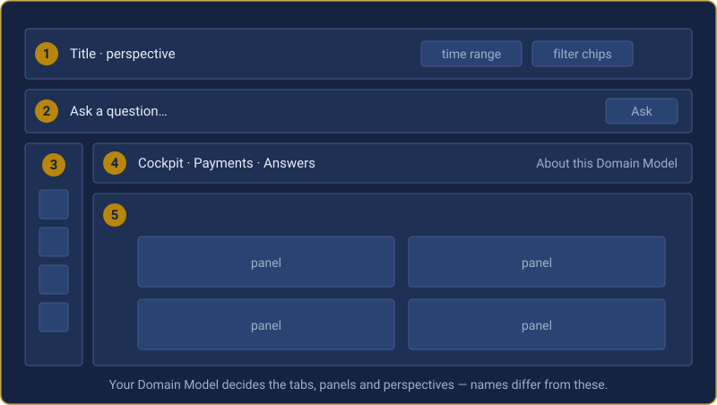

# Domain Workspace — User Manual

For everyone who opens a Domain Workspace to answer a question. No SPL
required, and none is written on your behalf behind your back.

This manual describes the workspace surface itself. The panels, questions and
perspectives you see come from your organisation's **Domain Model**, so your
workspace will name different things from the examples here — the mechanics are
the same.

---

## Contents

1. [What a Domain Workspace is](#1-what-a-domain-workspace-is)
2. [Opening it](#2-opening-it)
3. [The layout](#3-the-layout)
4. [Perspectives — why you see what you see](#4-perspectives--why-you-see-what-you-see)
5. [Reading a panel](#5-reading-a-panel)
6. [The panel toolbar](#6-the-panel-toolbar)
7. [Asking a question](#7-asking-a-question)
8. [Explain](#8-explain)
9. [How a number proves itself](#9-how-a-number-proves-itself)
10. [Filters and entity chips](#10-filters-and-entity-chips)
11. [Your session](#11-your-session)
12. [Evidence: Snapshot and Verify](#12-evidence-snapshot-and-verify)
13. [Reports — working a case queue](#13-reports--working-a-case-queue)
14. [The About tab](#14-the-about-tab)
15. [Keyboard and accessibility](#15-keyboard-and-accessibility)
16. [When a panel says it cannot answer](#16-when-a-panel-says-it-cannot-answer)
17. [Glossary](#17-glossary)

---

## 1. What a Domain Workspace is

A Domain Workspace is a place to investigate a business domain — payments,
fraud, service health — using data already in Splunk.

It looks like a dashboard and starts like one: a set of panels somebody
prepared for you. The difference is what happens when you have a question those
panels do not answer. You type the question in plain language, the workspace
shows you **what it is about to run before it runs it**, and the answer arrives
as a new panel beside the others.

Three promises shape everything in it:

- **Every number can prove where it came from.** Searches are assembled by the server, run under *your* Splunk permissions, and checked against a receipt before anything is recorded.
- **It never guesses.** If a question is outside what the model can answer, it says so and shows you what it *can* be asked. It will not run something similar and hope.
- **It never shows a blank chart and leaves you guessing.** If data is missing, unreachable or incomplete, the panel says which, and why.

You cannot break anything by clicking. Everything in this manual is safe to
try.

---

## 2. Opening it

Your administrator will give you a link. It looks like:

```
https://<your-splunk>/en-GB/app/<app-name>/workspace
```

If you are trying the bundled demo, the app name is
`itmip_adjutantai_domainworkspace_demo`.

Sign in to Splunk as yourself. **Do not use a shared account** — the workspace
runs every search as you, so a shared login gives you someone else's view of the
data and makes the audit trail meaningless.

**If the workspace opens on a perspective with nothing to switch to**, that is
not a fault. Your Splunk roles decide which perspectives you get, and you have
been given one. See §4.

---

## 3. The layout



| # | Region | What it does |
| - | - | - |
| **1** | **Header** | Carries the **perspective switcher** (changes which tabs and panels you see), the **time range** — a standard Splunk picker; changing it re-runs every panel that listens to time — and **filter chips**, which appear once you have filtered on something. |
| **2** | **Ask bar** | Present in every perspective. Type a question in your own words. See §7. |
| **3** | **Perspective stack** | The same perspectives as miniatures, each with a badge showing how many things need attention in it. Click one to switch. |
| **4** | **Tabs** | Declared by the model. Two are special: **Cockpit** (things needing attention) and **Answers** (where asked questions land if they have nowhere better to go). **About this Domain Model** sits at the far right and is always present — see §14. |
| **5** | **Canvas** | The panels. Resizes and re-packs when you change the browser window, without re-running any search. |

---

## 4. Perspectives — why you see what you see

A perspective is a view of the same domain for one audience. The analyst, the
fraud desk, compliance and the executive are not reading four different
dashboards that disagree — they are reading one model from four altitudes.

**Your Splunk roles decide which perspectives you get.** The model declares, per
perspective, which roles open on it and which roles may switch into it.

Two consequences worth understanding:

- **If a perspective is not yours, it is not shown at all** — not greyed out. Absence is the honest signal; a greyed control invites you to ask for something that was never on offer.
- **Perspectives are not a security boundary.** They decide presentation only. Your Splunk permissions decide data, always. A perspective can never show you something your roles forbid.

**To switch:** use the dropdown, or click a miniature in the left stack. Your
time range and the entity you are investigating come with you. Local filters
reset — they belonged to the view you left.

---

## 5. Reading a panel

Every panel carries the same furniture.

**The title**, and beside it any indicators:

| Indicator | Meaning |
| - | - |
| `● quality` | Measured data-quality findings affect this panel. Click for detail. |
| `▲ notable` | The explanation found something worth a look — a large move, a dominant contributor. Click to open Explain. |
| `in chat ◉` | This panel is the current context for the Ask bar. Click the panel body to release it. |
| `ready` | The search completed. |

**The footer** carries freshness and provenance:

- **`data as of 14:22:07`** — when the search that produced these numbers finished. If it is more than a couple of minutes old, the age appears in words: `(7 min ago)`.
- **`rendered 14:22:09`** — when this result was delivered to the panel.
- **`stands on 2 objects`** — how many Splunk objects this number depends on. Hover to see them.
- **`⚠ showing 500 of 5,000 rows`** — appears only when the panel holds part of the answer. Everything the panel says describes the rows shown, not the whole answer.

If a panel cannot show data, it says why in plain words. See §16.

---

## 6. The panel toolbar

Hover over any panel — or move keyboard focus into it — and a small toolbar
appears above its top-right corner. The buttons are always in the page, so
keyboard users get them too.

| Button | What it does |
| - | - |
| **↗** | Open the panel enlarged, over the canvas. `Escape` closes it. |
| **⛶** | Let the panel fill the whole canvas. `Escape` returns. |
| **Explain** | A plain-language, deterministic description of what is on the chart. See §8. |
| **Assured** | How this number is assured — the four checks. See §9. |
| **Peek** | The actual rows the panel drew from. This is the same data every check was computed over, not a fresh query. Some panels also offer **Raw events**. |
| **About** | What this panel is: its definition and where it comes from. |
| **Go to…** | Jump to another part of the workspace, where the model has declared a link. |
| **Search↗** | Open this panel's search in Splunk's own search view. |
| **Export** | Download the rendered rows as CSV. |
| **Inspect** | Open Splunk's job inspector for this search. |
| **⟳** | Re-run this panel's search. |
| **Snapshot** / **Verify** | Freeze and later re-check evidence. See §12. |

Some buttons are absent on some panels. That is deliberate: your organisation's
model decides which of the Splunk-native controls (Search, Export, Inspect,
Refresh) are available, and a panel with no rows has nothing to peek at.

**Resizing.** Hover a panel's lower edge for **◂ ▸** to make it narrower or
wider. The model sets limits and a size outside them is refused rather than
applied. **Reset to declared layout** puts everything back in one action. Your
sizing is remembered with your session.

---

## 7. Asking a question

The Ask bar is in every perspective.

**Step 1 — type your question** in your own words and press `Enter`, or click
**Ask**.

**Step 2 — check the match.** The workspace shows which of its own question
phrasings you matched and how strongly. If two of its questions fit equally
well, **it does not choose for you** — it asks which you meant.

**Step 3 — read the plan.** Before anything runs you see: which prepared search
will be used, with which parameters, and which tab the answer will land on.

**Step 4 — run it.** Click **Run this plan**. The answer appears as a live
panel, scrolls into view and pulses briefly so you can see where it went.

**Step 5 — inspect it if you want.** The answer carries a short record of what
it is built on: what you asserted, what was observed in the data, what was
calculated, and what could not be established and why.

### Where answers land

Each question declares the tab it belongs on. **If that tab is not part of your
perspective, the answer goes to the Answers tab instead** — so the same question
may land in a different place for you than for a colleague. It is never
silently dropped.

### Asking about one panel

Click a panel's body first. An `in chat ◉` chip appears on it and a context chip
appears beside the Ask bar. Your next question is then interpreted in that
panel's context, so *"why is this red?"* lands on the thing you are looking at.
Click the panel again to release it.

### When it will not answer

Ask something the model does not cover and the workspace tells you so, **and
shows you the questions it can answer**. It will not run the nearest-looking
search and present the result as though you had asked for it.

Some questions are answered from the model's own recorded knowledge and run **no
search at all** — for instance a question about which providers have an approved
exception. The answer appears in place.

---

## 8. Explain

**Explain** turns a chart into sentences: the peak and when it happened, the
sharpest change, the biggest contributor and its share, the trend from start to
end.

Every sentence is labelled:

- **FACT** — read directly from the rows.
- **CALCULATION** — worked out from them, deterministically.

It is computed in your browser from the rows already on screen. No search runs,
nothing leaves the page, and no language model is involved — which is why it
cannot be wrong about its own rows.

If the panel holds only part of the answer, the first sentence says so, and
everything after it is explicitly about the rows shown.

Opening Explain **makes the panel taller** rather than squeezing the chart. The
panels below move down; close it and they move back.

---

## 9. How a number proves itself

Every panel carries **four separate checks**. They are never merged into one
tick, because they can disagree and the difference matters.

| Check | Question it answers |
| - | - |
| **query** | Did the search that ran match the one the server authorised? |
| **contract** | Did the result have the shape the model declared — the right columns, a plausible number of rows? |
| **semantic** | Has this exact question been proven against known answers? |
| **presentation** | Did the panel actually render it — not clipped, not truncated, not mis-drawn? |

States are `✓` pass, `✗` fail, `warn`, `unverified`, or `undeclared` (the model
made no claim to check).

**A question nobody has proven can never show a semantic pass.** A test proves a
known question under known conditions — it does not bless every new phrasing.
That is why "semantic: unverified" on a question you just invented is correct
behaviour, not a defect.

**Where to find them.** On a business perspective the checks are one click away
— press **Assured** on the panel toolbar. On an administration perspective they
are pinned open under every panel. Same checks either way; the difference is
whether the plumbing is on your canvas by default.

---

## 10. Filters and entity chips

Values inside panels — an account number, a customer, an order, a provider —
are **clickable chips**, not text.

Clicking one:

- filters the workspace to that value,
- adds a **filter chip** in the header,
- updates the page URL,
- and is remembered with your session.

The value is checked against what the model says that kind of value looks like.
Something that is not a valid account number cannot become an account filter.
**Nothing is ever typed into a search box** — the only values that can enter are
the ones the model recognises.

**To clear a filter**, click the ✕ on its chip.

**Sensitive values** (for instance a customer identifier) show as `•••` in the
chip and are **never accepted from a link**, so a URL you paste into a chat
cannot carry one. This protects the filter chip and the URL only — where a
panel displays a sensitive value in its rows, it appears there, in Peek and in
exports in full.

> **Note.** Filtering does not always redraw a chart. A filter only changes
> panels that listen to that kind of value. If nothing moves, no panel on this
> tab depends on it.

---

## 11. Your session

Your workspace remembers, per user:

- the panels your questions produced,
- panel widths you nudged,
- filters and the entity you are investigating,
- which perspective and tab you were on.

Reload the page and it is all still there. Nothing you do affects a colleague's
view.

---

## 12. Evidence: Snapshot and Verify

Use this when a number may be questioned later — an audit, a case file, an
incident review.

**Snapshot** freezes the evidence behind a panel: the rows, the search that
produced them, and hashes of both. The footer confirms, for example `7 rows
sealed`.

**Verify** re-reads that evidence and re-checks the hashes. There are **three**
possible outcomes, and the difference between the last two matters:

| Result | Meaning |
| - | - |
| `hashes verified` | The evidence is intact and unchanged. |
| `HASH MISMATCH` | The evidence does not match what was sealed. This is a genuine tamper signal — report it. |
| `could not read the evidence back` | Verification **did not run**. Not a mismatch. |

The third happens most often if you press Verify immediately after Snapshot —
the evidence has gone into Splunk's indexing pipeline but is not searchable yet.
Wait a few seconds and try again. **The workspace will not accuse its own
evidence of tampering because a read was early.**

Evidence is written by the server from the job itself. Nothing your browser
sends can become evidence.

---

## 13. Reports — working a case queue

Where your organisation has set them up, the **Reports** tab turns a recurring
question into a worked queue rather than a spreadsheet emailed round.

Pick a report from the dropdown. If it has run, you see its work items.

| Action | What happens |
| - | - |
| **Claim** | Puts your name on a row. Colleagues see it within a refresh. Some reports block a second claim and name who holds it. |
| **Note** | Adds a comment to the row, kept with it across runs. |
| **Open ↗** | Puts the whole workspace into that row's context — the panels scope to it and a context bar appears with the row's identity. **Step out** returns you. |
| **Export** | XLSX or PDF of the queue. |
| **Ledger** | The audit trail for this report. |

**Findings keep their identity across runs.** Re-running a report does not
duplicate a finding you are already working — it adds an occurrence to the same
item, keeping your claim and your notes. A finding that was closed and comes
back is reopened and flagged, not created afresh.

**About exports.** A PDF renders at a fixed width so everyone receives the same
document, and it says on its provenance page that it is a rendering, not the
record. The ledger remains the record. Edits you make in an exported spreadsheet
do not flow back.

**If you are not in a report's audience** you are told so by name. You are never
shown an empty queue that makes it look as though there is no work.

---

## 14. The About tab

Present in every perspective, at the far right of the tab bar. It is the model
describing itself:

- **What it is for**, who it is for, and who owns it.
- **What it can answer** — and **what it cannot**, stated by the people who built it rather than discovered by you at an awkward moment.
- **Domain health** — coverage, when it was last measured, how many of its questions are proven, any data-quality findings, whether anything has drifted.
- **A list of everything currently not available, each with its cause.**
- **Suggested questions**, which load straight into the Ask bar. This is the fastest way to learn what a model can do.

The red entries are the product working. Every one names a reason.

---

## 15. Keyboard and accessibility

The workspace ships a deliberately small set of shortcuts rather than a large
one nobody remembers:

| Key | Action |
| - | - |
| `Enter` | In the Ask bar — submit the question. |
| `Escape` | Close an enlarged panel; if a panel is filling the canvas, return it. |
| `Tab` / `Shift`+`Tab` | Move between controls. Panel toolbars appear on keyboard focus, not only on hover. |

Other accessibility behaviour:

- Nothing is signalled by colour alone. States carry a shape, a label or a pattern as well.
- Charts with more series than the palette holds change **line style** as well as colour, and the legend says which are dashed.
- Where a chart cannot carry every series, the legend names the ones left out rather than dropping them silently.
- Panels announce state changes to screen readers.
- **Peek** is the text alternative to any chart: the same rows, as a table.

---

## 16. When a panel says it cannot answer

This is the part of the product most worth understanding, because these
messages are information, not errors.

| What you see | What it means | What to do |
| - | - | - |
| **Blocked: no permission** — names the index | Your Splunk roles cannot search the data behind this panel. Others may see it. | Contact the person named in the message, or your Splunk administrator. |
| **Blocked: `<feed>` is not onboarded** | The data was never brought into Splunk. Nobody sees this panel. | The message carries the onboarding route. This is a request for your data team. |
| **⚠ Degraded** — with a share and a cause | The numbers render, but a measured data-quality problem affects them — for example fields lost past an extraction limit on 4% of events. | Usable with care. The cause and remedy are named; pass them to your administrator. |
| **? Unverified** | The dependency check could not reach a verdict. The numbers ran, but whether they stand on everything they need is unknown. | Ask your administrator to run a health refresh. |
| **No events in the selected range** | Genuinely nothing happened. **That is an answer, not a failure.** | Widen the time range if you expected something. |
| **⚠ showing N of M rows** | The panel holds part of the answer. Totals and extremes on it describe what is shown. | Narrow the time range or filter to bring the answer under the limit. |
| **The search did not finish within 60s** | It timed out. **No rows are shown, because the rows it had were not the answer.** | Narrow the time range and try again. |
| **All quiet** on the Cockpit | Every attention rule was evaluated and none fired. | Nothing to do. Silence here is earned, not assumed. |

---

## 17. Glossary

| Term | Meaning |
| - | - |
| **Domain Model** | The versioned document describing your domain: its data, questions, panels, perspectives and rules. The workspace is generated from it. |
| **Domain Workspace** | The surface you are looking at — one workspace per Domain Model. |
| **Perspective** | A view of the workspace for one audience. Decided by your roles. |
| **Panel object** | A panel, plus everything attached to it: its identity, its checks, its explanation, its state. |
| **Question bank** | The questions the model knows how to answer, each with its search and — for the important ones — a proven answer. |
| **Assurance** | One of the four checks in §9. |
| **Attention rule** | A declared rule that decides when something belongs on the Cockpit. |
| **Work item** | One finding in a report, keeping its identity, claim and notes across runs. |
| **Evidence snapshot** | Frozen, hash-checked rows behind a panel, re-verifiable later. |
| **Health refresh** | An administrator action that re-measures what the model stands on. |
